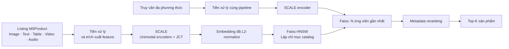
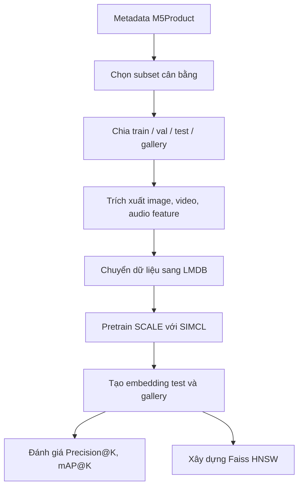

# Tìm kiếm sản phẩm đa phương thức với SCALE

> Hệ thống truy hồi sản phẩm thương mại điện tử kết hợp biểu diễn đa phương thức của **SCALE**, chỉ mục gần đúng **Faiss HNSW** và tái xếp hạng theo metadata.

[](https://www.python.org/)
[](https://pytorch.org/)
[](https://vitejs.dev/)

## Mục lục

- [Tổng quan](#tổng-quan)
- [Luồng hoạt động](#luồng-hoạt-động)
- [Tính năng](#tính-năng)
- [Cài đặt nhanh](#cài-đặt-nhanh)
- [Chạy hệ thống](#chạy-hệ-thống)
- [Tái lập pipeline SCALE](#tái-lập-pipeline-scale)
- [Cấu trúc dự án](#cấu-trúc-dự-án)
- [Đánh giá và kết quả](#đánh-giá-và-kết-quả)
- [Giới hạn hiện tại](#giới-hạn-hiện-tại)

## Tổng quan

Tìm kiếm sản phẩm chỉ bằng từ khoá thường không khai thác hết thông tin có trong một listing thương mại điện tử. Dự án này xây dựng một pipeline có thể tiếp nhận **ảnh, văn bản, bảng thuộc tính, video và âm thanh**, đưa chúng về không gian embedding thống nhất bằng SCALE, rồi truy hồi sản phẩm tương tự trong catalog.

SCALE tập trung trả lời câu hỏi: *truy vấn và sản phẩm có cùng ngữ nghĩa hay không?* Faiss HNSW giải quyết phần phục vụ: *làm thế nào tìm nhanh trong catalog lớn?* Sau bước truy hồi, metadata có thể được dùng để tái xếp hạng các ứng viên gần nhất.

Nguồn dữ liệu nghiên cứu là **M5Product**. Thí nghiệm cục bộ sử dụng subset 10.000 sản phẩm, chia train/validation/test theo tỉ lệ 70/20/10.

## Luồng hoạt động



## Tính năng

- **Truy vấn đa phương thức:** hỗ trợ ít nhất một trong các modality ảnh, văn bản, bảng thuộc tính, video hoặc audio.
- **Representation theo SCALE:** mã hoá riêng từng modality, sau đó kết hợp qua Joint Co-Transformer (JCT).
- **Pretraining SIMCL:** kết hợp masked modeling và contrastive learning liên modality.
- **Faiss HNSW:** lập chỉ mục và truy hồi vector gần đúng với độ trễ thấp hơn tìm kiếm tuần tự.
- **Tái xếp hạng theo metadata:** ưu tiên các ứng viên phù hợp hơn về category, thương hiệu hoặc thuộc tính khi cấu hình improved pipeline.
- **API và giao diện web:** FastAPI phục vụ tìm kiếm, React/Vite hiển thị kết quả.
- **Đánh giá tái lập:** có script cho Precision@K và mAP@K trên split đã chuẩn bị.

## Cài đặt nhanh

### Yêu cầu

- Windows 10/11
- Python 3.12
- Node.js 18+ và npm
- GPU NVIDIA có CUDA được khuyến nghị cho trích xuất feature và huấn luyện

> PyTorch có CUDA cần được cài bằng wheel tương ứng với máy trước khi cài các dependency còn lại. Xem hướng dẫn chính thức tại [pytorch.org](https://pytorch.org/get-started/locally/).

```powershell
git clone <repository-url>
cd "Product Ecommerce Image Retrieval"

python -m venv .venv
.\.venv\Scripts\Activate.ps1
python -m pip install --upgrade pip
pip install -r app/requirements-windows.txt
```

## Chạy hệ thống

### 1. Chuẩn bị artifacts

Backend SCALE cần artifacts đã được tạo trước, gồm metadata, embedding, chỉ mục HNSW và checkpoint. Đặt chúng trong thư mục `artifacts/scale_paper/` hoặc cấu hình biến môi trường `SCALE_WORK_DIR` đến thư mục phù hợp.

Các tệp lớn như dữ liệu gốc, video, feature, checkpoint và index không được đưa vào Git. Hãy lấy chúng từ bộ dữ liệu/Drive nộp bài của nhóm trước khi chạy.

### 2. Khởi động backend

Mở PowerShell tại thư mục gốc của dự án:

```powershell
.\scripts\start_backend.ps1
```

API chạy tại `http://127.0.0.1:8000`. Có thể kiểm tra trạng thái index tại:

```text
GET http://127.0.0.1:8000/health
```

### 3. Khởi động frontend

Mở một PowerShell khác:

```powershell
.\scripts\start_frontend.ps1
```

Giao diện chạy tại `http://127.0.0.1:5173`.

## Tái lập pipeline SCALE

Pipeline đầy đủ gồm: tải/chọn dữ liệu, tạo split, trích xuất feature, xây dựng LMDB, pretrain SCALE, tạo embedding, đánh giá và lập chỉ mục Faiss.



Sau khi đã có dữ liệu và split, có thể chạy pipeline chính:

```powershell
.\app\training\run_pipeline_scale.ps1 `
  -DatasetDir app\datasets\downloaded_m5product_balanced `
  -SplitsDir artifacts\scale_paper_splits `
  -WorkDir artifacts\scale_paper `
  -TrainEpochs 10 `
  -BatchSize 16 `
  -GradAccum 8
```

Để thử nhanh với số lượng nhỏ, dùng thêm `-SmokeTest`. Các tham số cần được ghi lại cùng seed, checkpoint và split khi báo cáo metric.

## Cấu trúc dự án

```text
.
├── app/
│   ├── api/             # FastAPI: endpoint tìm kiếm và health check
│   ├── datasets/        # Tải M5Product, metadata, chọn mẫu
│   ├── preprocess/      # Tạo split và chuẩn bị dữ liệu
│   ├── SCALE/           # Mô hình SCALE, dataloader, pretrain và evaluation
│   ├── encoding/        # Mã hoá sản phẩm/truy vấn thành embedding
│   ├── indexing/        # Faiss HNSW và metadata reranking
│   ├── evaluation/      # Metric và retrieval evaluation
│   └── training/        # Script điều phối pipeline
├── frontend/            # React + Vite
├── scripts/             # Lệnh chạy backend, frontend, pretrain
├── docs/                # Proposal, báo cáo, hình và tài liệu nộp bài
├── output/              # Kết quả metric và PDF đầu ra
└── README.md
```

## Đánh giá và kết quả

Các chỉ số chính:

| Chỉ số | Ý nghĩa |
|---|---|
| Precision@K | Tỷ lệ kết quả liên quan trong K sản phẩm đầu tiên. |
| mAP@K | Chất lượng thứ hạng trung bình, xét vị trí của các kết quả liên quan. |
| Latency | Thời gian phản hồi của truy vấn, đặc biệt quan trọng khi dùng ANN. |

Kết quả local phải được đọc trong đúng bối cảnh: subset sử dụng, cách định nghĩa positive, số query, seed, checkpoint, tham số HNSW và cấu hình reranking. Không nên so sánh trực tiếp với benchmark M5Product công bố khi protocol hoặc pipeline tiền xử lý khác nhau.

## Giới hạn hiện tại

- Source có hai hướng chạy: pipeline SCALE bám sát bài báo và một pipeline SigLIP rút gọn. Báo cáo và hướng dẫn này ưu tiên SCALE.
- Vì giới hạn phần cứng, một số bước local chưa trùng hoàn toàn protocol gốc: source hiện tại cố định 36 vùng ảnh, dùng tối đa 12 frame đầu của video và biểu diễn audio bằng log-mel spectrogram.
- Tái xếp hạng metadata và luồng SCALE end-to-end cần được kiểm chứng bằng manifest chạy đầy đủ trước khi được xem là benchmark chính thức.
- M5Product và các artifacts lớn không được kèm trong repository.

## Tài liệu tham khảo

- Báo cáo dự án: [`docs/report/main-report.pdf`](docs/report/main-report.pdf)
- Giới thiệu mã nguồn cho giảng viên: [`docs/other/giới thiệu source code cơ bản.txt`](docs/other/giới%20thiệu%20source%20code%20cơ%20bản.txt)
- M5Product-SCALE: [paper và benchmark chính thức](https://xiaodongsuper.github.io/M5Product_dataset/)
- Faiss: [tài liệu chính thức](https://faiss.ai/)

---

Đây là đồ án học thuật; kết quả công bố trong report được diễn giải theo đúng cấu hình và dữ liệu đã chạy.
