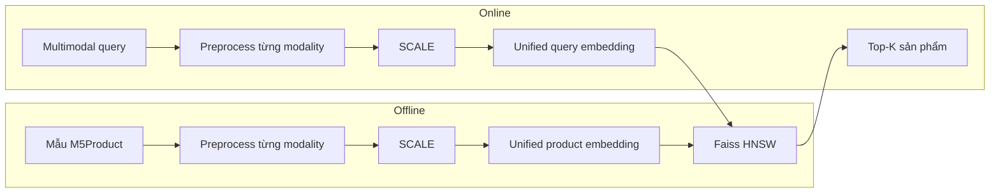

# 01. Topic Introduction and Overview

## 1.1. Bối cảnh

E-commerce đang chuyển từ tìm kiếm dựa hoàn toàn vào từ khóa sang trải nghiệm giàu ngữ cảnh hơn. Tìm kiếm truyền thống đòi hỏi người dùng diễn đạt sản phẩm bằng text: tên mặt hàng, màu sắc, kiểu dáng, vật liệu hoặc thương hiệu. Cách này thất bại khi người dùng chỉ có ảnh hoặc video tham khảo, không biết gọi đúng tên sản phẩm, hoặc khi mô tả của người bán không đồng nhất.

Truy vấn thị giác giảm ma sát đó: người dùng đưa ảnh hoặc video sản phẩm, hệ thống nhận diện đặc trưng và truy hồi sản phẩm tương tự. Bài survey *The Rise of Visual Search in E-Commerce* nhấn mạnh visual search giúp cải thiện product discovery, tăng relevance và giảm search friction.

Trong catalog thực tế, một listing hiếm khi chỉ là ảnh. Sản phẩm thường kèm caption, bảng thuộc tính, video giới thiệu và audio tách từ video. Vì vậy đề tài không dừng ở so khớp ảnh-ảnh, mà đặt bài toán **multimodal retrieval**: biểu diễn query và sản phẩm từ mọi modality khả dụng, rồi tìm top-K entry tương đồng nhất.

## 1.2. Visual Product Image Search trong phạm vi đề tài

Topic giữ tên visual product image search vì ảnh (hoặc video) là tín hiệu vào tối thiểu. Phạm vi kỹ thuật là truy hồi đa phương thức trên catalog e-commerce:

- **Query** `q = (Image, Text, Table, Video, Audio)` gồm các modality khả dụng; tối thiểu có Image hoặc Video; các modality còn lại có thể thiếu.
- **Catalog** `G = {p_1, ..., p_N}` với mỗi `p_i` cũng là bộ năm modality, và cũng có thể thiếu một số nhánh.
- **Kết quả** là top-K product entry có embedding đa phương thức gần query nhất, kèm ảnh đại diện và metadata.

Kết quả không chỉ cần giống màu hoặc texture, mà còn phải đúng ngữ nghĩa thương mại: cùng siêu danh mục/danh mục, cùng thuộc tính quyết định mua. Pixel-level similarity không đủ.

## 1.3. Tại sao topic này quan trọng?

- Giảm phụ thuộc vào từ khóa và lỗi mô tả sản phẩm.
- Hỗ trợ mobile commerce và social commerce, nơi người dùng thường thấy sản phẩm qua ảnh hoặc video ngắn.
- Tận dụng thông tin bổ sung từ text, table, video và audio khi listing có đủ dữ liệu.
- Vẫn hoạt động khi listing thiếu modality — tình huống phổ biến trên sàn.
- Mở đường cho catalog lớn: embedding được lập chỉ mục HNSW để thêm sản phẩm mới mà không rebuild toàn bộ.

## 1.4. Overview hệ thống đề xuất

Hệ thống gồm hai tầng, khớp pipeline trên slide:

1. **Feature extraction**: SCALE học embedding chung từ image, text, table, video và audio; tự cân bằng mức đóng góp từng modality (SIMCL) và xử lý missing modality bằng zero imputation.
2. **Indexing/retrieval**: Faiss HNSW lưu embedding catalog; query được embed rồi duyệt đồ thị đa tầng để lấy ứng viên. Tầng cải tiến tái xếp hạng ứng viên bằng thuộc tính trước khi cắt top-K.

Điểm cốt lõi: SCALE trả lời câu hỏi sản phẩm và query có cùng ngữ nghĩa đa phương thức hay không; HNSW trả lời câu hỏi làm sao tìm nhanh trên catalog lớn và cập nhật listing mới.
