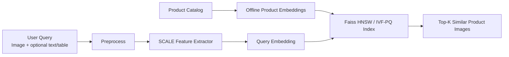

# 01. Topic Introduction and Overview

## 1.1. Bối cảnh

E-commerce đang chuyển từ trải nghiệm tìm kiếm dựa hoàn toàn vào từ khóa sang trải nghiệm tìm kiếm giàu ngữ cảnh hơn. Trong tìm kiếm truyền thống, người dùng phải diễn đạt sản phẩm bằng text: tên mặt hàng, màu sắc, kiểu dáng, vật liệu hoặc thương hiệu. Cách này thường thất bại khi người dùng chỉ có một ảnh tham khảo, không biết gọi đúng tên sản phẩm, hoặc khi mô tả của người bán không đồng nhất.

Visual search giải quyết phần lớn ma sát đó bằng cách cho phép người dùng upload ảnh hoặc chụp ảnh sản phẩm ngoài đời, sau đó hệ thống tự nhận diện đặc trưng thị giác và truy hồi sản phẩm tương tự. Bài survey *The Rise of Visual Search in E-Commerce* nhấn mạnh visual search là một công nghệ quan trọng để cải thiện product discovery, tăng relevance, cá nhân hóa và giảm search friction trong hành trình mua sắm.

## 1.2. Visual Product Image Search là gì?

Visual Product Image Search là bài toán tìm kiếm sản phẩm trong catalog dựa trên độ tương đồng giữa query và product entry. Trong phạm vi đề tài, query chính là ảnh; text hoặc bảng thuộc tính ngắn chỉ là ngữ cảnh bổ sung khi có sẵn. Catalog có thể chứa:

- Ảnh sản phẩm do người dùng tải lên hoặc chụp từ thực tế.
- Title/caption và bảng thông tin như brand, material, color, style, usage.
- Video nhiều góc nhìn và audio/mô tả đi kèm listing, nếu dataset có cung cấp.

Kết quả không chỉ cần giống về màu hoặc texture, mà còn phải đúng ngữ nghĩa thương mại: cùng loại sản phẩm, cùng style, cùng vật liệu hoặc cùng intent mua hàng. Vì vậy, bài toán này không thể chỉ dựa vào pixel-level similarity.

## 1.3. Tại sao topic này quan trọng?

Visual search hữu ích với e-commerce vì:

- Giảm phụ thuộc vào từ khóa và lỗi mô tả sản phẩm.
- Hỗ trợ mobile commerce và social commerce, nơi người dùng thường thấy sản phẩm qua ảnh.
- Cải thiện discovery cho long-tail products, đặc biệt các sản phẩm khó gọi tên.
- Tăng khả năng matching giữa nhu cầu người mua và catalog người bán.
- Mở đường cho multi-modal retrieval: ảnh + text + bảng thuộc tính + video + audio.

## 1.4. Overview hệ thống đề xuất

Hệ thống được định hướng theo hai tầng chính:

1. **Feature extraction layer**: dùng SCALE trên M5Product để học embedding đa phương thức cho sản phẩm. Mục tiêu là đưa image, text, table, video và audio vào một không gian embedding có thể so sánh.
2. **Retrieval layer**: dùng Faiss để đánh chỉ mục embedding của catalog. `IndexFlatIP` trên vector đã chuẩn hóa là exact baseline; Faiss HNSW là index chính; IVF-PQ/OPQ-PQ chỉ được dùng khi memory trở thành bottleneck.

Luồng tổng quát:

Điểm cốt lõi của đề tài là kết hợp chất lượng embedding đa phương thức với tốc độ truy hồi ở quy mô catalog lớn.
