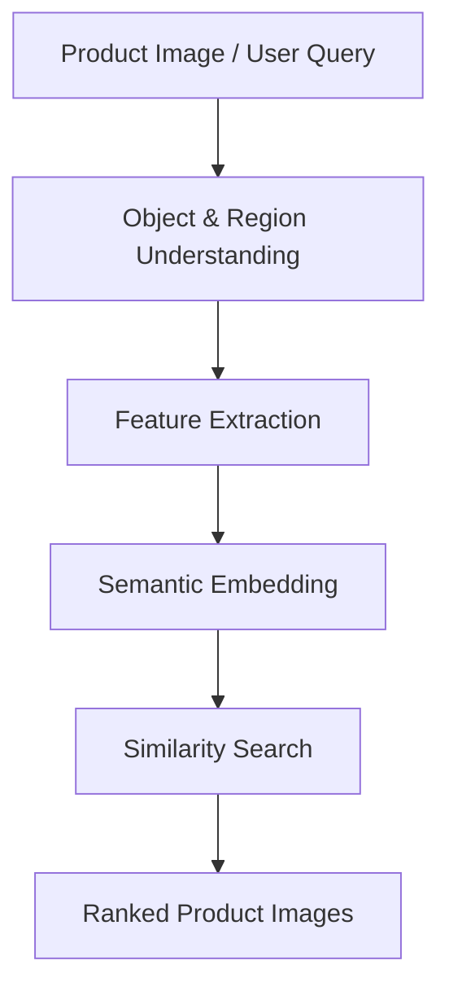

# 02. Product E-commerce Image

## 2.1. Khái niệm

Product e-commerce image là ảnh đại diện cho sản phẩm trong môi trường thương mại điện tử. Khác với ảnh tự nhiên thông thường, ảnh sản phẩm thường gắn với mục tiêu mua bán: người dùng cần hiểu sản phẩm là gì, trông như thế nào, có thuộc tính gì, và có phù hợp với nhu cầu hay không.

Trong visual search, ảnh sản phẩm không chỉ là dữ liệu thị giác. Nó là điểm vào để suy luận về category, brand, material, shape, color, pattern, usage scenario và đôi khi cả selling point của sản phẩm.

## 2.2. Các tính chất quan trọng

### 2.2.1. Fine-grained visual similarity

Nhiều sản phẩm khác nhau có hình dáng tổng thể rất giống nhau nhưng khác ở chi tiết nhỏ: logo, pattern, texture, màu phụ, kiểu cổ áo, loại đế giày, model điện thoại. Vì vậy hệ thống cần phân biệt fine-grained attributes thay vì chỉ nhận diện category chung.

### 2.2.2. Semantic similarity

Hai ảnh có thể giống về màu và hình khối nhưng khác ý nghĩa thương mại. Ví dụ hộp pin, hộp nước hoa và hộp bánh có thể đều là hình chữ nhật; nếu chỉ dựa vào texture/shape, hệ thống dễ trả về sản phẩm sai category. Đây là semantic gap: khoảng cách giữa đặc trưng thị giác cấp thấp và ý nghĩa sản phẩm cấp cao.

### 2.2.3. Multi-view and product-level identity

Một sản phẩm thường có nhiều ảnh: mặt trước, mặt sau, cận cảnh, ảnh trên người mẫu, ảnh trong ngữ cảnh sử dụng. Người dùng có thể query bằng một góc nhìn khác với ảnh chính của catalog. Do đó hệ thống cần hiểu product-level identity thay vì chỉ so sánh từng ảnh đơn lẻ.

### 2.2.4. Noisy real-world query

Ảnh query từ người dùng có thể bị crop, nén qua mạng xã hội, xoay, chèn logo, có watermark, có background phức tạp hoặc chứa nhiều object. Bài Shopsy chỉ ra các biến đổi như compression, cropping, scribbling/logo overlay là thách thức thực tế trong visual search cho reseller commerce.

### 2.2.5. Incomplete and heterogeneous metadata

E-commerce catalog thường có thuộc tính không đầy đủ. Sản phẩm này có bảng material/color/brand, sản phẩm khác chỉ có title và ảnh. M5Product cũng phản ánh thực tế này khi có missing modality và long-tail distribution.

## 2.3. Các gap cần xử lý

| Gap | Mô tả | Tác động tới search |
| --- | --- | --- |
| Sensory Gap | Khác biệt giữa ảnh catalog đẹp và ảnh query ngoài đời: ánh sáng, góc chụp, crop, compression. | Làm embedding lệch dù là cùng sản phẩm. |
| Semantic Gap | Đặc trưng pixel giống nhau nhưng category/intent khác nhau. | Trả về sản phẩm nhìn giống nhưng không đúng nhu cầu mua. |
| Context-Query Gap | Query của người dùng thiếu ngữ cảnh hoặc có ngữ cảnh khác catalog. | Khó hiểu người dùng muốn cùng sản phẩm, cùng style hay cùng chức năng. |
| Modal Gap | Query và catalog có modality khác nhau: ảnh query nhưng catalog có text/table/video/audio. | Cần học không gian chung để so sánh cross-modal. |

## 2.4. Quy trình visual search điển hình

Theo survey về visual search trong e-commerce, một hệ thống thường gồm các bước: nhận ảnh query, trích xuất đặc trưng, nhận diện object, so khớp similarity với database và trả về sản phẩm đề xuất. Với đề tài này, quy trình được mở rộng sang multi-modal retrieval: thay vì chỉ dùng CNN trên ảnh, hệ thống dùng multi-modal pretraining để khai thác thêm text, table, video và audio.

## 2.5. Kết luận chuyển tiếp

Từ các đặc trưng trên, có thể thấy product image search không phải bài toán image retrieval thuần túy. Hệ thống cần vừa chống nhiễu thị giác, vừa hiểu semantic, vừa tận dụng nhiều modality trong catalog. Vì vậy, dataset và phương pháp được chọn phải đủ gần với dữ liệu e-commerce thực tế. Đây là lý do chúng tôi sử dụng M5Product và SCALE làm nền tảng cho phần tiếp theo.
