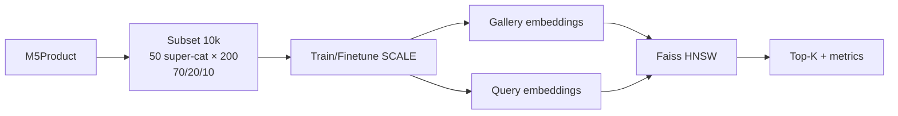

# 03. Dataset: M5Product

## 3.1. Chuyển tiếp từ đặc điểm sản phẩm

Mục 02 nêu ba tính chất: dữ liệu có cấu trúc nhiều modality, không toàn vẹn, và cực kỳ đa dạng. Dataset ảnh-text nhỏ hoặc dataset thời trang đơn miền không mô phỏng được catalog đó. Chúng tôi chọn **M5Product** từ bài *M5Product: Self-harmonized Contrastive Learning for E-commercial Multi-modal Pretraining*.

## 3.2. Tổng quan M5Product

M5Product là bộ dữ liệu quy mô lớn cho sản phẩm thương mại điện tử:

- Hơn **6 triệu** mẫu đa phương thức; **6,313,067** samples theo paper.
- **6,232** danh mục; hơn **5.000** thuộc tính với **24 triệu+** giá trị.
- **5 modality**: hình ảnh, văn bản, dữ liệu bảng, video, âm thanh.
- Thu thập từ hơn **1 triệu** người bán, đảm bảo đa dạng ngành hàng.

Dataset không paired hoàn hảo: thiếu modality, nhiễu, phân phối long-tail — giống điều kiện sàn thật.

## 3.3. Vai trò của từng modality

| Modality | Thông tin chính | Vai trò trong retrieval |
| --- | --- | --- |
| Image | Appearance, màu, hình dáng, texture. | Tín hiệu thị giác; thường có mặt trong query. |
| Text | Title, caption, selling point, cụm category. | Semantic và intent mà ảnh khó biểu diễn. |
| Table | Brand, chất liệu, kích thước, scene, thuộc tính. | Fine-grained matching theo thông số. |
| Video | Nhiều góc nhìn, use case, hành vi sản phẩm (ví dụ độ đàn hồi). | Bổ sung appearance/usage khi có video. |
| Audio | Lời giới thiệu hoặc âm thanh tách từ video (MFCC). | Tín hiệu bổ sung; không phải video nào cũng có tiếng hữu ích. |

## 3.4. Dataset split gốc của paper

Training set paper gồm **4,423,160** samples từ **3,593** classes. Retrieval chia gallery/query ở hai mức:

- **Coarse-grained**: match theo category.
- **Fine-grained**: match cùng sản phẩm (model/màu/kiểu).

Paper dùng ResNet50 + BERT để tạo candidate pool, rồi crowd-sourcing xác nhận cặp match.

## 3.5. Subset dùng trong đề tài

Full M5Product quá lớn cho thời gian và GPU của nhóm. Chúng tôi chọn số mẫu nhỏ hơn nhưng vẫn giữ bao quát ngành hàng và tính **không đầy đủ** của từng mẫu:

1. Đếm số sản phẩm theo hơn 6.000 category.
2. Đưa danh sách số mẫu và tên category qua ChatGPT, gộp thành **50 super category** (ví dụ giày, đồ gia dụng, đồ phòng khách).
3. Với mỗi super category chọn **200** mẫu theo tỉ lệ **70 / 20 / 10**:
   - 70% đủ 5 modality;
   - 20% thiếu 1 hoặc 2 modality;
   - 10% chỉ có 1 modality.
4. Tổng **50 × 200 = 10.000** mẫu.

Subset này dùng cho train/finetune embedding, xây gallery HNSW và đánh giá retrieval. Tỉ lệ 70/20/10 bảo đảm model vẫn gặp missing modality, khớp Thách thức 2 ở Mục 05.

## 3.6. Vì sao M5Product phù hợp?

- Đủ 5 modality cho cả query và catalog.
- Missing modality giúp kiểm tra zero imputation và SIMCL.
- Super category đa dạng hơn dataset fashion hẹp miền.
- Có task retrieval để đo mAP@K, Precision@K trên embedding SCALE.

## 3.7. Cách sử dụng trong đề tài

1. **Pretrain/finetune SCALE** trên subset 10.000 mẫu.
2. **Build gallery embedding** rồi lập chỉ mục Faiss HNSW.
3. **Evaluate**: query đa phương thức → unified embedding → HNSW → (tùy chọn) tái xếp hạng thuộc tính → top-K; đo Precision@K, AP, mAP, kể cả ablation Image-Text-Video hoặc Image-Table-Video.

