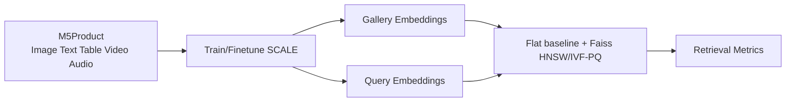

# 03. Dataset: M5Product

## 3.1. Chuyển tiếp từ Product E-commerce Image

Ở mục 02, ta thấy dữ liệu e-commerce có ba đặc điểm nổi bật: đa phương thức, nhiễu và thiếu hụt, đồng thời có long-tail category. Nếu chỉ dùng dataset ảnh-text nhỏ hoặc dataset thời trang đơn miền, hệ thống khó mô phỏng môi trường catalog thực tế. Vì vậy, chúng tôi chọn **M5Product** từ bài *M5Product: Self-harmonized Contrastive Learning for E-commercial Multi-modal Pretraining*.

## 3.2. Tổng quan M5Product

M5Product là dataset e-commerce đa phương thức gồm 5 modality:

- Image
- Text/caption
- Table/specification
- Video
- Audio

Theo bài báo, dataset có **6,313,067 samples**, **6,232 categories**, hơn **5,000 attributes**, và lớn hơn đáng kể so với các dataset đa phương thức cùng số modality trước đó. Điểm quan trọng là M5Product không phải dataset paired hoàn hảo; nó chứa missing modality, noise và phân phối long-tail, giống điều kiện e-commerce thật.

## 3.3. Vai trò của từng modality

| Modality | Thông tin chính | Vai trò trong retrieval |
| --- | --- | --- |
| Image | Appearance, color, shape, texture, pattern. | Cốt lõi cho visual similarity và query bằng ảnh. |
| Text | Title, caption, selling point, category phrase. | Bổ sung semantic và intent mà ảnh khó biểu diễn. |
| Table | Brand, material, color, applicable scene, product properties. | Cung cấp thuộc tính cấu trúc, hỗ trợ fine-grained matching. |
| Video | Nhiều góc nhìn, scale, use case, product behavior. | Giảm view incompleteness và sensory gap. |
| Audio | Voice/sound trong video hoặc mô tả liên quan. | Bổ sung tín hiệu khi query hoặc listing có audio. |

## 3.4. Dataset split và annotation

Bài báo M5Product mô tả training set gồm **4,423,160 samples** từ **3,593 classes**. Phần retrieval được chia thành gallery/query cho hai mức:

- **Coarse-grained retrieval**: match theo category, ví dụ tất cả điện thoại được xem là cùng nhóm.
- **Fine-grained retrieval**: chỉ xem là match khi cùng sản phẩm ở mức instance, ví dụ cùng model/màu/kiểu dáng.

Để giảm chi phí labeling, paper dùng ResNet50 và BERT-Base để tạo candidate pool, sau đó dùng crowd-sourcing để xác nhận các cặp match. Điều này phù hợp với mục tiêu của đề tài: đánh giá không chỉ retrieval theo category mà còn retrieval cùng sản phẩm hoặc rất gần sản phẩm.

## 3.5. Vì sao M5Product phù hợp với đề tài?

- Có đủ 5 modality cho product entry trong catalog: image, text, video, audio và information table.
- Có dữ liệu lớn để học embedding robust.
- Có missing modality, giúp kiểm tra khả năng vận hành khi catalog không đầy đủ.
- Có category đa dạng hơn các dataset thời trang hẹp miền.
- Có task retrieval, classification và clustering để đánh giá embedding.

## 3.6. Cách sử dụng trong đề tài

Chúng tôi dự kiến dùng M5Product theo ba pha:

1. **Pretraining/finetuning feature extractor**: học embedding chung bằng SCALE.
2. **Build gallery embedding**: trích xuất embedding cho ảnh sản phẩm trong catalog.
3. **Evaluate retrieval**: dùng query set để truy hồi top-K qua `IndexFlatIP` exact baseline, Faiss HNSW và IVF-PQ, sau đó đo mAP@K, Precision@K, Recall@K.

