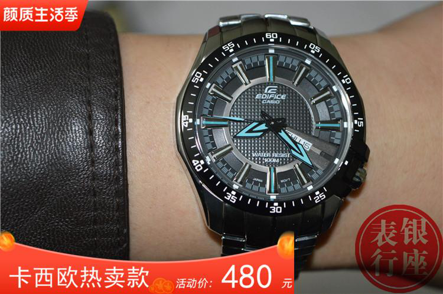

# 04. Problem Statement

## 4.1. Mục tiêu

Nhóm giải **multimodal retrieval** trên tập sản phẩm thương mại điện tử, không chỉ image retrieval. Với query gồm các modality khả dụng và kho sản phẩm `G`, hệ thống trả về top-K entry có biểu diễn đa phương thức tương đồng nhất, đúng tinh thần bài M5Product/SCALE: cùng listing có thể thiếu nhánh, nhưng embedding vẫn phải so được.

## 4.2. Input và output

### Input

1. **Query**

```text
q = (Image, Text, Table, Video, Audio)
```

Table là bảng thuộc tính; Audio lấy từ video (SCALE tách bằng moviepy, lưu mp3, rồi MFCC). Query gồm các modality khả dụng, **tối thiểu có Image hoặc Video**, các nhánh còn lại có thể thiếu.

2. **Kho sản phẩm**

```text
G = {p_1, p_2, ..., p_N}
p_i = (Image_i, Text_i, Table_i, Video_i, Audio_i)
```

Mỗi `p_i` cũng có thể thiếu modality — M5Product không phải dataset paired đầy đủ.

### Output

```text
Output = {p_1, p_2, ..., p_K}
p_i = (Image_i, Text_i, Table_i, Video_i, Audio_i)
```

Kèm ảnh đại diện, metadata và điểm `sim(f(q), f(p_i))` để UI và tầng tái xếp hạng.

## 4.3. Formalization

- `f(.)` là SCALE: encoder từng nhánh, zero-impute nhánh thiếu, Joint Co-Transformer, pooled embedding.
- `sim` là inner product trên vector đã L2-normalize (tương đương cosine).
- Bài toán:

```text
TopK(q, G) = arg top-K_{p_i in G} sim(f(q), f(p_i))
```

Sau HNSW, điểm này có thể kết hợp `S_thuoc_tinh` ở Mục 08 rồi cắt đúng K.

## 4.4. Ví dụ minh họa

### Query ảnh + text + table (từ slide)

Query là đồng hồ Casio Edifice trên cổ tay, caption dòng Accent Color EF-130D-1A2, bảng thuộc tính (thương hiệu Casio, chống nước 100m, độ dày 13mm, xuất xứ Nhật Bản, loại hiển thị kim). Output là top-K listing cùng model/cùng dòng, không chỉ cùng màu mặt đồng hồ.



**Hình 4.1.** Query thị giác thực tế: sản phẩm chính là đồng hồ, nhưng ảnh còn chữ quảng cáo, giá và logo shop.

## 4.5. Yêu cầu hệ thống

- Học embedding giàu ngữ nghĩa từ năm modality, tự cân bằng mức bổ trợ (SIMCL).
- Encode được query/catalog thiếu modality (zero imputation).
- Truy hồi nhanh; thêm listing vào HNSW không rebuild toàn bộ.
- Đánh giá bằng mAP@K và Prec@K theo protocol `evaluate_unit_v2.py` của SCALE, K ∈ {1, 5, 10}.
