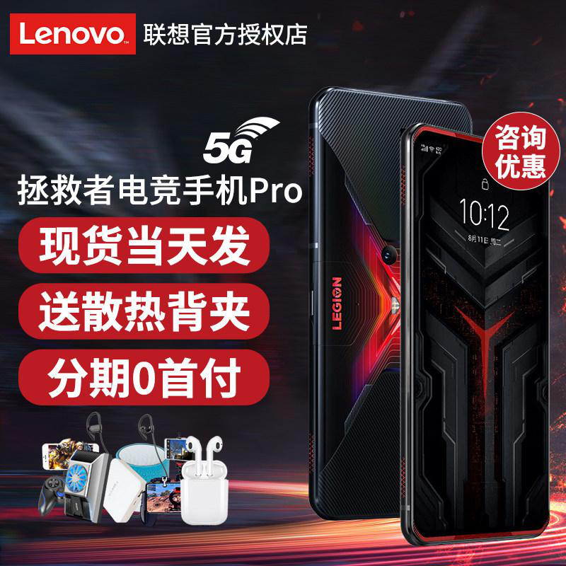
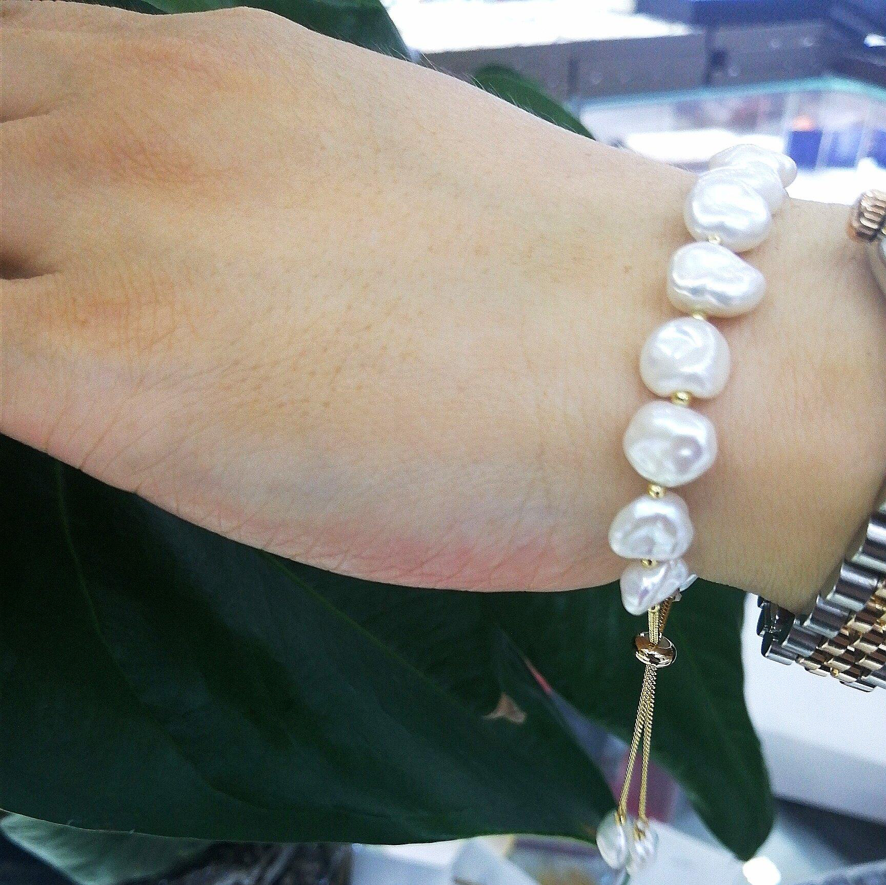

# 05. Các thách thức thực hiện

Hai thách thức trung tâm lấy từ M5Product/SCALE: **Modality Interaction** và **Modality Noise**. Thách thức bổ sung trên slide là nhiễu thị giác trên ảnh listing.

## 5.1. Thách thức 1: Modality Interaction

Làm sao mô hình hóa tương tác giữa nhiều modality khi mỗi nhánh chỉ chứa một phần thông tin sản phẩm?

Ví dụ chiếc gối trong slide:

- Ảnh: màu sắc và hình dáng.
- Text: gối Memory Foam.
- Table: kích thước và chất liệu.
- Video: độ đàn hồi.
- Audio: lời giới thiệu người bán.

Không modality nào đủ để mô tả toàn bộ. SCALE gọi mức bổ trợ semantic giữa hai nhánh là điểm alignment. Trong SIMCL, ma trận `S` học được chính là trọng số cho từng cặp loss liên-modality:

- `S(u, v)` lớn: hai nhánh bổ sung nhiều thông tin cho nhau.
- `S(u, v)` nhỏ: hai nhánh ít hỗ trợ hoặc gần độc lập.

Nếu gán mọi cặp trọng số bằng nhau (cách mặc định của các model image–text), nhánh nhiễu hoặc ít complementary kéo representation lệch khi số modality tăng — đúng quan sát paper khi đi từ 2 lên 5 nhánh.

## 5.2. Thách thức 2: Modality Noise

Làm sao tận dụng sản phẩm có modality không đầy đủ?

Ví dụ gối khác chỉ có ảnh và text “gối du lịch”, không table/video/audio. Embedding thiếu kích thước, chất liệu, độ đàn hồi.

Trong M5Product:

- Khoảng **20%** mẫu không đủ năm modality; **~5%** unimodal.
- Paper không loại mẫu thiếu: zero imputation, vẫn train.

Nếu discard mẫu thiếu thì mất dữ liệu và model không học được listing thực tế trên sàn.

## 5.3. Thách thức khác: nhiễu trên ảnh

SCALE dùng region feature (bottom-up Faster R-CNN, 10–36 ROI) vì ảnh e-commerce hiếm khi là object sạch trên nền trắng. Các ảnh dưới lấy từ slide đề tài.

**Nhiễu do chữ.** Chữ quảng cáo, giá, watermark, logo shop chiếm diện tích lớn hoặc đè lên sản phẩm. Detector/encoder nếu nhìn toàn ảnh sẽ nhúng cả banner.

**Hình 5.1.** Listing điện thoại: sản phẩm chính bị bao bởi chữ, badge “hiện hàng”, tai nghe và quạt tản nhiệt tặng kèm.

**Nhiễu do nhiều biến thể trong một khung.** Cùng brand, khác dung tích/vòi bơm/móc treo. Query một size có thể kéo cả family SKU.

**Hình 5.2.** Một ảnh chứa nhiều biến thể cùng dòng — dễ nhầm instance-level retrieval thành category-level.

**Nhiễu do người, đồ tặng, sản phẩm phụ.** Vòng trên cổ tay, cọ tặng kèm set makeup, hộp quà.

**Hình 5.3.** Sản phẩm chính là vòng; tay người và dây đồng hồ là tín hiệu phụ.

**Hình 5.4.** Set + quà tặng: model có thể nhúng nhầm cọ hoặc hộp thay vì chai.

Hai hệ quả đi kèm (cũng trên slide): hàng trăm SKU giày/điện thoại trông gần giống nhau nhưng khác model; background trắng, màu, hoặc môi trường thật.

## 5.4. Ràng buộc vận hành: catalog lớn và dữ liệu động

Exact search tuyến tính không phù hợp catalog lớn. Listing được thêm liên tục. Chỉ mục cần nạp vector mới, liên kết láng giềng, không rebuild mỗi lần cập nhật — lý do HNSW ở Mục 07, tách khỏi hai thách thức representation của SCALE.
