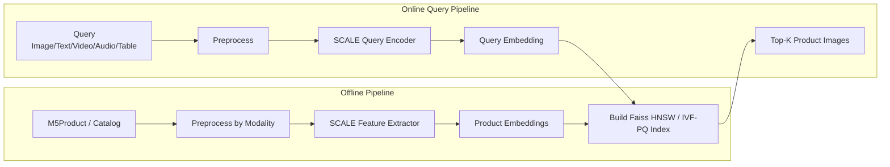
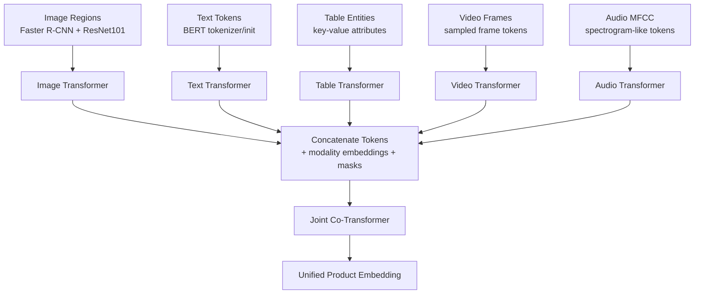
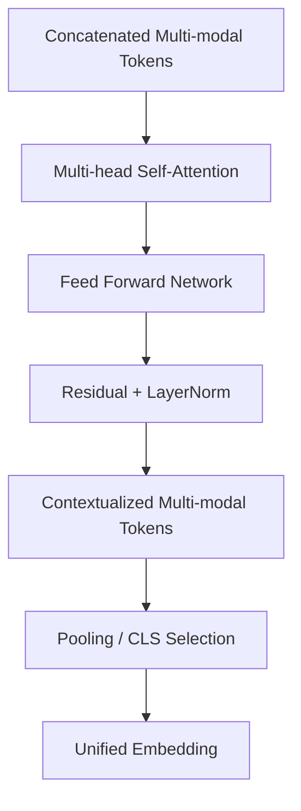
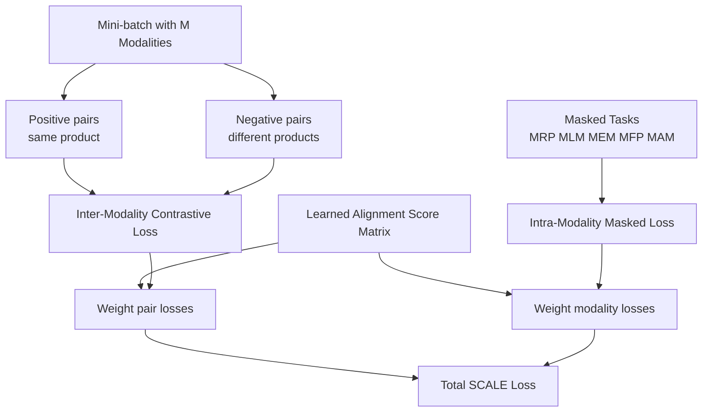
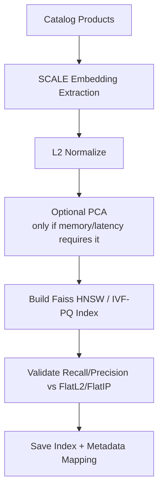
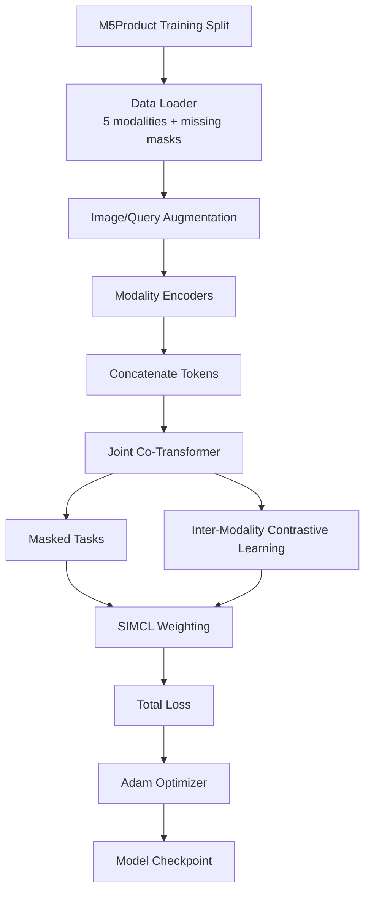
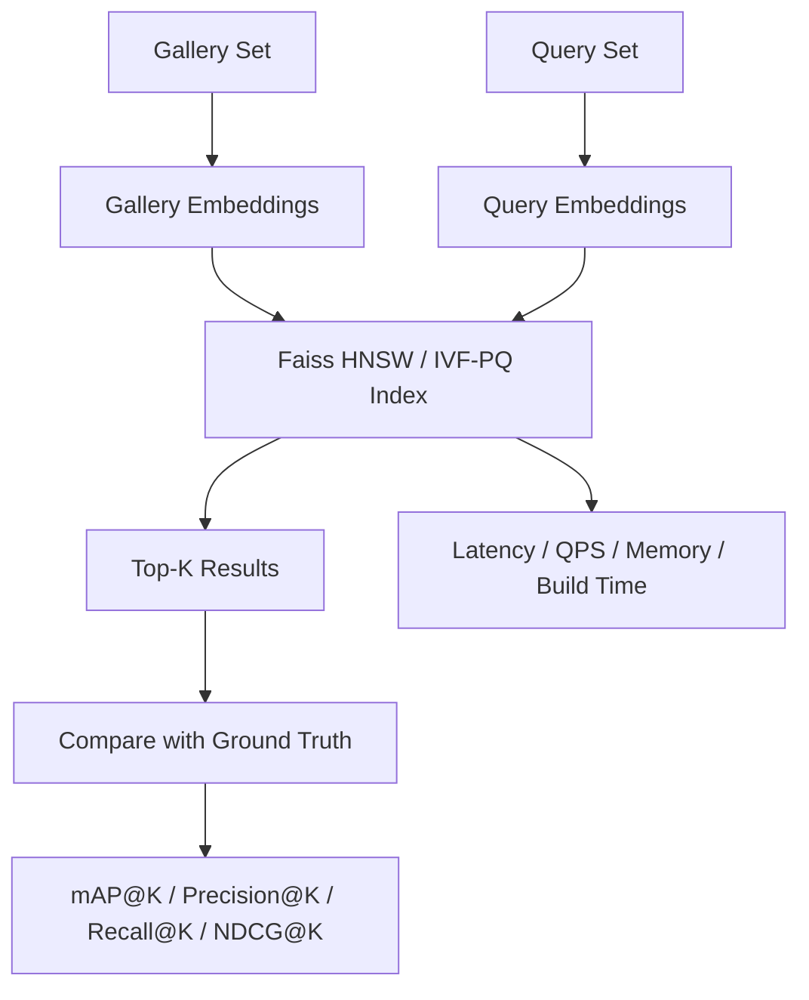
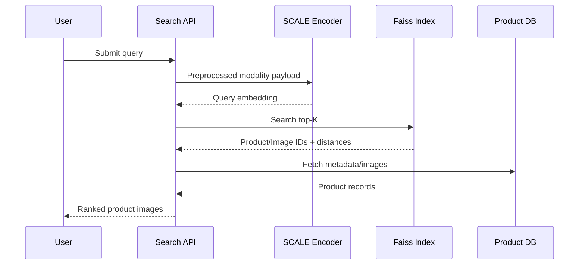

# 06. Methodology

## 6.1. Mục tiêu kỹ thuật

Phương pháp đề xuất gồm hai khối lớn:

1. **SCALE feature extractor**: biến dữ liệu sản phẩm đa phương thức thành vector embedding chung.
2. **Faiss-based retrieval index**: lưu và tìm kiếm các embedding đó để trả về top-K sản phẩm gần query nhất. Trong đó FlatL2/FlatIP là exact baseline, Faiss HNSW là index chính, Faiss IVF-PQ/OPQ-PQ là phương án khi cần nén, và ScaNN là optional benchmark.

Nói ngắn gọn: SCALE trả lời câu hỏi "query và sản phẩm có giống nhau không?", còn retrieval index trả lời câu hỏi "làm sao tìm nhanh sản phẩm giống nhất trong hàng triệu sản phẩm?".



## 6.2. Một khái niệm nền: token, feature và embedding

Trước khi đi vào từng modality, cần phân biệt ba khái niệm:

- **Raw data**: dữ liệu gốc, ví dụ ảnh `.jpg`, câu mô tả sản phẩm, bảng key-value, video `.mp4`, audio waveform.
- **Feature/token**: biểu diễn trung gian mà model đọc được. Transformer không đọc trực tiếp ảnh/video/audio thô; ta phải đổi chúng thành một chuỗi vector. Mỗi vector trong chuỗi được gọi là một token.
- **Embedding**: vector cuối cùng đại diện cho cả query hoặc cả sản phẩm. Vector này được dùng để tính similarity và đưa vào Flat baseline hoặc Faiss HNSW/IVF-PQ index.

Ví dụ với text `"white leather sneakers"`, tokenizer có thể tách thành các token như `[CLS]`, `white`, `leather`, `sneakers`, `[SEP]`; mỗi token được biến thành một vector 768 chiều. Với image, "token" không phải là word mà là region feature: vùng giày, vùng logo, vùng đế giày, vùng texture, v.v.

## 6.3. Tổng quan kiến trúc SCALE

SCALE trong paper M5Product là một kiến trúc multi-modal pretraining gồm:

1. **Modality-specific encoders**: mỗi loại dữ liệu có encoder riêng để biến dữ liệu đó thành token vectors.
2. **Concatenate tokens**: nối token của các modality thành một sequence dài.
3. **Joint Co-Transformer (JCT)**: transformer chung học quan hệ giữa token của nhiều modality.
4. **SIMCL + masked tasks**: các loss để model học alignment giữa modality và học lại phần bị che.



Theo paper M5Product/SCALE:

- Text transformer được khởi tạo từ BERT.
- Các modality transformer và fusion encoder có 6 transformer layers; tổng single-modality + multi-modal fusion là 12 layers.
- Hidden size là 768.
- Caption length tối đa là 36, table length tối đa là 64.
- Image dùng Faster R-CNN với ResNet101 pretrained trên Visual Genome để lấy 10-36 region features.
- Audio dùng MFCC.
- Missing modality được xử lý bằng zero imputation.

## 6.4. Image branch: Image Regions -> Image Transformer

### 6.4.1. Image branch là gì?

Image branch là nhánh biến ảnh sản phẩm thành một sequence các vector mô tả những vùng quan trọng trong ảnh. Thay vì đưa toàn bộ ảnh vào transformer như một ma trận pixel, SCALE dùng object/region features.

Ví dụ ảnh một đôi giày:

- Region 1: toàn bộ đôi giày.
- Region 2: logo.
- Region 3: phần đế.
- Region 4: dây giày.
- Region 5: texture da/vải.

Mỗi region được biểu diễn bằng một vector. Sequence các vector này là input cho Image Transformer.

### 6.4.2. Vì sao dùng region feature thay vì toàn ảnh?

Trong e-commerce, background, model, ánh sáng và layout ảnh có thể thay đổi mạnh. Nếu dùng toàn ảnh, model dễ học nhầm background hoặc style chụp. Region feature giúp model tập trung vào object chính và các bộ phận sản phẩm.

Paper SCALE dùng hướng **bottom-up attention**: object detector đề xuất các vùng ảnh quan trọng trước, sau đó transformer học quan hệ giữa các vùng đó.

### 6.4.3. Input và output

| Thành phần | Mô tả |
| --- | --- |
| Input raw | Ảnh sản phẩm hoặc ảnh query. |
| Detector output | `N` bounding boxes, thường chọn 10-36 vùng có objectness score cao. |
| Region feature | Vector cho mỗi vùng, ví dụ `N x d`. |
| Image transformer output | Sequence token ảnh đã được contextualize, ví dụ `N x 768`. |

### 6.4.4. Tool đề xuất

| Tool | Nguồn | Vai trò |
| --- | --- | --- |
| `airsplay/py-bottom-up-attention` | Được paper SCALE nhắc tới trong footnote. | Gần nhất với cách SCALE lấy bottom-up region features. |
| `torchvision.models.detection` | Tool ngoài, dựa trên PyTorch/TorchVision. | Dùng Faster R-CNN/ResNet-FPN để prototype object detection nếu không dùng đúng bottom-up attention code. |
| `timm` hoặc `torchvision.models` | Tool ngoài. | Dùng ResNet/ViT/Swin làm visual backbone thay thế nếu cần đơn giản hóa. |

Nếu dùng đúng tinh thần paper, lựa chọn tốt nhất là `py-bottom-up-attention`. Nếu môi trường khó cài, có thể dùng `torchvision` Faster R-CNN để lấy bounding boxes, sau đó lấy feature từ backbone hoặc ROI pooled features. Đây là thay thế thực dụng, cần ghi rõ trong báo cáo là implementation approximation.

### 6.4.5. Thiết kế thêm của nhóm

Paper nói image region extraction nhưng không mô tả chi tiết augmentation cho query thực tế. Chúng tôi bổ sung augmentation dựa trên Shopsy:

- JPEG compression.
- Random crop.
- Rotation nhẹ.
- Horizontal flip.
- Logo/watermark overlay.
- Resize quality degradation.

Mục tiêu là giảm **sensory gap** giữa ảnh catalog đẹp và ảnh query ngoài đời.

## 6.5. Text branch: Text Tokens -> Text Transformer

### 6.5.1. Text branch là gì?

Text branch biến title/caption/description thành token vectors. Ví dụ:

```text
Input text: "Bubble Matt Blind Box Storage Ladder"
Tokens: [CLS], bubble, matt, blind, box, storage, ladder, [SEP]
```

Mỗi token được ánh xạ thành vector thông qua embedding layer của BERT, sau đó đi qua Text Transformer để học ngữ cảnh.

### 6.5.2. BERT init nghĩa là gì?

SCALE không train text transformer từ con số 0. Paper dùng BERT để khởi tạo text transformer. BERT là encoder-only transformer đã học ngôn ngữ bằng masked language modeling. Vì vậy, ngay từ đầu model đã biết một phần quan hệ giữa các từ, ví dụ `leather`, `shoe`, `sneaker`, `white`, `size`.

### 6.5.3. Input và output

| Thành phần | Mô tả |
| --- | --- |
| Input raw | Product title, caption, description. |
| Tokenizer output | `input_ids`, `attention_mask`, optional `token_type_ids`. |
| Text transformer output | Sequence token text, ví dụ `L_text x 768`. |
| Vai trò | Bổ sung category, function, material, selling point mà ảnh không thể hiện rõ. |

### 6.5.4. Tool đề xuất

| Tool | Nguồn | Vai trò |
| --- | --- | --- |
| Hugging Face `transformers` | Tool ngoài, official docs. | Dùng `BertTokenizer`, `BertModel`, hoặc `AutoTokenizer/AutoModel`. |
| Google BERT checkpoint | Paper gốc BERT. | Khởi tạo text encoder. |

Ví dụ lựa chọn implementation:

```text
tokenizer = AutoTokenizer.from_pretrained("bert-base-uncased")
text_encoder = AutoModel.from_pretrained("bert-base-uncased")
```

Nếu dữ liệu có tiếng Việt hoặc đa ngôn ngữ, có thể đổi sang `bert-base-multilingual-cased` hoặc PhoBERT. Đây là thiết kế thêm của nhóm nếu dataset/query tiếng Việt xuất hiện trong demo.

## 6.6. Table branch: Table Entities -> Table Transformer

### 6.6.1. Table entities là gì?

Table trong e-commerce là thông tin có cấu trúc dạng key-value. Ví dụ:

| Key | Value |
| --- | --- |
| Item | Blind Box Ladder Storage Box |
| Brand | Tang Craftsman |
| Material | Wood |
| Color | White, Light Gray, Dark Gray |
| Applicable Scene | Study |

Một **table entity** là một đơn vị thuộc tính có nghĩa, thường là cặp `key: value`. Ví dụ `Material: Wood` là một entity, `Color: White` là một entity. Nó khác text bình thường vì key cho biết vai trò của value.

### 6.6.2. Vì sao không chỉ nối table thành text?

Nếu nối mọi thứ thành câu text, model có thể mất cấu trúc key-value. Ví dụ `white` trong `Color: White` khác với `Brand: White Label`. Table Transformer giúp model học rằng `Color`, `Brand`, `Material`, `Size`, `Applicable Scene` là các loại thuộc tính khác nhau.

### 6.6.3. Cách biểu diễn table entity

Paper SCALE nói table encoder là transformer riêng và dùng **Mask Entity Modeling (MEM)**. Paper không đưa đầy đủ code encoding table entity trong phần chính, nên chúng tôi đề xuất một serialization rõ ràng như sau:

```text
[ENT] key = material [VAL] wood [SEP]
[ENT] key = color [VAL] white [SEP]
[ENT] key = brand [VAL] tang craftsman [SEP]
```

Đây là **thiết kế thêm của nhóm**, không phải tool có sẵn từ paper. Lý do thiết kế:

- Giữ được ranh giới từng entity.
- Giữ được phân biệt key và value.
- Cho phép mask nguyên entity trong MEM.
- Dễ implement bằng tokenizer BERT hoặc tokenizer riêng.

### 6.6.4. Input và output

| Thành phần | Mô tả |
| --- | --- |
| Input raw | JSON/CSV/key-value product specification. |
| Entity sequence | Danh sách entity đã serialize. |
| Table transformer output | Sequence token/entity table, ví dụ `L_table x 768`. |
| Vai trò | Bổ sung fine-grained attributes như brand, material, color, size. |

### 6.6.5. Tool đề xuất

| Tool | Nguồn | Vai trò |
| --- | --- | --- |
| `pandas` | Tool ngoài. | Đọc CSV/JSON, normalize bảng thuộc tính. |
| Python `json` | Standard library. | Parse product attribute JSON. |
| Hugging Face tokenizer | Tool ngoài. | Tokenize chuỗi entity serialization. |

### 6.6.6. Mask Entity Modeling

Với MLM, ta mask token lẻ. Với MEM, ta mask cả entity:

```text
Before: [ENT] key = material [VAL] wood [SEP]
After:  [MASK_ENTITY]
Target: material = wood
```

Việc mask nguyên entity buộc model dùng image/text/video/audio còn lại để suy luận thuộc tính bị thiếu. Ví dụ nhìn ảnh ghế gỗ và title "wooden chair", model có thể dự đoán `Material: Wood`.

## 6.7. Video branch: Video Frames -> Video Transformer

### 6.7.1. Video branch là gì?

Video branch biến video sản phẩm thành chuỗi frame features. Một video có nhiều frame, nhưng không thể đưa toàn bộ frame vào model vì quá nặng. Ta sample một số frame đại diện, ví dụ 8 hoặc 16 frame theo thời gian.

Ví dụ video quay túi xách:

- Frame 1: mặt trước.
- Frame 2: góc nghiêng.
- Frame 3: mặt sau.
- Frame 4: cận cảnh khóa kéo.
- Frame 5: bên trong túi.

Những frame này giúp model hiểu sản phẩm ở nhiều góc nhìn.

### 6.7.2. Input và output

| Thành phần | Mô tả |
| --- | --- |
| Input raw | Video sản phẩm. |
| Frame sampler | Chọn `T` frame theo thời gian. |
| Frame feature | Vector cho từng frame hoặc region trong frame. |
| Video transformer output | Sequence video tokens, ví dụ `T x 768`. |

### 6.7.3. Tool đề xuất

| Tool | Nguồn | Vai trò |
| --- | --- | --- |
| `ffmpeg` | Tool ngoài, industry standard. | Decode video, extract frames/audio. |
| `PyAV` | Tool ngoài, Python binding cho FFmpeg libraries. | Đọc video frame trực tiếp trong Python dataloader. |
| `decord` | Tool ngoài. | Efficient video loading cho deep learning. |
| `torchvision.io` | Tool ngoài. | Đọc video cơ bản trong PyTorch ecosystem. |

### 6.7.4. Thiết kế thêm của nhóm

Paper nói "ordinal frames sampled from video are fed into video encoder" nhưng không chốt sampling policy. Chúng tôi đề xuất:

- **Uniform sampling**: lấy `T` frame cách đều toàn video, đơn giản và ổn định.
- **Middle-biased sampling**: lấy nhiều frame ở giữa video nếu video đầu/cuối có intro/outro.
- **Object-aware sampling**: nếu có detector, ưu tiên frame có object confidence cao.

Giai đoạn đầu nên dùng uniform sampling vì dễ tái lập. Object-aware sampling là hướng nâng cấp nếu video noisy.

## 6.8. Audio branch: Audio MFCC -> Audio Transformer

### 6.8.1. Audio branch là gì?

Audio branch biến tín hiệu âm thanh thành chuỗi feature theo thời gian. Trong SCALE, audio được biểu diễn bằng **MFCC - Mel-Frequency Cepstral Coefficients**.

MFCC là cách nén phổ âm thanh theo thang Mel, gần với cách tai người cảm nhận tần số. Nó thường gồm các bước:

1. Chia audio thành frame ngắn.
2. Tính phổ tần số cho từng frame.
3. Áp dụng Mel filter bank.
4. Lấy log năng lượng.
5. Dùng DCT để tạo cepstral coefficients.

### 6.8.2. Audio giúp gì cho product search?

Audio không phải modality mạnh nhất cho mọi sản phẩm, nhưng có thể hữu ích khi:

- Video sản phẩm có lời giới thiệu.
- Query là voice/audio.
- Sản phẩm có âm thanh đặc trưng, ví dụ nhạc cụ, thiết bị điện, đồ chơi.
- Audio transcript có thể bổ sung text signal.

### 6.8.3. Input và output

| Thành phần | Mô tả |
| --- | --- |
| Input raw | Audio waveform hoặc audio track từ video. |
| MFCC output | Ma trận `time_steps x n_mfcc`. |
| Projection | Linear layer đưa MFCC về hidden size 768. |
| Audio transformer output | Sequence audio tokens, ví dụ `L_audio x 768`. |

### 6.8.4. Tool đề xuất

| Tool | Nguồn | Vai trò |
| --- | --- | --- |
| `librosa.feature.mfcc` | Tool ngoài, official docs. | Tính MFCC từ waveform. |
| `torchaudio.transforms.MFCC` | Tool ngoài, PyTorch ecosystem. | Tính MFCC trực tiếp bằng tensor pipeline. |
| `ffmpeg` hoặc `PyAV` | Tool ngoài. | Tách audio track từ video. |

Nếu audio là voice query, nhóm có thể thêm ASR để chuyển speech sang text rồi đưa vào Text Transformer. Đây là hướng mở rộng, không phải thành phần bắt buộc của SCALE gốc.

## 6.9. Concatenate Tokens: nối các modality như thế nào?

Sau khi từng encoder tạo token sequence riêng, ta nối chúng thành một sequence chung:

```text
[IMG_CLS], img_1, img_2, ..., img_N,
[TXT_CLS], txt_1, txt_2, ..., txt_L,
[TAB_CLS], tab_1, tab_2, ..., tab_M,
[VID_CLS], vid_1, vid_2, ..., vid_T,
[AUD_CLS], aud_1, aud_2, ..., aud_A
```

Để JCT biết token nào thuộc modality nào, cần cộng thêm:

- **Position embedding**: token đứng ở vị trí nào trong sequence.
- **Modality/type embedding**: token thuộc image, text, table, video hay audio.
- **Attention mask**: token nào là thật, token nào là padding/missing.

Đây là phần implementation cần làm rõ khi code. Nếu thiếu modality, ví dụ query chỉ có image, ta dùng mask để JCT không chú ý vào padding token của modality khác.

## 6.10. Joint Co-Transformer (JCT)

### 6.10.1. JCT là gì?

JCT là transformer chung nhận sequence token đã nối từ nhiều modality. Nó dùng self-attention để mỗi token có thể "nhìn" các token khác, kể cả token từ modality khác.

Ví dụ:

- Token ảnh vùng "đế giày" có thể chú ý tới token text "sneaker".
- Token table `Material: leather` có thể chú ý tới vùng texture trong ảnh.
- Token video frame cận cảnh logo có thể chú ý tới text brand.
- Token audio từ lời giới thiệu có thể chú ý tới table attribute.

### 6.10.2. Vì sao JCT quan trọng?

Nếu chỉ encode từng modality riêng rồi average, model khó học quan hệ chi tiết giữa chúng. JCT cho phép cross-modal reasoning:

- Text giải thích ảnh.
- Table xác nhận thuộc tính trong ảnh.
- Video bổ sung góc nhìn ảnh không có.
- Audio/voice bổ sung intent hoặc selling point.

JCT là nơi semantic gap và modal gap được giảm mạnh nhất.

### 6.10.3. Self-attention trong JCT hoạt động thế nào?

Với mỗi token, transformer tạo ba vector `Q`, `K`, `V`:

- `Q` - query: token này đang tìm thông tin gì?
- `K` - key: token khác chứa loại thông tin nào?
- `V` - value: nội dung token khác sẽ truyền sang là gì?

Attention score giữa token `i` và token `j` được tính từ `Q_i` và `K_j`. Nếu score cao, token `i` lấy nhiều thông tin từ `V_j`.

Trong JCT, token image có thể attend tới token text/table/video/audio. Vì vậy, output của JCT không còn là feature đơn modality nữa mà là feature đã được "làm giàu" bởi các modality khác.



### 6.10.4. Output của JCT lấy embedding như thế nào?

Có ba cách phổ biến:

| Cách pooling | Mô tả | Ghi chú |
| --- | --- | --- |
| Global `[CLS]` token | Thêm một token đại diện toàn sample, lấy output token này. | Dễ dùng cho retrieval. |
| Mean pooling | Trung bình các token hợp lệ sau JCT. | Ổn nếu sequence không có CLS tốt. |
| Modality-aware pooling | Pool từng modality rồi học trọng số fusion. | Phù hợp nếu muốn giải thích modality contribution. |

Paper nói dùng fused modality features từ JCT. Trong implementation của nhóm, đề xuất dùng global `[CLS]` hoặc mean pooling ở bản đầu, sau đó thử modality-aware pooling nếu cần explainability.

## 6.11. Self-supervised masked tasks

SCALE dùng các pretext tasks để model học đặc trưng hữu ích ngay cả khi không có label thủ công.

| Task | Modality | Cách hoạt động | Vì sao hữu ích |
| --- | --- | --- | --- |
| MRP - Masked Region Prediction | Image | Che một số region image và dự đoán lại feature/label vùng đó. | Học object part và visual context. |
| MLM - Masked Language Modeling | Text | Che token text và dự đoán token bị che. | Học ngữ nghĩa title/caption. |
| MEM - Mask Entity Modeling | Table | Che nguyên entity key-value. | Học product attributes có cấu trúc. |
| MFP - Mask Frame Prediction | Video | Che frame/token video và dự đoán lại. | Học quan hệ theo thời gian/góc nhìn. |
| MAM - Mask Audio Modeling | Audio | Che audio feature và dự đoán lại. | Học pattern âm thanh/speech context. |

Paper mask 15% input. Với table, mask nguyên entity giúp model học tốt hơn so với mask từng word rời rạc.

## 6.12. Self-harmonized Inter-Modality Contrastive Learning (SIMCL)

Nếu chỉ có hai modality image-text, ta có thể dùng contrastive learning: image và text của cùng sản phẩm là positive pair, image và text của sản phẩm khác là negative pair. Nhưng với 5 modality, có nhiều cặp: image-text, image-table, image-video, text-table, video-audio, v.v. Không phải cặp nào cũng quan trọng như nhau.

SIMCL học một **modality alignment score matrix** để tự cân bằng:

- Cặp modality nào align tốt và nhiều thông tin hơn thì trọng số cao hơn.
- Cặp modality nhiễu hoặc thiếu thông tin thì trọng số thấp hơn.
- Masked task của từng modality cũng được cân bằng, tránh một modality lấn át toàn bộ training.



Tổng loss khái niệm:

```text
L_total = weighted_inter_modality_contrastive_loss
        + weighted_intra_modality_masked_loss
```

Đây là lý do SCALE phù hợp hơn cách fusion đơn giản như concatenate rồi train classifier: nó không chỉ nối dữ liệu, mà còn học mức độ tin cậy/đóng góp giữa các modality.

## 6.13. Embedding extraction

Sau khi train/finetune, ta dùng SCALE để tạo embedding:

### Catalog embedding offline

1. Load product record.
2. Đọc image/text/table/video/audio nếu có.
3. Preprocess từng modality.
4. Chạy qua modality encoders.
5. Nối token và chạy JCT.
6. Pool output thành vector embedding.
7. L2-normalize.
8. Lưu `{product_id, image_id, embedding, metadata}`.

### Query embedding online

1. Nhận query.
2. Xác định query có modality nào.
3. Preprocess modality đó.
4. Các modality thiếu được mask/zero.
5. Chạy qua SCALE.
6. L2-normalize embedding.
7. Search Flat baseline hoặc Faiss HNSW/IVF-PQ index.

L2-normalization giúp cosine similarity hoặc inner product ổn định hơn. Shopsy cũng dùng L2-normalization trước khi đưa embedding vào ANN.

## 6.14. Retrieval index: Flat baseline, Faiss HNSW, IVF-PQ và ScaNN

Khi xây dựng một hệ thống tìm kiếm ảnh sản phẩm ở quy mô thương mại điện tử, chúng ta phải đối mặt với thách thức lớn về mặt hiệu năng khi danh mục hàng hóa tăng dần lên đến hàng triệu phần tử. Nếu hệ thống vận hành theo cơ chế duyệt cạn (Exhaustive Search) tức là ép ảnh truy vấn phải đối chiếu trực tiếp với từng sản phẩm một trong cơ sở dữ liệu sẽ làm tăng tuyến tính độ trễ truy vấn theo kích thước dữ liệu, đồng thời làm giảm số lượng truy vấn xử lý được trong mỗi giây khiến người dùng phải chờ đợi lâu.

Để giải quyết vấn đề này, tầng truy hồi Retrieval Layer cần sử dụng các kỹ thuật tìm kiếm lân cận gần đúng ANN (Approximate Nearest Neighbor). Nhằm đảm bảo tính thực tế, thay vì chỉ gọi tên các giải pháp ANN một cách chung chung, hệ thống sẽ xây dựng một chiến lược cấu trúc tầng index cụ thể và phân chia rõ ràng giữa việc đo lường kiểm thử và khả năng mở rộng quy mô dữ liệu sau này.

Hệ thống truy hồi vận hành dựa trên sự phối hợp giữa các giải pháp cấu trúc dữ liệu, trong đó mỗi thành phần đảm nhận một vai trò cụ thể:

**FlatL2 / FlatIP (Exact Baseline):** Hệ thống thực hiện chuẩn hóa vector (L2 Normalization) rồi tính toán khoảng cách Euclidean hoặc tích vô hướng để tìm ra Ground Truth. Bước này giúp đánh giá chính xác năng lực trích xuất đặc trưng của mô hình SCALE mà không bị nhiễu bởi các sai số, từ đó đo lường được các thuật toán gần đúng phía sau đã đánh đổi bao nhiêu % độ chính xác (Recall/Precision loss) để lấy tốc độ.

**Faiss HNSW (Index mặc định cho Prototype/Demo):** Thuật toán này tổ chức không gian vector thành một cấu trúc đồ thị đa tầng để tối ưu quỹ đạo tìm kiếm. Hệ thống ưu tiên lựa chọn HNSW làm index mặc định trong giai đoạn đầu vì thuật toán đáp ứng các chỉ số về độ phủ và độ trễ, đồng thời không yêu cầu bước huấn luyện index, giúp luồng cập nhật dữ liệu trở nên đơn giản hơn. Các tầng đồ thị phía trên giữ mật độ liên kết thưa thớt để định hướng nhanh vùng không gian, trong khi tầng đáy chứa toàn bộ dữ liệu để thu hẹp phạm vi tìm kiếm cục bộ. Nhờ đặc tính không cần training, hệ thống có thể chèn trực tiếp vector mới vào đồ thị theo thời gian thực mà không cần xây dựng lại toàn bộ cấu trúc index từ đầu.

**Faiss IVF-PQ / OPQ-PQ (Phương án mở rộng quy mô):** Khi dung lượng dữ liệu lớn và bộ nhớ RAM trở thành bottleneck, hệ thống sẽ kích hoạt giải pháp này. Bằng cách kết hợp danh mục đảo IVF để phân cụm không gian và lượng tử hóa sản phẩm (OPQ/PQ), thuật toán tiến hành chia nhỏ vector và nén thành các mã định danh ngắn, giúp tối ưu dung lượng lưu trữ bộ nhớ. Khi truy vấn, hệ thống tính toán khoảng cách trực tiếp trên các mã định danh đã nén thông qua bảng tra cứu mà không cần giải nén.

**ScaNN (Optional Benchmark):** Giải pháp này từ Google thực hiện tìm kiếm tương đồng thông qua cơ chế lượng tử hóa vector bất đẳng hướng (Anisotropic Vector Quantization). Hệ thống thiết lập ScaNN như một module độc lập không bắt buộc nhằm mục đích thử nghiệm và kiểm chứng khả năng tối ưu QPS trên hạ tầng CPU, dựa trên kết quả thực nghiệm từ kiến trúc hệ thống Shopsy của Flipkart.

**Các giải pháp bổ trợ (Annoy, Qdrant/Milvus):** Hệ thống có thể ứng dụng Annoy để thử nghiệm nhanh ở quy mô nhỏ dựa trên cấu trúc cây phân tách không gian. Đối với Qdrant hoặc Milvus, các công cụ này sẽ được cân nhắc nếu hệ thống cần tích hợp các dịch vụ hoàn chỉnh có sẵn API và bộ lọc metadata ở cấp độ production, dù không nằm trong trọng tâm tối ưu hóa thuật toán.


|Index|Ưu điểm|Nhược điểm|Khi dùng|
|-|-|-|-|
|FlatL2 / FlatIP|Phản ánh đúng khoảng cách toán học thực tế trong không gian không nén, làm mốc chuẩn Exact Baseline để kiểm thử sai số.|Tốc độ xử lý (QPS) giảm tuyến tính khi kích thước danh mục tăng lớn, tiêu tốn nhiều tài nguyên tính toán.|Đánh giá năng lực biểu diễn của không gian embedding do mô hình SCALE tạo ra và đo lường tỷ lệ hao hụt độ chính xác của các thuật toán ANN.|
|Faiss HNSW|Đạt chỉ số độ phủ cao trên các tập dữ liệu thử nghiệm, không yêu cầu bước huấn luyện index, hỗ trợ triển khai nhanh.|Tốn RAM, cần tune `M`, `efSearch`, `efConstruction`; không tối ưu khi cần xóa vector thường xuyên.|Cấu hình làm index chính cho hệ thống chạy thử nghiệm Prototype/Demo và các bài kiểm tra hiệu năng ban đầu.|
|Faiss IVF-PQ / OPQ-PQ|Giảm dung lượng bộ nhớ RAM bằng cơ chế nén vector, hỗ trợ mở rộng quy mô khi số lượng phần tử tăng lên.|Bắt buộc phải thực hiện bước huấn luyện trên tập dữ liệu mẫu, có thể giảm một phần precision, cần tune `nlist`, `nprobe`, PQ code size.|Sử dụng khi bộ nhớ vật lý chạm ngưỡng giới hạn bottleneck hoặc khi kích thước danh mục sản phẩm tăng lớn lên quy mô hàng triệu phần tử.|
|ScaNN|Tối ưu vector similarity search bằng pruning/quantization, đạt chỉ số QPS cao trên hạ tầng CPU.|Quy trình thiết lập môi trường phức tạp, phụ thuộc chặt chẽ vào hệ điều hành và phiên bản thư viện hỗ trợ. Không bắt buộc phải là một dependency cốt lõi của hệ thống.|Sử dụng làm Optional benchmark để thu thập và đối chiếu số liệu hiệu năng với cấu trúc đồ thị của Faiss HNSW.|
|Annoy|Cấu trúc dữ liệu dựa trên cây chia không gian đơn giản, dễ cài đặt, thời gian nạp index vào bộ nhớ nhanh.|Thời gian xây dựng index (Build time) dài; tốc độ tìm kiếm và độ chính xác bị giới hạn so với HNSW hoặc ScaNN khi kích thước dữ liệu tăng lên.|Phục vụ quá trình hiện thực hóa luồng xử lý cơ bản hoặc xây dựng prototype nhanh ở giai đoạn đầu.|

Dựa trên kết quả thực nghiệm từ kiến trúc hệ thống Shopsy của Flipkart với quy mô 3 triệu ảnh sản phẩm, các giải pháp lượng tử hóa và đồ thị như ScaNN và HNSW đạt chỉ số Precision@4 tương đương với FlatL2 nhưng mang lại tốc độ QPS cao hơn nhiều lần. Thống nhất lộ trình triển khai thực nghiệm tầng truy hồi theo thứ tự ưu tiên như sau:

- **FlatL2 / FlatIP**: Làm exact baseline để xác định trần chất lượng tối đa của không gian embedding do mô hình SCALE tạo ra.
- **Faiss HNSW**: Làm retrieval index mặc định cho hệ thống tìm kiếm thời gian thực để chứng minh hiệu năng về latency và recall trên môi trường demo.
- **Faiss IVF-PQ / OPQ-PQ**: Tiến hành huấn luyện và cấu hình song song để làm phương án dự phòng tối ưu tài nguyên bộ nhớ khi catalog tăng trưởng.
- **ScaNN**: Triển khai làm module đối soát độc lập để thu thập và so sánh số liệu hiệu năng với Faiss HNSW trên cùng một cấu hình CPU nếu môi trường hỗ trợ tốt.

## 6.15. Index building pipeline



Nếu embedding dimension lớn và index memory cao, có thể áp dụng PCA giống Shopsy. Với SCALE hidden size 768, PCA cần được kiểm tra thực nghiệm: chỉ giữ nếu giảm memory/latency mà không làm mất nhiều Precision@K.

## 6.16. Training workflow



Training chia thành:

- **Pretraining**: self-supervised masked tasks + SIMCL trên dữ liệu lớn.
- **Finetuning**: dùng subset retrieval/classification nếu có label category/instance.
- **Embedding export**: freeze model tốt nhất và export gallery/query embedding.

## 6.17. Testing and evaluation workflow



Model quality được đo bằng retrieval metrics. System quality được đo bằng latency, QPS, memory footprint và index build/update time.

## 6.18. Serving design

Online serving gồm:

1. Query API nhận file hoặc payload.
2. Preprocessor chuẩn hóa modality.
3. SCALE inference tạo query embedding.
4. ANN service trả về candidate IDs.
5. Metadata service map IDs sang image/product.
6. Optional reranker sắp xếp lại bằng business rules hoặc score kết hợp.



## 6.19. Rủi ro và hướng xử lý

| Rủi ro | Nguyên nhân | Hướng xử lý |
| --- | --- | --- |
| Query chỉ có image nhưng model train nhiều modality | Modal mismatch giữa train và serve. | Missing modality mask/zero imputation, train với random modality dropout. |
| Semantic sai dù ảnh giống | Embedding quá thiên về texture. | Tăng trọng số text/table, finetune bằng category/instance labels. |
| Approximate index giảm recall | Approximation/quantization quá mạnh. | So sánh với FlatL2/FlatIP, tune Faiss HNSW hoặc IVF-PQ, dùng rerank top-N bằng exact distance. |
| Latency cao | SCALE inference nặng. | Cache embedding, batch offline, dùng model distillation/ONNX/TensorRT nếu cần. |
| Catalog update | Product mới cần embedding và index update. | Incremental index hoặc rebuild định kỳ theo batch. |

## 6.20. Summary

SCALE + Faiss-based retrieval phù hợp với đề tài vì SCALE học representation chung cho 5 modality và tự cân bằng đóng góp giữa các modality, còn Flat/HNSW/IVF-PQ biến embedding đó thành hệ thống truy hồi có thể đo đạc và mở rộng. Điểm cần nhấn mạnh là mỗi block trong kiến trúc đều có vai trò cụ thể: image branch học vùng sản phẩm, text branch học mô tả, table branch học thuộc tính có cấu trúc, video branch học góc nhìn theo thời gian, audio branch học tín hiệu âm thanh/voice, JCT học quan hệ giữa tất cả token, SIMCL học cách cân bằng modality, và Faiss HNSW/IVF-PQ phục vụ truy hồi top-K ở quy mô lớn.
