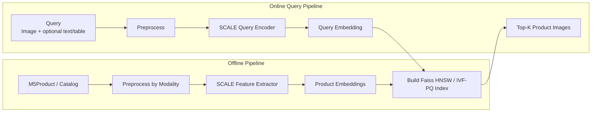
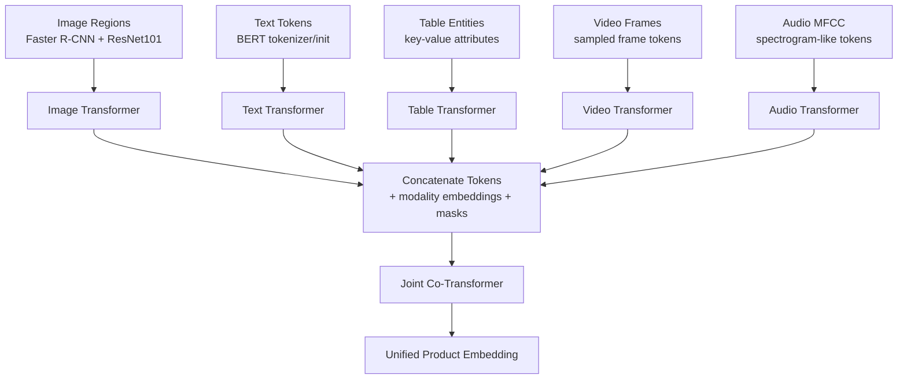
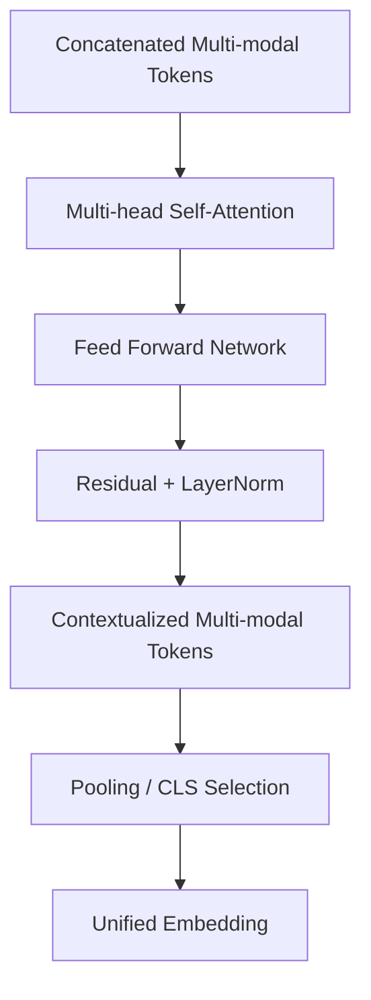
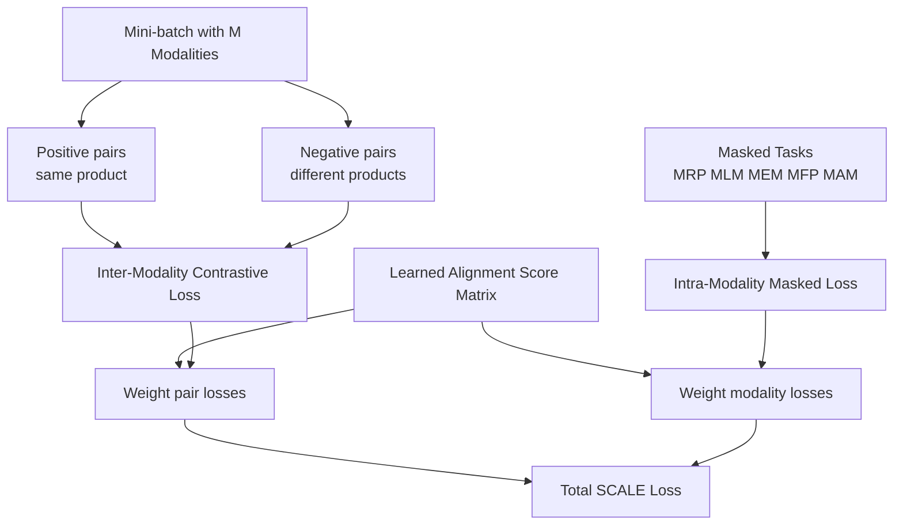
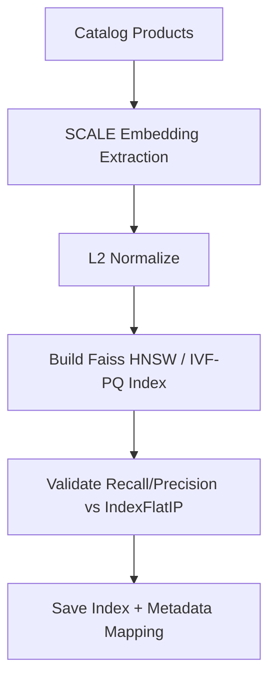
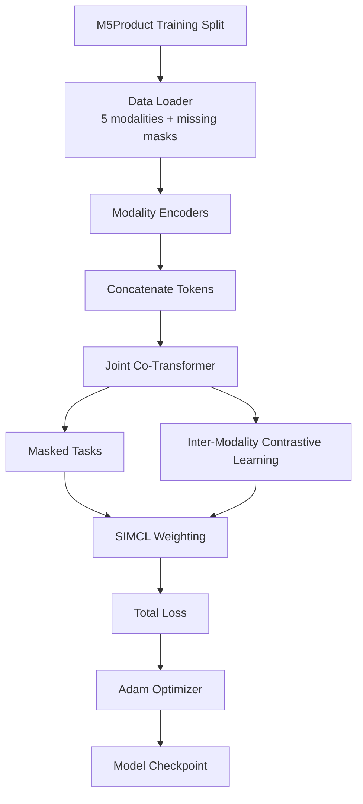
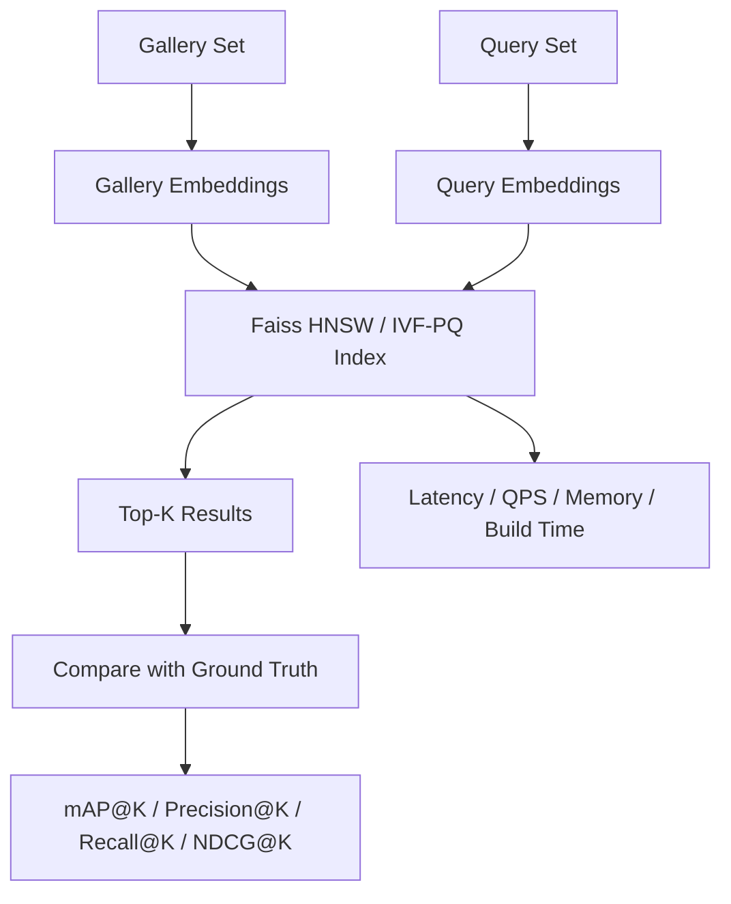
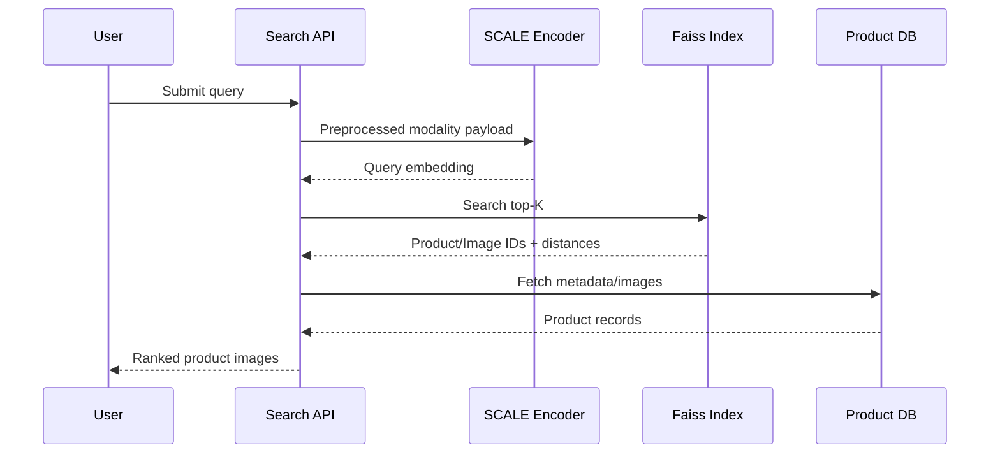

# 07. Methodology

## 7.1. Mục tiêu kỹ thuật

Phương pháp đề xuất gồm hai khối lớn:

1. **SCALE feature extractor**: biến dữ liệu sản phẩm đa phương thức thành vector embedding chung.
2. **Faiss-based retrieval index**: lưu và tìm kiếm các embedding đó để trả về top-K product entry gần query nhất. `IndexFlatIP` là exact baseline trên vector đã chuẩn hóa, Faiss HNSW là index chính, còn IVF-PQ/OPQ-PQ là phương án nén khi cần.

Nói ngắn gọn: SCALE trả lời câu hỏi "query và sản phẩm có giống nhau không?", còn retrieval index trả lời câu hỏi "làm sao tìm nhanh sản phẩm giống nhất trong hàng triệu sản phẩm?".



## 7.2. Một khái niệm nền: token, feature và embedding

Trước khi đi vào từng modality, cần phân biệt ba khái niệm:

- **Raw data**: dữ liệu gốc, ví dụ ảnh `.jpg`, câu mô tả sản phẩm, bảng key-value, video `.mp4`, audio waveform.
- **Feature/token**: biểu diễn trung gian mà model đọc được. Transformer không đọc trực tiếp ảnh/video/audio thô; ta phải đổi chúng thành một chuỗi vector. Mỗi vector trong chuỗi được gọi là một token.
- **Embedding**: vector cuối cùng đại diện cho cả query hoặc cả sản phẩm. Vector này được dùng để tính similarity và đưa vào Flat baseline hoặc Faiss HNSW/IVF-PQ index.

Ví dụ với text `"white leather sneakers"`, tokenizer có thể tách thành các token như `[CLS]`, `white`, `leather`, `sneakers`, `[SEP]`; mỗi token được biến thành một vector 768 chiều. Với image, "token" không phải là word mà là region feature: vùng giày, vùng logo, vùng đế giày, vùng texture, v.v.

## 7.3. Tổng quan kiến trúc SCALE

SCALE trong paper M5Product là một kiến trúc multi-modal pretraining gồm:

1. **Modality-specific encoders**: mỗi loại dữ liệu có encoder riêng để biến dữ liệu đó thành token vectors.
2. **Concatenate tokens**: nối token của các modality thành một sequence dài.
3. **Joint Co-Transformer (JCT)**: transformer chung học quan hệ giữa token của nhiều modality.
4. **SIMCL + masked tasks**: các loss để model học alignment giữa modality và học lại phần bị che.



Theo paper M5Product/SCALE:

- Text transformer được khởi tạo từ BERT.
- Các modality transformer và fusion encoder có 6 transformer layers; tổng single-modality + multi-modal fusion là 12 layers.
- Hidden size là 768.
- Caption length tối đa là 36, table length tối đa là 64.
- Image dùng Faster R-CNN với ResNet101 pretrained trên Visual Genome để lấy 10-36 region features.
- Audio dùng MFCC.
- Missing modality được xử lý bằng zero imputation.

## 7.4. Image branch: Image Regions -> Image Transformer

### 7.4.1. Image branch là gì?

Image branch là nhánh biến ảnh sản phẩm thành một sequence các vector mô tả những vùng quan trọng trong ảnh. Thay vì đưa toàn bộ ảnh vào transformer như một ma trận pixel, SCALE dùng object/region features.

Ví dụ ảnh một đôi giày:

- Region 1: toàn bộ đôi giày.
- Region 2: logo.
- Region 3: phần đế.
- Region 4: dây giày.
- Region 5: texture da/vải.

Mỗi region được biểu diễn bằng một vector. Sequence các vector này là input cho Image Transformer.

### 7.4.2. Vì sao dùng region feature thay vì toàn ảnh?

Trong e-commerce, background, model, ánh sáng và layout ảnh có thể thay đổi mạnh. Nếu dùng toàn ảnh, model dễ học nhầm background hoặc style chụp. Region feature giúp model tập trung vào object chính và các bộ phận sản phẩm.

Paper SCALE dùng hướng **bottom-up attention**: object detector đề xuất các vùng ảnh quan trọng trước, sau đó transformer học quan hệ giữa các vùng đó.

### 7.4.3. Input và output

| Thành phần | Mô tả |
| --- | --- |
| Input raw | Ảnh sản phẩm hoặc ảnh query. |
| Detector output | `N` bounding boxes, thường chọn 10-36 vùng có objectness score cao. |
| Region feature | Vector cho mỗi vùng, ví dụ `N x d`. |
| Image transformer output | Sequence token ảnh đã được contextualize, ví dụ `N x 768`. |

### 7.4.4. Tool đề xuất

| Tool | Nguồn | Vai trò |
| --- | --- | --- |
| `airsplay/py-bottom-up-attention` | Được paper SCALE nhắc tới trong footnote. | Gần nhất với cách SCALE lấy bottom-up region features. |
| `torchvision.models.detection` | Tool ngoài, dựa trên PyTorch/TorchVision. | Dùng Faster R-CNN/ResNet-FPN để prototype object detection nếu không dùng đúng bottom-up attention code. |
| `timm` hoặc `torchvision.models` | Tool ngoài. | Dùng ResNet/ViT/Swin làm visual backbone thay thế nếu cần đơn giản hóa. |

Nếu dùng đúng tinh thần paper, lựa chọn tốt nhất là `py-bottom-up-attention`. Nếu môi trường khó cài, có thể dùng `torchvision` Faster R-CNN để lấy bounding boxes, sau đó lấy feature từ backbone hoặc ROI pooled features. Đây là thay thế thực dụng, cần ghi rõ trong báo cáo là implementation approximation.

## 7.5. Text branch: Text Tokens -> Text Transformer

### 7.5.1. Text branch là gì?

Text branch biến title/caption/description thành token vectors. Ví dụ:

```text
Input text: "Bubble Matt Blind Box Storage Ladder"
Tokens: [CLS], bubble, matt, blind, box, storage, ladder, [SEP]
```

Mỗi token được ánh xạ thành vector thông qua embedding layer của BERT, sau đó đi qua Text Transformer để học ngữ cảnh.

### 7.5.2. BERT init nghĩa là gì?

SCALE không train text transformer từ con số 0. Paper dùng BERT để khởi tạo text transformer. BERT là encoder-only transformer đã học ngôn ngữ bằng masked language modeling. Vì vậy, ngay từ đầu model đã biết một phần quan hệ giữa các từ, ví dụ `leather`, `shoe`, `sneaker`, `white`, `size`.

### 7.5.3. Input và output

| Thành phần | Mô tả |
| --- | --- |
| Input raw | Product title, caption, description. |
| Tokenizer output | `input_ids`, `attention_mask`, optional `token_type_ids`. |
| Text transformer output | Sequence token text, ví dụ `L_text x 768`. |
| Vai trò | Bổ sung category, function, material, selling point mà ảnh không thể hiện rõ. |

### 7.5.4. Tool đề xuất

| Tool | Nguồn | Vai trò |
| --- | --- | --- |
| Hugging Face `transformers` | Tool ngoài, official docs. | Dùng `BertTokenizer`, `BertModel`, hoặc `AutoTokenizer/AutoModel`. |
| Google BERT checkpoint | Paper gốc BERT. | Khởi tạo text encoder. |

Ví dụ lựa chọn implementation:

```text
tokenizer = AutoTokenizer.from_pretrained("bert-base-uncased")
text_encoder = AutoModel.from_pretrained("bert-base-uncased")
```

## 7.6. Table branch: Table Entities -> Table Transformer

### 7.6.1. Table entities là gì?

Table trong e-commerce là thông tin có cấu trúc dạng key-value. Ví dụ:

| Key | Value |
| --- | --- |
| Item | Blind Box Ladder Storage Box |
| Brand | Tang Craftsman |
| Material | Wood |
| Color | White, Light Gray, Dark Gray |
| Applicable Scene | Study |

Một **table entity** là một đơn vị thuộc tính có nghĩa, thường là cặp `key: value`. Ví dụ `Material: Wood` là một entity, `Color: White` là một entity. Nó khác text bình thường vì key cho biết vai trò của value.

### 7.6.2. Vì sao không chỉ nối table thành text?

Nếu nối mọi thứ thành câu text, model có thể mất cấu trúc key-value. Ví dụ `white` trong `Color: White` khác với `Brand: White Label`. Table Transformer giúp model học rằng `Color`, `Brand`, `Material`, `Size`, `Applicable Scene` là các loại thuộc tính khác nhau.

### 7.6.3. Cách biểu diễn table entity

Paper SCALE dùng table transformer riêng và **Mask Entity Modeling (MEM)**, nhưng không công bố chi tiết serialization table trong phần chính. Chi tiết encoding table sẽ được quyết định khi hiện thực và ghi riêng trong báo cáo thực nghiệm; nó không được xem là một thành phần đã xác định của SCALE gốc.

### 7.6.4. Input và output

| Thành phần | Mô tả |
| --- | --- |
| Input raw | JSON/CSV/key-value product specification. |
| Entity sequence | Danh sách entity đã serialize. |
| Table transformer output | Sequence token/entity table, ví dụ `L_table x 768`. |
| Vai trò | Bổ sung fine-grained attributes như brand, material, color, size. |

### 7.6.5. Tool đề xuất

| Tool | Nguồn | Vai trò |
| --- | --- | --- |
| `pandas` | Tool ngoài. | Đọc CSV/JSON, normalize bảng thuộc tính. |
| Python `json` | Standard library. | Parse product attribute JSON. |
| Hugging Face tokenizer | Tool ngoài. | Tokenize chuỗi entity serialization. |

### 7.6.6. Mask Entity Modeling

Với MLM, ta mask token lẻ. Với MEM, ta mask cả entity:

```text
Before: [ENT] key = material [VAL] wood [SEP]
After:  [MASK_ENTITY]
Target: material = wood
```

Việc mask nguyên entity buộc model dùng image/text/video/audio còn lại để suy luận thuộc tính bị thiếu. Ví dụ nhìn ảnh ghế gỗ và title "wooden chair", model có thể dự đoán `Material: Wood`.

## 7.7. Video branch: Video Frames -> Video Transformer

### 7.7.1. Video branch là gì?

Video branch biến video sản phẩm thành chuỗi frame features. Một video có nhiều frame, nhưng không thể đưa toàn bộ frame vào model vì quá nặng. Ta sample một số frame đại diện, ví dụ 8 hoặc 16 frame theo thời gian.

Ví dụ video quay túi xách:

- Frame 1: mặt trước.
- Frame 2: góc nghiêng.
- Frame 3: mặt sau.
- Frame 4: cận cảnh khóa kéo.
- Frame 5: bên trong túi.

Những frame này giúp model hiểu sản phẩm ở nhiều góc nhìn.

### 7.7.2. Input và output

| Thành phần | Mô tả |
| --- | --- |
| Input raw | Video sản phẩm. |
| Frame sampler | Chọn `T` frame theo thời gian. |
| Frame feature | Vector cho từng frame hoặc region trong frame. |
| Video transformer output | Sequence video tokens, ví dụ `T x 768`. |

### 7.7.3. Tool đề xuất

| Tool | Nguồn | Vai trò |
| --- | --- | --- |
| `ffmpeg` | Tool ngoài, industry standard. | Decode video, extract frames/audio. |
| `PyAV` | Tool ngoài, Python binding cho FFmpeg libraries. | Đọc video frame trực tiếp trong Python dataloader. |
| `decord` | Tool ngoài. | Efficient video loading cho deep learning. |
| `torchvision.io` | Tool ngoài. | Đọc video cơ bản trong PyTorch ecosystem. |

## 7.8. Audio branch: Audio MFCC -> Audio Transformer

### 7.8.1. Audio branch là gì?

Audio branch biến tín hiệu âm thanh thành chuỗi feature theo thời gian. Trong SCALE, audio được biểu diễn bằng **MFCC - Mel-Frequency Cepstral Coefficients**.

MFCC là cách nén phổ âm thanh theo thang Mel, gần với cách tai người cảm nhận tần số. Nó thường gồm các bước:

1. Chia audio thành frame ngắn.
2. Tính phổ tần số cho từng frame.
3. Áp dụng Mel filter bank.
4. Lấy log năng lượng.
5. Dùng DCT để tạo cepstral coefficients.

### 7.8.2. Audio giúp gì cho product search?

Audio không phải modality mạnh nhất cho mọi sản phẩm, nhưng có thể hữu ích khi:

- Video sản phẩm có lời giới thiệu.
- Sản phẩm có âm thanh đặc trưng, ví dụ nhạc cụ, thiết bị điện, đồ chơi.
- Audio transcript có thể bổ sung text signal.

### 7.8.3. Input và output

| Thành phần | Mô tả |
| --- | --- |
| Input raw | Audio waveform hoặc audio track từ video. |
| MFCC output | Ma trận `time_steps x n_mfcc`. |
| Projection | Linear layer đưa MFCC về hidden size 768. |
| Audio transformer output | Sequence audio tokens, ví dụ `L_audio x 768`. |

### 7.8.4. Tool đề xuất

| Tool | Nguồn | Vai trò |
| --- | --- | --- |
| `librosa.feature.mfcc` | Tool ngoài, official docs. | Tính MFCC từ waveform. |
| `torchaudio.transforms.MFCC` | Tool ngoài, PyTorch ecosystem. | Tính MFCC trực tiếp bằng tensor pipeline. |
| `ffmpeg` hoặc `PyAV` | Tool ngoài. | Tách audio track từ video. |

## 7.9. Concatenate Tokens: nối các modality như thế nào?

Sau khi từng encoder tạo token sequence riêng, ta nối chúng thành một sequence chung:

```text
[IMG_CLS], img_1, img_2, ..., img_N,
[TXT_CLS], txt_1, txt_2, ..., txt_L,
[TAB_CLS], tab_1, tab_2, ..., tab_M,
[VID_CLS], vid_1, vid_2, ..., vid_T,
[AUD_CLS], aud_1, aud_2, ..., aud_A
```

Để JCT biết token nào thuộc modality nào, cần cộng thêm:

- **Position embedding**: token đứng ở vị trí nào trong sequence.
- **Modality/type embedding**: token thuộc image, text, table, video hay audio.
- **Attention mask**: token nào là thật, token nào là padding/missing.

Đây là phần implementation cần làm rõ khi code. Nếu thiếu modality, ví dụ query chỉ có image, ta dùng mask để JCT không chú ý vào padding token của modality khác.

## 7.10. Joint Co-Transformer (JCT)

### 7.10.1. JCT là gì?

JCT là transformer chung nhận sequence token đã nối từ nhiều modality. Nó dùng self-attention để mỗi token có thể "nhìn" các token khác, kể cả token từ modality khác.

Ví dụ:

- Token ảnh vùng "đế giày" có thể chú ý tới token text "sneaker".
- Token table `Material: leather` có thể chú ý tới vùng texture trong ảnh.
- Token video frame cận cảnh logo có thể chú ý tới text brand.
- Token audio từ lời giới thiệu có thể chú ý tới table attribute.

### 7.10.2. Vì sao JCT quan trọng?

Nếu chỉ encode từng modality riêng rồi average, model khó học quan hệ chi tiết giữa chúng. JCT cho phép cross-modal reasoning:

- Text giải thích ảnh.
- Table xác nhận thuộc tính trong ảnh.
- Video bổ sung góc nhìn ảnh không có.
- Audio/voice bổ sung intent hoặc selling point.

JCT là nơi semantic gap và việc liên kết thông tin đa phương thức được cải thiện mạnh nhất.

### 7.10.3. Self-attention trong JCT hoạt động thế nào?

Với mỗi token, transformer tạo ba vector `Q`, `K`, `V`:

- `Q` - query: token này đang tìm thông tin gì?
- `K` - key: token khác chứa loại thông tin nào?
- `V` - value: nội dung token khác sẽ truyền sang là gì?

Attention score giữa token `i` và token `j` được tính từ `Q_i` và `K_j`. Nếu score cao, token `i` lấy nhiều thông tin từ `V_j`.

Trong JCT, token image có thể attend tới token text/table/video/audio. Vì vậy, output của JCT không còn là feature đơn modality nữa mà là feature đã được "làm giàu" bởi các modality khác.



### 7.10.4. Output của JCT lấy embedding như thế nào?

Paper sử dụng fused modality features từ JCT cho downstream task nhưng không quy định một pooling rule duy nhất trong phần chính. Pooling rule được chọn cho pipeline retrieval cần được ghi rõ và kiểm chứng bằng ablation.

## 7.11. Self-supervised masked tasks

SCALE dùng các pretext tasks để model học đặc trưng hữu ích ngay cả khi không có label thủ công.

| Task | Modality | Cách hoạt động | Vì sao hữu ích |
| --- | --- | --- | --- |
| MRP - Masked Region Prediction | Image | Che một số region image và dự đoán lại feature/label vùng đó. | Học object part và visual context. |
| MLM - Masked Language Modeling | Text | Che token text và dự đoán token bị che. | Học ngữ nghĩa title/caption. |
| MEM - Mask Entity Modeling | Table | Che nguyên entity key-value. | Học product attributes có cấu trúc. |
| MFP - Mask Frame Prediction | Video | Che frame/token video và dự đoán lại. | Học quan hệ theo thời gian/góc nhìn. |
| MAM - Mask Audio Modeling | Audio | Che audio feature và dự đoán lại. | Học pattern âm thanh/speech context. |

Paper mask 15% input. Với table, mask nguyên entity giúp model học tốt hơn so với mask từng word rời rạc.

## 7.12. Self-harmonized Inter-Modality Contrastive Learning (SIMCL)

Nếu chỉ có hai modality image-text, ta có thể dùng contrastive learning: image và text của cùng sản phẩm là positive pair, image và text của sản phẩm khác là negative pair. Nhưng với 5 modality, có nhiều cặp: image-text, image-table, image-video, text-table, video-audio, v.v. Không phải cặp nào cũng quan trọng như nhau.

SIMCL học một **modality alignment score matrix** để tự cân bằng:

- Cặp modality nào align tốt và nhiều thông tin hơn thì trọng số cao hơn.
- Cặp modality nhiễu hoặc thiếu thông tin thì trọng số thấp hơn.
- Masked task của từng modality cũng được cân bằng, tránh một modality lấn át toàn bộ training.

Trong paper, alignment score matrix được học như tham số tự do; phần tam giác trên được dùng để weighting các inter-modality contrastive loss, còn phần đường chéo weighting intra-modality masked loss. Vì vậy SIMCL là cơ chế weighting loss, không phải bộ chọn modality động ở inference.



Tổng loss khái niệm:

```text
L_total = weighted_inter_modality_contrastive_loss
        + weighted_intra_modality_masked_loss
```

Đây là lý do SCALE phù hợp hơn cách fusion đơn giản như concatenate rồi train classifier: nó không chỉ nối dữ liệu, mà còn học mức độ tin cậy/đóng góp giữa các modality.

## 7.13. Embedding extraction

Sau khi train/finetune, ta dùng SCALE để tạo embedding:

### Catalog embedding offline

1. Load product record.
2. Đọc image/text/table/video/audio nếu có.
3. Preprocess từng modality.
4. Chạy qua modality encoders.
5. Nối token và chạy JCT.
6. Pool output thành vector embedding.
7. L2-normalize.
8. Lưu `{product_id, image_id, embedding, metadata}`.

### Query embedding online

1. Nhận query.
2. Xác định query có modality nào.
3. Preprocess modality đó.
4. Các modality thiếu được mask/zero.
5. Chạy qua SCALE.
6. L2-normalize embedding.
7. Search Flat baseline hoặc Faiss HNSW/IVF-PQ index.

L2-normalization giúp cosine similarity hoặc inner product ổn định hơn. Shopsy cũng dùng L2-normalization trước khi đưa embedding vào ANN.

## 7.14. Retrieval index: Flat baseline, Faiss HNSW và IVF-PQ

Tầng retrieval nhận embedding của ảnh query và tìm top-K embedding gần nhất trong gallery product entry. Embedding gallery được tạo offline, lưu cùng `product_id`, ảnh đại diện và metadata; khi truy vấn, hệ thống chỉ tính embedding query rồi gọi index. Thiết kế này tách chi phí feature extraction khỏi latency của retrieval.

### 7.14.1. Chuẩn hóa vector và exact baseline

Trước khi index, query embedding và gallery embedding đều được L2-normalize. Retrieval chính dùng inner product, vì với vector đã chuẩn hóa thứ hạng theo inner product tương đương cosine similarity. `IndexFlatIP` duyệt toàn bộ gallery nên là exact baseline: top-K của nó được đối chiếu với nhãn đánh giá để đo chất lượng representation, đồng thời làm mốc tính recall loss của index ANN. `IndexFlatL2` chỉ dùng để kiểm tra tính nhất quán của metric khi cần, không phải một index triển khai riêng.

### 7.14.2. Faiss HNSW: index chính

Prototype sử dụng `IndexHNSWFlat` với inner product trên embedding đã chuẩn hóa. HNSW không cần train index; mỗi embedding mới có thể được thêm cùng `product_id` qua lớp mapping ID. Ba tham số được tune trên validation set:

- `M`: số liên kết của mỗi node, ảnh hưởng memory và recall.
- `efConstruction`: độ rộng tìm kiếm khi xây graph, ảnh hưởng build time và chất lượng graph.
- `efSearch`: độ rộng tìm kiếm khi query, là núm điều chỉnh chính cho trade-off latency–recall.

HNSW phù hợp cho demo vì pipeline add vector đơn giản và latency thấp. Tuy nhiên, record bị xóa hoặc thay ảnh không nên chỉnh trực tiếp trong graph: hệ thống đánh dấu `product_id` không còn hiệu lực ở metadata mapping, lọc kết quả trước khi trả về, và rebuild index theo batch khi lượng thay đổi tích lũy vượt ngưỡng đã đặt.

### 7.14.3. IVF-PQ/OPQ-PQ: phương án nén

Khi memory của HNSW không còn phù hợp với kích thước gallery, hệ thống chuyển sang IVF-PQ. IVF phân cụm embedding thành `nlist` cell; khi query chỉ duyệt `nprobe` cell gần nhất. PQ nén mỗi vector thành mã PQ, còn OPQ là phép xoay không gian tùy chọn trước PQ để giảm sai số lượng tử hóa.

IVF-PQ phải được train trên một mẫu gallery đại diện trước khi add toàn bộ vector. Các tham số `nlist`, `nprobe`, số subquantizer `m` và số bit mỗi mã được chọn bằng validation benchmark; cấu hình được chấp nhận khi đạt memory budget và recall loss so với `IndexFlatIP` phù hợp với mục tiêu demo. IVF-PQ không thay thế HNSW trong bản đầu, mà là phương án scale khi benchmark cho thấy HNSW vượt memory budget.

### 7.14.4. Quy trình benchmark và cập nhật index

Mỗi cấu hình chạy trên cùng gallery, cùng embedding, cùng hardware và cùng tập query. Báo cáo gồm Recall@K so với `IndexFlatIP`, query latency, QPS, build time và memory footprint. Với catalog update, embedding mới được tạo offline; HNSW add tăng dần, còn IVF-PQ add sau khi index đã train. Mỗi lần rebuild phải tạo version mới của index và metadata mapping, kiểm tra trên validation set rồi mới thay thế version đang phục vụ.

| Thành phần | Vai trò trong hệ thống | Điều kiện sử dụng |
| --- | --- | --- |
| `IndexFlatIP` | Exact baseline trên vector L2-normalize. | Luôn chạy trên subset/benchmark để đo representation quality và recall loss. |
| `IndexHNSWFlat` | Index ANN mặc định cho demo. | Dùng khi memory đáp ứng và cần latency thấp. |
| IVF-PQ/OPQ-PQ | Index ANN nén. | Dùng khi benchmark cho thấy HNSW vượt memory budget. |

## 7.15. Index building pipeline



## 7.16. Training workflow



Training chia thành:

- **Pretraining**: self-supervised masked tasks + SIMCL trên dữ liệu lớn.
- **Finetuning**: dùng subset retrieval/classification nếu có label category/instance.
- **Embedding export**: freeze model tốt nhất và export gallery/query embedding.

Để tái lập paper, cấu hình tham chiếu là batch size 64, 5 epochs, Adam với warm-up learning rate `1e-4`; chỉ thay đổi khi giới hạn GPU hoặc subset dữ liệu buộc phải điều chỉnh. Mọi thay đổi cấu hình của nhóm phải được ghi riêng trong thực nghiệm.

## 7.17. Testing and evaluation workflow



Model quality được đo bằng retrieval metrics. System quality được đo bằng latency, QPS, memory footprint và index build/update time.

## 7.18. Serving design

Online serving gồm:

1. Query API nhận file hoặc payload.
2. Preprocessor chuẩn hóa modality.
3. SCALE inference tạo query embedding.
4. ANN service trả về candidate IDs.
5. Metadata service map IDs sang image/product.
6. Optional reranker sắp xếp lại bằng business rules hoặc score kết hợp.



## 7.19. Rủi ro và hướng xử lý

| Rủi ro | Nguyên nhân | Hướng xử lý |
| --- | --- | --- |
| Query chỉ có image nhưng model train nhiều modality | Modal mismatch giữa train và serve. | Missing modality mask/zero imputation theo SCALE. |
| Semantic sai dù ảnh giống | Embedding quá thiên về texture. | Tăng trọng số text/table, finetune bằng category/instance labels. |
| Approximate index giảm recall | Approximation/quantization quá mạnh. | So sánh với `IndexFlatIP`, tune Faiss HNSW hoặc IVF-PQ, dùng rerank top-N bằng exact distance. |
| Latency cao | SCALE inference nặng. | Cache embedding, batch offline, dùng model distillation/ONNX/TensorRT nếu cần. |
| Catalog update | Product mới cần embedding và index update. | Incremental index hoặc rebuild định kỳ theo batch. |

## 7.20. Phương pháp giải quyết các thách thức thực hiện

Mỗi thách thức được xử lý ở một tầng khác nhau. SCALE và M5Product giúp model tạo embedding tốt hơn; Faiss giúp tìm kiếm nhanh; re-ranking ở Mục 08 chỉ sắp xếp lại các kết quả đã tìm được. Vì vậy, không có một thành phần nào giải quyết toàn bộ vấn đề.

### 7.20.1. Sensory Gap

**Vấn đề:** ảnh query có thể tối, bị crop hoặc có background khác ảnh catalog.

**Hệ thống làm gì:** image regions giúp model tập trung hơn vào vùng sản phẩm; video trong catalog cung cấp thêm góc nhìn của cùng sản phẩm.

**Giới hạn:** nếu ảnh query quá mờ hoặc chỉ thấy một chi tiết quá nhỏ, kết quả vẫn có thể kém. Vì vậy cần báo cáo metric riêng cho từng nhóm ảnh nhiễu.

### 7.20.2. Semantic Gap

**Vấn đề:** sản phẩm nhìn giống nhau nhưng khác model, material, size hoặc compatibility.

**Hệ thống làm gì:** image encoder học phần nhìn thấy; text/table encoder bổ sung thông tin như brand, model, material; JCT kết hợp các nguồn này. Nếu query có text/table đáng tin cậy, attribute-aware re-ranking ở Mục 08 ưu tiên candidate khớp thuộc tính.

**Giới hạn:** nếu query chỉ có ảnh, hệ thống không biết chắc ràng buộc như “iPhone 14” hay “iPhone 15”.

### 7.20.3. Context-Query Gap

**Vấn đề:** chỉ từ ảnh, không phải lúc nào hệ thống cũng biết người dùng muốn đúng SKU, cùng style hay sản phẩm thay thế.

**Hệ thống làm gì:** hệ thống nhận thêm text/table ngắn khi có; JCT và metadata catalog dùng thông tin đó để làm rõ intent. Zero imputation cho phép model vẫn hoạt động khi một modality bị thiếu.

**Giới hạn:** metadata thiếu hoặc sai không thể tự trở thành thông tin đúng. Hệ thống không dùng metadata của Top-1 để đoán ngược ý định của query.

### 7.20.4. Model Gap

**Vấn đề:** model có thể học tốt các category quen thuộc nhưng kém với category hiếm hoặc chưa xuất hiện trong training.

**Hệ thống làm gì:** M5Product có 6.232 category và 5 modality, nên model được học từ dữ liệu đa dạng hơn dataset đơn miền.

**Giới hạn:** dữ liệu đa dạng giúp giảm gap nhưng không bảo đảm đúng với sản phẩm long-tail hoặc ngoài training. Vì vậy metric và failure case phải được tách theo category.

### 7.20.5. Ràng buộc hệ thống

**Vấn đề:** catalog lớn làm exact search chậm; catalog thay đổi làm index cũ đi nhanh.

**Hệ thống làm gì:** embedding catalog được tạo offline. `IndexFlatIP` làm mốc exact; HNSW phục vụ tìm nhanh; IVF-PQ dùng khi cần giảm memory. Exact re-ranking ở Mục 08 sửa thứ tự của Top-N sau HNSW.

**Giới hạn:** HNSW/IVF-PQ vẫn có recall loss so với exact search; re-ranking không tìm lại candidate bị ANN bỏ sót. Khi catalog thay đổi nhiều, index và metadata mapping cần được rebuild/batch update.

Nhờ cách tách này, thực nghiệm có thể trả lời rõ: embedding có hiểu sản phẩm không, index đã đánh đổi bao nhiêu chất lượng để đổi tốc độ, và gap nào vẫn là failure case.

## 7.21. Summary

SCALE + Faiss-based retrieval phù hợp với đề tài vì SCALE học representation chung cho 5 modality, còn Faiss biến embedding đó thành hệ thống truy hồi có thể đo đạc và mở rộng. Pipeline cải thiện representation và khả năng phục vụ, nhưng không tự giải quyết hoàn toàn ảnh query nhiễu, category ngoài training hay metadata sai. Vì vậy, kết quả cần được báo cáo theo Sensory, Semantic, Context-Query, Model Gap và ràng buộc hệ thống thay vì chỉ nêu một metric trung bình.
