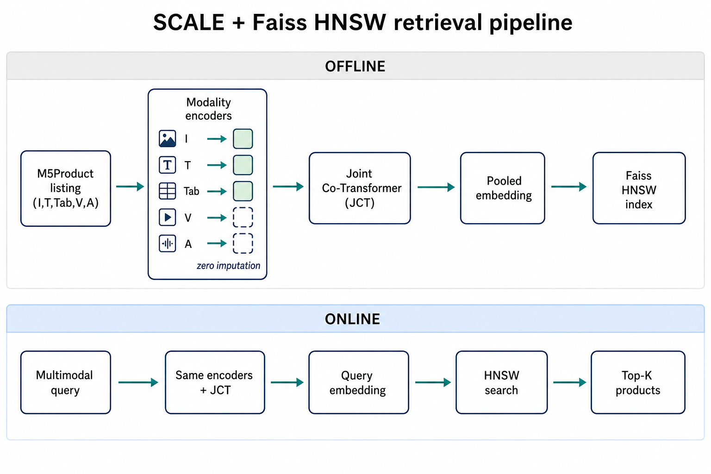
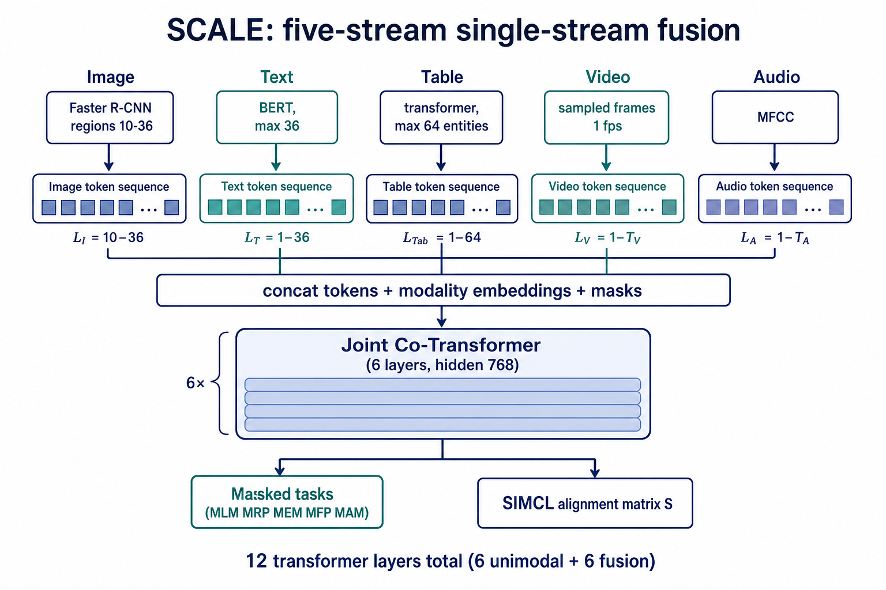
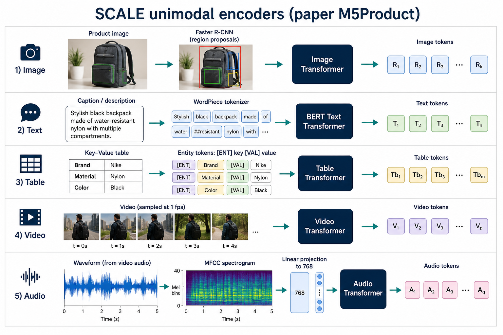
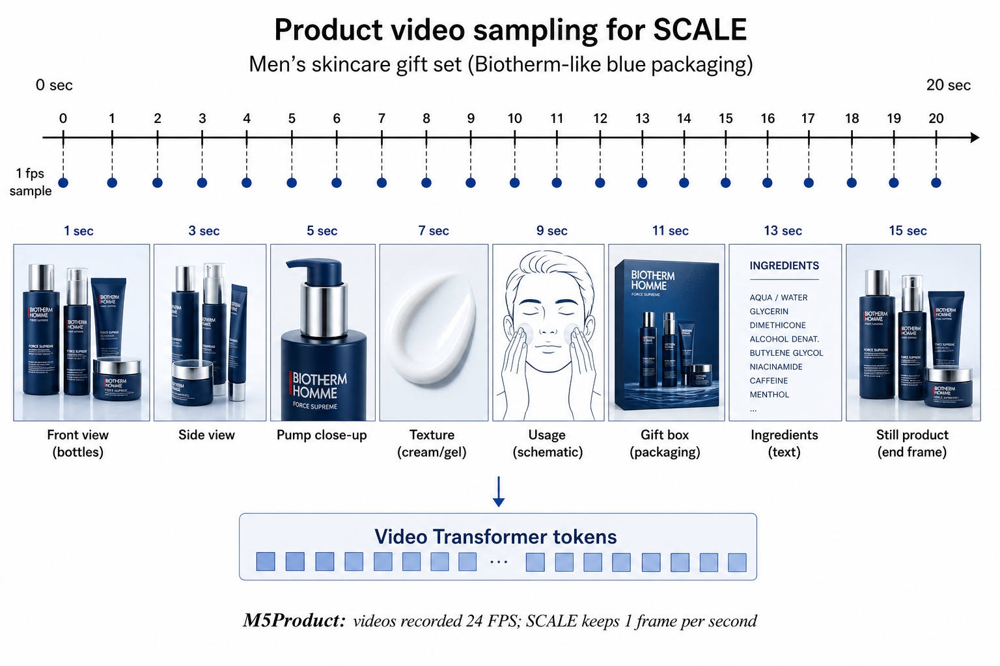
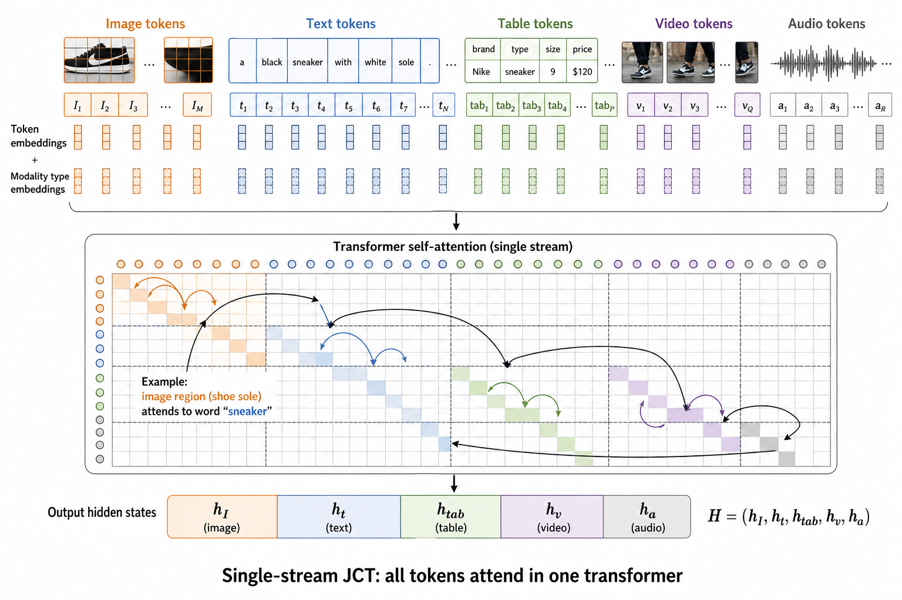
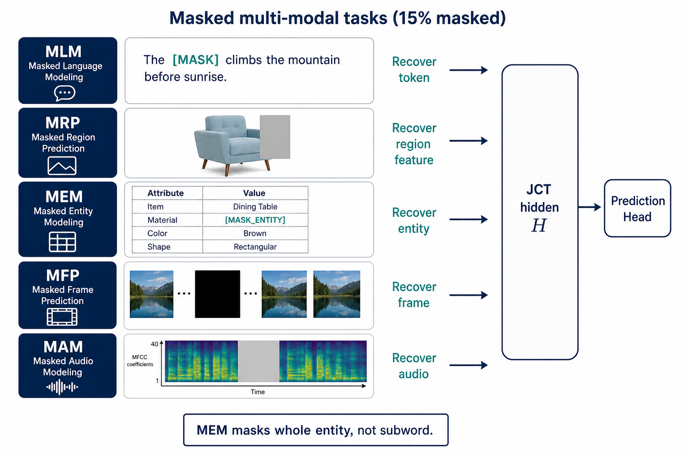
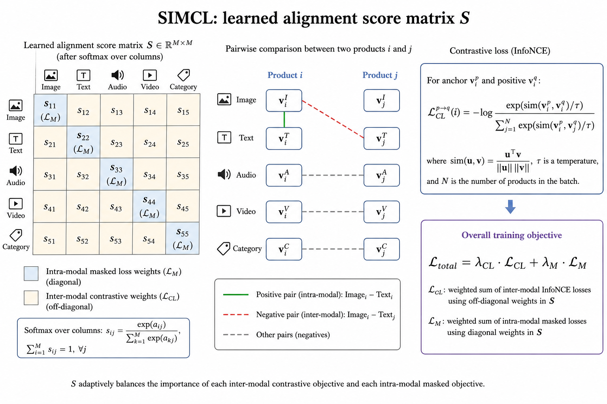
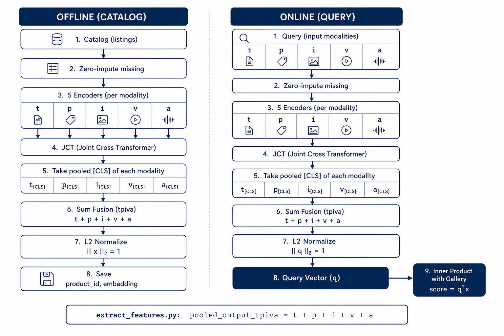
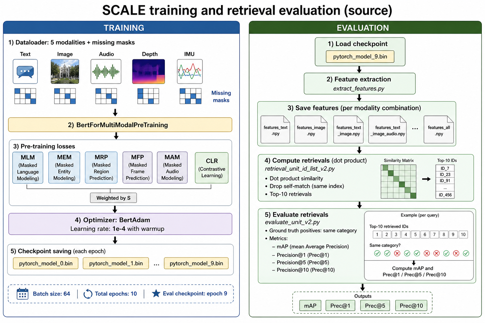

# 07. Methodology

## 7.1. Mục tiêu kỹ thuật

Hai khối, đúng SCALE rồi mới tới serving:

1. **SCALE** (Dong et al.): năm encoder → Joint Co-Transformer → masked tasks + SIMCL → embedding.
2. **Faiss HNSW**: lập chỉ mục catalog, lọc thô ứng viên. Tái xếp hạng thuộc tính ở Mục 08.



**Hình 7.1.** Offline nhúng toàn bộ listing vào HNSW. Online chạy cùng SCALE trên query (nhánh thiếu = zero imputation).

## 7.2. Ý tưởng SCALE

**SCALE** (*Self-harmonized ContrAstive Learning*): học embedding chung từ nhiều modality và **tự cân bằng** đóng góp từng nhánh.

- **Chi tiết token:** che 15% input, dùng hidden JCT khôi phục (MLM, MRP, MEM, MFP, MAM).
- **Toàn cục:** contrastive giữa modality cùng listing (positive) và listing khác trong batch (negative), nhân trọng số từ ma trận alignment `S`.

Paper: với ≥3 modality không được gán mọi cặp `L_CL` bằng nhau vì complementary khác nhau.

## 7.3. Token, feature, embedding

- **Raw:** ảnh, caption, bảng key-value, video 24 FPS, audio (mp3 từ video).
- **Token:** region 2048-d, WordPiece, entity table, frame/S3D, MFCC.
- **Embedding:** pooled vector sau JCT (thường `[CLS]` từng nhánh), lúc retrieval cộng các nhánh dùng được rồi L2-normalize.

## 7.4. Tổng quan kiến trúc

Paper mô tả **single-stream transformer**. Đáy: năm embedding layer + transformer unimodal. Token được concat, đưa **Joint Co-Transformer (JCT)**. Mỗi unimodal encoder và fusion encoder **6 layer** (tổng 12); hidden **768**. Text init BERT; các nhánh còn lại random. Caption max **36**, table max **64**. Missing modality: **zero imputation**.



**Hình 7.2.** Kiến trúc SCALE: năm stream → concat + modality embedding/mask → JCT → pretext + SIMCL.

## 7.5. Xử lý từng modality



**Hình 7.3.** Pipeline raw → token cho Image, Text, Table, Video, Audio.

### 7.5.1. Image: region giàu thông tin (bottom-up attention)

SCALE **không** đưa cả ảnh pixel vào ViT. Object detector đề xuất vùng, transformer học quan hệ giữa vùng.

Paper dùng Faster R-CNN, backbone **ResNet-101**, pretrained **Visual Genome**, lấy **10–36** box có objectness cao — cùng setting ViLBERT / `py-bottom-up-attention`. Mỗi region là vector (thường 2048-d khi `predict_feature`); cộng location (x, y, w, h, area). Image Transformer (6 layer) contextualize thành image tokens `R1 … Rk`.

Lý do e-commerce: background, model, chữ, quà tặng thay đổi mạnh (Mục 5.3). Region giúp token bám logo, đế giày, texture thay vì banner giá.

Code: `image_feat` shape `B × box × 2048`, `image_attention_mask` đánh dấu box padding.

### 7.5.2. Text: BERT tokenizer + Text Transformer

Input: title/caption merchant (paper: text không luôn khớp ảnh). Tokenizer WordPiece, max length **36**, `[CLS]` / `[SEP]`. Text transformer **khởi tạo BERT** (paper: `bert-base`; script gốc `bert-base-chinese` vì caption tiếng Trung).

`[CLS]` sau encoder là `pooled_output_t`. MLM che 15% token, đoán lại từ ngữ cảnh **và các modality khác** qua JCT.

### 7.5.3. Table: entity key-value, encoder riêng

Table là spec merchant: 5,679 loại thuộc tính, ~24.4M value. SCALE **không** concat table vào caption. Ablation paper (Table 8): T/Tab tách **85.50** Acc vs T+Tab **84.61** — một transformer dễ hy sinh table vì text “mạnh miệng” hơn.

Serialize entity, ví dụ:

```text
[ENT] key = material [VAL] wood [SEP]
```

Max **64** token. **MEM** che **cả entity** (brand, property), không che từng subword như MLM — Acc 85.50 vs 84.05 (Table 7).

Code: `pv_input_ids` (pv = property-value), `em_label_ids` cho MEM; loss `masked_em_loss`.

### 7.5.4. Video: sample 1 fps

Video listing 24 FPS. Paper: **một frame mỗi giây** để bớt frame kề trùng, rồi “ordinal frames” vào video encoder. Mask Frame Prediction (MFP) che frame/token, reconstruct feature.



**Hình 7.4.** Đúng preprocessing M5Product: 24 FPS → 1 fps → video tokens.

Code train: `video_len=12` (12 token). Tool `VideoFeatureExtractor` trong repo SCALE fork S3D pretrained HowTo100M, xuất `.npy` rồi pickle — implementation cụ thể hơn câu “video transformer” trên paper. Padding/mask khi listing không có video.

### 7.5.5. Audio: MFCC từ video

Audio **tách từ video** (moviepy → mp3). Không phải clip nào cũng có tiếng hữu ích. SCALE: Mel-Frequency Cepstral Coefficients, **frame size 1024, hop 256**, ma trận `time_steps × n_mfcc`, linear projection lên 768, Audio Transformer, MAM.

Code: `audio_len=12`, `audio_feat` / `audio_label` / `audio_target` song song image/video. Thiếu audio = zero + mask.

## 7.6. JCT: Joint Co-Transformer

Paper: **single-stream** — không dual-stream như ViLBERT. Sau encoder unimodal, token năm nhánh **concatenate**, cộng:

- position embedding;
- **modality / type embedding** (biết token thuộc I/T/Tab/V/A);
- **attention mask** (padding và nhánh zero-impute không được attend).

JCT (6 layer, hidden 768) self-attention trên chuỗi hỗn hợp. Pedagogical (slide): intra-modality = token cùng màu chú ý nhau; cross-modality = vùng “đế giày” chú ý token “sneaker”, `Material: leather` chú ý texture.



**Hình 7.5.** Một transformer, năm loại token; output `H = (h_I, h_t, h_tab, h_v, h_a)`.

Pooled vector lấy `sequence_output[:, 0]` từng nhánh (token đầu / `[CLS]`). Code `SCALE.py`:

```text
pooled_output_t  = sequence_output_t[:, 0]
pooled_output_pv = sequence_output_pv[:, 0]   # table
pooled_output_v  = sequence_output_v[:, 0]    # image
pooled_output_video, pooled_output_audio tương tự
```

## 7.7. Masked self-supervised learning

Che **15%**. Ground truth là feature/token vùng bị che. Loss nhánh `i`:

```text
L_Mi(θ) = −E log Pθ(t_msk | t_¬msk, M_¬i)
```

tức dùng token còn lại **và modality khác** để đoán — đây là chỗ JCT buộc interaction.



**Hình 7.6.** Pretext SCALE. MEM khác MLM: mask nguyên entity.

| Paper | Code (`pretrain_task.py`) | Mục tiêu |
| --- | --- | --- |
| MLM | `masked_loss_t`, flag `--MLM` | Token caption |
| MRP / MRM | `masked_loss_v`, `--MRM` | Region image (`predict_feature`: regress 2048-d) |
| MEM | `masked_loss_pv`, `--MEM` | Entity table |
| MFP / MFM | `masked_loss_video`, `--MFM` | Frame/video token |
| MAM | `masked_loss_audio`, `--MAM` | Audio token |

Tắt flag thì nhân loss với 0. `predict_feature=True` đặt `v_target_size=2048` (feature regression); false thì 1601 (object class Visual Genome).

## 7.8. SIMCL và alignment matrix S

Với hai modality, InfoNCE: cùng sample = positive; sample khác trong batch = negative; `sim` = cosine, temperature `τ` (code/paper ~0.1).

Với năm modality, số cặp tăng; paper không fit trực tiếp Eq. 2. **SIMCL** đưa ma trận `S`:

- Paper: `S` init 0, học như parameter; `S ← S · softmax(S)`. Tam giác `S_△` nhân `L_CL`; chéo `S_\` nhân `L_Mi`.

```text
L_total = Σ S△ S_ij L_CL_ij + Σ S\ S_i L_Mi
```

- Code `graph_construct_per_sample`: với mỗi sample, xếp 5 pooled vector, cosine `5×5`, rồi `revised = sim * softmax(sim)` — **cùng công thức** `S · softmax(S)`, tính **theo sample** từ embedding hiện tại. `modality_weight` lấy đường chéo; các `prediction_scores_*` (masked heads) được **nhân** `modality_weight` trước khi tính MLM/MRM/… Contrastive là `CLR_loss` (`--CLR`).



**Hình 7.7.** SIMCL: positive cùng listing, negative listing khác; `S` hạ trọng số nhánh thiếu hoặc ít complementary.

## 7.9. Cách SCALE giải hai thách thức

**Modality Interaction (5.1).** Năm loại token vào một JCT; self-attention trong nhánh, cross-attention giữa nhánh. SIMCL không ép mọi `L_CL` bằng nhau.

**Modality Noise (5.2).** Zero imputation + mask: mẫu thiếu vẫn vào batch (paper Table 10: train cả incomplete tốt hơn chỉ full-modality). `S` / `modality_weight` giảm ảnh hưởng nhánh zero.

## 7.10. Xuất embedding

Paper: fused feature từ JCT cho retrieval/classification/clustering; không khóa một pooling rule. Code `extract_features.py` (`return_features=True`) lưu **từng** pooled nhánh và **tổng**:

```text
tpiva = t + p + i + v + a
```

Ablation I+T+V tương ứng file `tiv_feature_np.npy`, v.v. `id.npy` giữ product id.



**Hình 7.8.** Cùng encoder; nhánh thiếu = 0 nên tổng `tpiva` tự rơi về các nhánh có dữ liệu.

Offline: preprocess → SCALE → L2-normalize → `{product_id, embedding, metadata}`. Online query: tối thiểu Image hoặc Video, cùng đường, search HNSW (serving) hoặc dot product (so với paper).

## 7.11. Indexing với Faiss HNSW

Paper SCALE **không** dùng HNSW; retrieval là `query · gallery^T` (`retrieval_unit_id_list_v2.py`). HNSW là lớp đề tài:

- Add vector, không train IVF.
- Đồ thị đa tầng: trên thưa, tầng 0 đủ điểm.
- Tune `M`, `efConstruction`, `efSearch`.
- Xóa listing: đánh dấu metadata, rebuild theo lô.

Mục 08 lấy **N > K** ứng viên rồi tái xếp hạng.

## 7.12. Training (paper + `pretrain_task.py`)

Paper: batch **64**, **5 epoch**, Adam, warmup lr **`1e-4`**, 4 GPU 3090/2080 Ti, Apex mixed precision. Script eval gốc load **`pytorch_model_9.bin`** → đề tài train **10 epoch** (`epochId` 0–9), so Table 3–5 bằng đúng protocol Mục 7.13.

Vòng lặp `pretrain_task.py`:

1. `Pretrain_DataSet_Train`: lmdb ảnh, caption json, video/audio dir, flags MLM/MRM/MEM/MFM/MAM/CLR.
2. `BertForMultiModalPreTraining`: BERT init nếu `--from_pretrained`.
3. Forward → `masked_loss_t, masked_loss_pv, masked_loss_v, masked_loss_video, masked_loss_audio, next_sentence_loss` (CLR).
4. `loss = Σ masked_* + CLR` (nhánh tắt = ×0; image × `img_weight`).
5. BertAdam, warmup_proportion mặc định 0.1; BERT pretrained lr × 0.1 so với phần random.
6. Mỗi hết epoch: `pytorch_model_{epochId}.bin`.



**Hình 7.9.** Trái: pretrain. Phải: extract → ranking → `evaluate_unit_v2.py`.

Finetune classification: `train_cls.py` gắn head trên concat 5 pooled (`dense1: 5×hidden → bi_hidden`), Accuracy trên test, cũng lưu `pytorch_model_{epochId}.bin`. Retrieval sau CLS dùng `extract_features_cls.py` (`dense_feature_np`).

Subset đề tài: 10k, tỉ lệ 70/20/10 đủ/thiếu/unimodal để SIMCL gặp missing modality như paper.

## 7.13. Đánh giá retrieval (paper + source)

**Không** dùng SigLIP/`downloaded_2k` khi so số paper.

1. Load checkpoint (`pytorch_model_9.bin`).
2. `extract_features.py`: `model.eval()`, `return_features=True`, ghi `*_feature_np.npy` + `id.npy`.
3. `retrieval_unit_id_list_v2.py`: `score = query @ gallery.T`, `heapq.nlargest(max_topk=10)`, **bỏ id trùng query**.
4. `evaluate_unit_v2.py`: GT json `id → label` (category). Positive = mọi id cùng label (kể cả query trong tập label). Với K ∈ {1,5,10}:
   - `topk = min(K, |pos_set|, |rank_list|)`;
   - Prec = |hit ∩ topk| / topk;
   - AP = trung bình precision tại mỗi hit, **chia cho số hit** (không chia `min(|pos|, K)`);
   - mAP, Prec trung bình theo query, nhân 100 khi ghi json.

Paper Table 3–5: mAP@1,5,10 và Prec@1,5,10, cột pretrain/finetune; classification Accuracy; clustering NMI, Purity. Ablation đúng tổ hợp file npy: `ti`, `tpi`, `tpiv`, `tpiva`, …

HNSW, latency, QPS là **metric hệ thống** của đề tài, báo cáo tách, không trộn vào bảng SCALE.

## 7.14. Serving

1. API nhận payload multimodal.
2. Preprocess + SCALE → query embedding (cùng fusion lúc export).
3. HNSW → candidate + `S_emb`.
4. Map metadata.
5. Optional Mục 08 rồi cắt K.

## 7.15. Rủi ro và xử lý

| Rủi ro | Hướng xử lý |
| --- | --- |
| Thiếu modality | Zero + mask; `S` / `modality_weight`. |
| Chữ/quà trên ảnh | Region 10–36 box; rerank / segment sau này. |
| SKU gần giống | Table/MEM; `S_thuoc_tinh` Mục 08. |
| So số paper lệch công thức AP | Bắt buộc `evaluate_unit_v2.py`. |
| Checkpoint epoch | Báo cáo `pytorch_model_9.bin` (10 epoch), ghi chú paper viết 5 epoch. |

## 7.16. Summary

SCALE: năm encoder, JCT, masked 15%, SIMCL `S · softmax(S)`, zero-impute. Retrieval gốc: cộng pooled nhánh + dot product + mAP/Prec@1,5,10. HNSW và rerank là phần serving của đề tài, không thay protocol so với bài báo.
