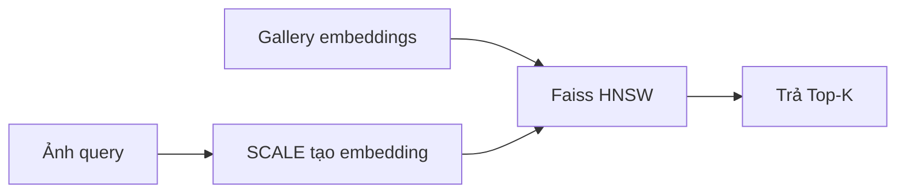
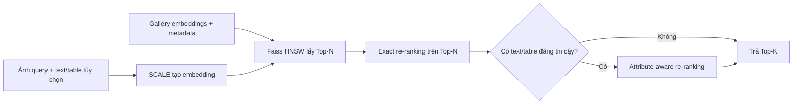

# 08. Cải thiện đề xuất

Mục này chỉ trình bày hai cải tiến ở tầng retrieval index: exact re-ranking và attribute-aware re-ranking. Cả hai đều chạy sau Faiss HNSW, nên không thay đổi kiến trúc SCALE hay cách tạo embedding.

| Cải tiến | Challenge/gap được xử lý | Mục đích trực tiếp | Chỉ số kiểm chứng |
| --- | --- | --- | --- |
| Exact re-ranking | Sai số xấp xỉ của ANN và sai thứ tự giữa các candidate có embedding gần nhau. | Sắp xếp lại Top-N bằng điểm exact để tăng chất lượng Top-K. | Precision@K, Recall@K và latency trước/sau re-ranking. |
| Attribute-aware re-ranking | Semantic gap ở thuộc tính quyết định tính tương thích: model, size, compatibility. | Ưu tiên candidate thỏa thuộc tính query, tránh kết quả nhìn giống nhưng dùng sai. | Precision@K trên query có text/table; kiểm tra metric chung không giảm. |

## 8.1. Flow cơ sở và flow sau cải thiện

Flow cơ sở trả trực tiếp Top-K từ HNSW. Flow mới lấy Top-N lớn hơn, sắp xếp lại bằng điểm exact, sau đó chỉ dùng thuộc tính nếu query có text/table đáng tin cậy.





## 8.2. Exact re-ranking

**Vấn đề:** HNSW ưu tiên tốc độ, nên có thể xếp sai thứ tự các candidate có điểm gần nhau.

**Cách làm:** HNSW lấy Top-N, ví dụ 100 candidate. Hệ thống tính lại inner product chính xác giữa embedding query và từng candidate trong Top-N, rồi sắp xếp lại trước khi trả Top-K.

```text
HNSW lấy Top-N -> tính exact inner product trên Top-N -> trả Top-K
```

**Challenge được giải quyết:** sai số ANN trong Mục 5.5. HNSW ưu tiên tốc độ nên có thể cho score xấp xỉ và sai thứ tự ở nhóm candidate sát nhau.

**Mục đích:** cải thiện thứ tự của các kết quả đầu mà không cần exact search trên toàn bộ gallery. Vì exact score chỉ tính trên Top-N nhỏ, chi phí tăng thêm được kiểm soát.

**Giới hạn:** chỉ sắp xếp lại candidate đã thuộc Top-N; không thể khôi phục sản phẩm mà HNSW không trả về.

**Đánh giá:** so sánh Precision@K, Recall@K và latency trước/sau re-ranking; chọn `N` và `efSearch` bằng validation set.

## 8.3. Attribute-aware re-ranking

**Vấn đề:** hai sản phẩm có thể giống ảnh nhưng không tương thích về mặt thương mại, ví dụ ốp lưng iPhone 14 và iPhone 15.

**Cách làm:** chỉ khi query có text hoặc bảng thuộc tính đáng tin cậy, hệ thống kiểm tra metadata của candidate trong Top-N sau exact re-ranking. Candidate khớp model, size hoặc compatibility được ưu tiên cao hơn; màu sắc/texture chỉ là thuộc tính phụ.

**Challenge được giải quyết:** semantic gap và nhiễu metadata ở Mục 5.3–5.4. Visual similarity không đủ để kiểm tra các ràng buộc như đúng model máy, kích thước hoặc compatibility.

**Mục đích:** giảm semantic gap và tránh kết quả “nhìn giống nhưng dùng sai”. Metadata chỉ được dùng để điều chỉnh thứ tự trong Top-N, không thay thế score embedding.

**Giới hạn:** không lấy metadata của Top-1 làm nhãn cho query. Nếu Top-1 sai, cách này sẽ khuếch đại lỗi. Khi query chỉ có ảnh, hệ thống dừng ở exact re-ranking.

**Đánh giá:** đo Precision@K trên tập query có text/table và kiểm tra rằng metric chung không giảm.

## 8.4. Thứ tự triển khai

1. Chạy baseline SCALE + `IndexFlatIP` + HNSW.
2. Thêm exact re-ranking và chọn `N`, `efSearch` theo validation set.
3. Chỉ bật attribute-aware re-ranking cho query có text/table đủ tin cậy.

Hai cải tiến chỉ được giữ khi metric tốt hơn baseline tương ứng và latency vẫn đáp ứng yêu cầu demo.
