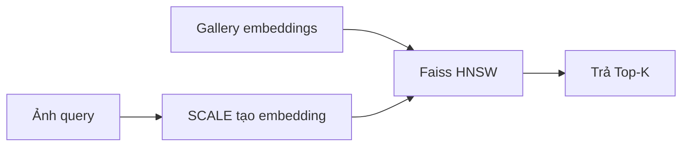
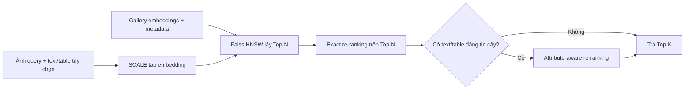

# 08. Cải thiện đề xuất

Mục 05 phân chia bốn gap và một ràng buộc hệ thống. Hai cải tiến trong mục này chỉ hoạt động ở **sau Faiss HNSW**; vì vậy chúng không thay đổi SCALE, không thay thế M5Product và không giải quyết tất cả thách thức.

| Cải tiến | Liên hệ với Mục 05 | Mục đích | Không giải quyết trực tiếp |
| --- | --- | --- | --- |
| Exact re-ranking | Ràng buộc hệ thống ở Mục 5.6: ANN có thể xếp sai thứ tự. | Sắp xếp lại Top-N bằng điểm exact để cải thiện Top-K. | Sensory Gap, Model Gap và candidate bị HNSW bỏ sót hoàn toàn. |
| Attribute-aware re-ranking | Semantic Gap ở Mục 5.3 và Context-Query Gap ở Mục 5.4. | Dùng thuộc tính query đáng tin cậy để ưu tiên sản phẩm tương thích. | Không giúp khi query chỉ có ảnh hoặc metadata không tin cậy. |

## 8.1. Flow cơ sở và flow sau cải thiện

Flow cơ sở trả trực tiếp Top-K từ HNSW. Flow mới lấy Top-N lớn hơn, tính lại điểm exact và chỉ kiểm tra thuộc tính khi query có text/table đáng tin cậy.





## 8.2. Exact re-ranking cho ràng buộc ANN

**Thách thức liên quan:** Ở Mục 5.6, HNSW dùng approximate nearest-neighbor search để giảm latency. Đổi lại, các candidate có score gần nhau có thể bị xếp sai thứ tự.

**Cách làm:** HNSW lấy Top-N, ví dụ 100 candidate. Hệ thống tính lại inner product chính xác giữa query embedding và từng candidate trong Top-N, sau đó sắp xếp lại trước khi trả Top-K.

```text
HNSW lấy Top-N -> tính exact inner product trên Top-N -> trả Top-K
```

**Mục đích:** tăng chất lượng thứ tự Top-K nhưng không phải exact search trên toàn bộ gallery.

**Giới hạn:** bước này chỉ đổi thứ tự candidate đã có trong Top-N. Nếu HNSW không đưa sản phẩm đúng vào Top-N, re-ranking không thể khôi phục nó.

**Đánh giá:** so sánh Precision@K, Recall@K và latency trước/sau re-ranking; chọn `N` và `efSearch` bằng validation set.

## 8.3. Attribute-aware re-ranking cho Semantic và Context-Query Gap

**Thách thức liên quan:** Semantic Gap ở Mục 5.3 xảy ra khi sản phẩm nhìn giống nhưng khác model, size hoặc compatibility. Context-Query Gap ở Mục 5.4 xảy ra vì ảnh query không luôn nói rõ ràng buộc người dùng cần.

**Cách làm:** chỉ khi query có text hoặc bảng thuộc tính đáng tin cậy, hệ thống kiểm tra metadata của candidate trong Top-N sau exact re-ranking. Candidate khớp model, size hoặc compatibility được ưu tiên cao hơn; màu sắc/texture chỉ là thuộc tính phụ.

**Mục đích:** tránh kết quả “nhìn giống nhưng dùng sai”, ví dụ ốp iPhone 14 được xếp trên ốp iPhone 15 khi query ghi rõ “iPhone 14”.

**Giới hạn:** không lấy metadata của Top-1 làm nhãn cho query vì Top-1 sai sẽ khuếch đại lỗi. Khi query chỉ có ảnh, hoặc metadata không tin cậy, hệ thống chỉ dùng exact re-ranking ở Mục 8.2.

**Đánh giá:** đo Precision@K trên tập query có text/table và kiểm tra rằng metric chung không giảm.

## 8.4. Phần còn lại của Mục 05 được xử lý như thế nào?

- **Sensory Gap (Mục 5.2):** SCALE dùng image regions và catalog có nhiều view, nhưng proposal không thêm cải tiến riêng cho ảnh query nhiễu. Chất lượng được kiểm tra bằng noise slice trong evaluation.
- **Model Gap (Mục 5.5):** M5Product có 6.232 category giúp mở rộng kiến thức model. Gap này không thể loại bỏ bằng re-ranking; cần báo cáo metric và failure case theo category, đặc biệt long-tail/out-of-distribution.
- **Metadata noise (Mục 5.4):** attribute-aware re-ranking chỉ chạy khi metadata query đáng tin cậy; metadata nhiễu vẫn được coi là failure case, không được tự động tin tưởng.

## 8.5. Thứ tự triển khai

1. Chạy baseline SCALE + `IndexFlatIP` + HNSW.
2. Thêm exact re-ranking và chọn `N`, `efSearch` theo validation set.
3. Chỉ bật attribute-aware re-ranking cho query có text/table đủ tin cậy.
4. Báo cáo riêng hiệu quả theo gap: noise slice, category slice, query có/không có context và ANN recall loss.

Hai cải tiến chỉ được giữ khi metric tốt hơn baseline tương ứng và latency vẫn đáp ứng yêu cầu demo.
