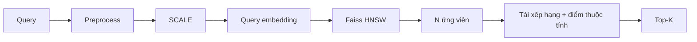

# 08. Hướng cải tiến phương pháp

Baseline Mục 07 trả top-K trực tiếp từ HNSW theo `S_emb`. Chữ quảng cáo, logo, watermark và vật thể phụ vẫn có thể làm embedding lệch, nên kết quả lọc thô chưa chắc đúng sản phẩm cần tìm. Cải tiến **không đổi SCALE**, mà thêm tái xếp hạng trên tập ứng viên.



## 8.1. Giai đoạn 1: Lọc thô với Faiss HNSW

| | |
| --- | --- |
| Đầu vào | Vector `v_query` do SCALE trích từ query đa phương thức. |
| Xử lý | Duyệt HNSW, lấy **N** listing có `S_emb` cao nhất (N > K). |
| Đầu ra | Danh sách N ID kèm điểm tương đồng thị giác/đa phương thức `S_emb`. |

## 8.2. Giai đoạn 2: Tái xếp hạng

Dùng metadata (siêu danh mục, danh mục, thương hiệu, thông số) để định danh lại ứng viên. Nếu HNSW đưa 100 listing gần về embedding, tầng này giữ những listing trùng thuộc tính cao hơn.

Hàm chỉ thị `I(·)` = 1 nếu điều kiện đúng, = 0 nếu sai hoặc thành phần truy vấn thiếu. `Jaccard` đo trùng tập từ khóa thông số. Trọng số `α, β, γ` thỏa `α + β + γ = 1` và `α > β` (siêu danh mục quan trọng hơn danh mục chi tiết).

### Hướng 1: Query có ảnh kèm văn bản

Người dùng nhập ảnh kèm text chứa siêu danh mục `SD_truy_van`, danh mục `D_truy_van` hoặc thông số `S_truy_van`.

```text
S_thuoc_tinh
  = α · I(SD_truy_van = SD_ung_vien)
  + β · I(D_truy_van = D_ung_vien)
  + γ · Jaccard(S_truy_van, S_ung_vien)
```

### Hướng 2: Query chỉ có ảnh

Không có text thuộc tính. Áp dụng **phản hồi độ liên quan giả định** (pseudo relevance feedback) trên N ứng viên lọc thô:

1. **Trích xuất thuộc tính**: lấy nhãn đa số trong N ứng viên.
   - `SD*`: siêu danh mục xuất hiện nhiều nhất.
   - `D*`: nhãn thương hiệu (danh mục suy luận) xuất hiện nhiều nhất.
2. **Tính điểm thuộc tính** để loại listing khác siêu danh mục/thương hiệu gốc:

```text
S_thuoc_tinh = α · I(SD_ung_vien = SD*) + β · I(D_ung_vien = D*)
```

với `α > β`.

Hướng 2 chỉ suy từ tập ứng viên HNSW, không lấy Top-1 làm nhãn duy nhất (Top-1 sai sẽ khuếch đại lỗi). Nếu N ứng viên lẫn nhiều ngành, `SD*`/`D*` có thể sai; ghi nhận là failure case.

## 8.3. Điểm tổng hợp và Giai đoạn 3

```text
S_tong = λ · S_emb + (1 − λ) · S_thuoc_tinh,   λ ∈ [0, 1]
```

Điều phối `λ` theo ngành:

- Thời trang, ưu tiên thị giác: `λ > 0.5`.
- Thiết bị số, ưu tiên cấu hình: `λ < 0.5`.

Giai đoạn 3: sắp xếp N ứng viên theo `S_tong` giảm dần, cắt đúng **K** listing (K < N) để hiển thị.

## 8.4. Liên hệ thách thức

| Thách thức | Baseline SCALE + HNSW | Cải tiến này |
| --- | --- | --- |
| Modality Interaction / Noise | JCT, SIMCL, zero imputation | Không thay; vẫn dùng `S_emb`. |
| SKU gần giống, sai danh mục | Embedding có thể lẫn | `S_thuoc_tinh` ưu tiên trùng SD/D/thông số. |
| Query chỉ ảnh | Vẫn retrieve được | Hướng 2 suy SD*, D* từ ứng viên. |
| Chữ/logo trên ảnh | Region features, chưa lọc rác | Không xóa chữ; hướng phát triển: lọc nhiễu / segment vùng sản phẩm (Mục 09). |

## 8.5. Thứ tự triển khai

1. Baseline: SCALE + HNSW trả top-K theo `S_emb`.
2. Lấy Top-N, bật Hướng 1 cho query có text/table.
3. Bật Hướng 2 cho query chỉ ảnh; chọn `N`, `α, β, γ`, `λ` trên validation.
4. Ablation: Image-Text-Video, Image-Table-Video, và mô hình đủ 5 modality; so Precision@K, AP, mAP trước/sau rerank.

Cải tiến chỉ giữ khi metric tăng và latency demo vẫn chấp nhận được.
