# 00. Introduction

## Topic

**Visual Product Image Search in E-commerce**

## Team Members

| STT | Team Member | Student ID | Email | Phone |
| --- | --- | --- | --- | --- |
| 1 | Trần Hải Đức | 23127173 | thduc23@clc.fitus.edu.vn | 0916821170 |
| 2 | Trần Hoàng Nam | 23127232 | thnam23@clc.fitus.edu.vn | 0916821170 |

## Revision History

| Version | Date | Author | Description |
| --- | --- | --- | --- |
| 0.1 | 2026-06-26 | Trần Hải Đức, Trần Hoàng Nam | Khởi tạo proposal, xác định topic, problem statement, dataset, methodology và plan 2 tháng. |
| 0.2 | 2026-06-26 | Trần Hải Đức, Trần Hoàng Nam | Bổ sung related works, hướng dùng SCALE để trích xuất đặc trưng và Faiss-based ANN retrieval để truy hồi top-K. |

## Scope

Đề tài tập trung xây dựng hệ thống tìm kiếm sản phẩm trong thương mại điện tử với **ảnh là query chính**. Text hoặc bảng thuộc tính ngắn có thể được dùng làm ngữ cảnh bổ sung khi có sẵn. Mỗi product entry trong catalog có thể chứa image, text, table, video và audio; SCALE tạo embedding cho entry, `IndexFlatIP` là exact baseline và Faiss HNSW là index chính. Hệ thống trả về top-K product entry kèm ảnh đại diện và metadata.

Proposal này mô tả động lực, đặc trưng dữ liệu product e-commerce image, dataset M5Product, problem statement, related works, methodology dự kiến, tiêu chí đánh giá, kế hoạch thực hiện và danh mục tài liệu tham khảo.

---

# 01. Topic Introduction and Overview

## 1.1. Bối cảnh

E-commerce đang chuyển từ trải nghiệm tìm kiếm dựa hoàn toàn vào từ khóa sang trải nghiệm tìm kiếm giàu ngữ cảnh hơn. Trong tìm kiếm truyền thống, người dùng phải diễn đạt sản phẩm bằng text: tên mặt hàng, màu sắc, kiểu dáng, vật liệu hoặc thương hiệu. Cách này thường thất bại khi người dùng chỉ có một ảnh tham khảo, không biết gọi đúng tên sản phẩm, hoặc khi mô tả của người bán không đồng nhất.

Visual search giải quyết phần lớn ma sát đó bằng cách cho phép người dùng upload ảnh hoặc chụp ảnh sản phẩm ngoài đời, sau đó hệ thống tự nhận diện đặc trưng thị giác và truy hồi sản phẩm tương tự. Bài survey *The Rise of Visual Search in E-Commerce* nhấn mạnh visual search là một công nghệ quan trọng để cải thiện product discovery, tăng relevance, cá nhân hóa và giảm search friction trong hành trình mua sắm.

## 1.2. Visual Product Image Search là gì?

Visual Product Image Search là bài toán tìm kiếm sản phẩm trong catalog dựa trên độ tương đồng giữa query và product entry. Trong phạm vi đề tài, query chính là ảnh; text hoặc bảng thuộc tính ngắn chỉ là ngữ cảnh bổ sung khi có sẵn. Catalog có thể chứa:

- Ảnh sản phẩm do người dùng tải lên: có thể là ảnh chụp thực tế ở nhà/ngoài trời/cửa hàng, ảnh crop từ cảnh có nhiều object, hoặc ảnh/screenshot từ mạng xã hội và website.
- Title/caption và bảng thông tin như brand, material, color, style, usage.
- Video nhiều góc nhìn và audio/mô tả đi kèm listing, nếu dataset có cung cấp.

Kết quả không chỉ cần giống về màu hoặc texture, mà còn phải đúng ngữ nghĩa thương mại: cùng loại sản phẩm, cùng style, cùng vật liệu hoặc cùng intent mua hàng. Vì vậy, bài toán này không thể chỉ dựa vào pixel-level similarity.

## 1.3. Tại sao topic này quan trọng?

Visual search hữu ích với e-commerce vì:

- Giảm phụ thuộc vào từ khóa và lỗi mô tả sản phẩm.
- Hỗ trợ mobile commerce và social commerce, nơi người dùng thường thấy sản phẩm qua ảnh.
- Cải thiện discovery cho long-tail products, đặc biệt các sản phẩm khó gọi tên.
- Tăng khả năng matching giữa nhu cầu người mua và catalog người bán.
- Mở đường cho multi-modal retrieval: ảnh + text + bảng thuộc tính + video + audio.

## 1.4. Overview hệ thống đề xuất

Hệ thống được định hướng theo hai tầng chính:

1. **Feature extraction layer**: dùng SCALE trên M5Product để học embedding đa phương thức cho sản phẩm. Mục tiêu là đưa image, text, table, video và audio vào một không gian embedding có thể so sánh.
2. **Retrieval layer**: dùng Faiss để đánh chỉ mục embedding của catalog. `IndexFlatIP` trên vector đã chuẩn hóa là exact baseline; Faiss HNSW là index chính; IVF-PQ/OPQ-PQ chỉ được dùng khi memory trở thành bottleneck.

Luồng tổng quát:

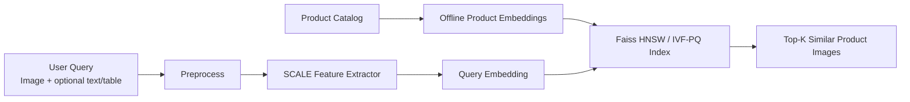

Điểm cốt lõi của đề tài là kết hợp chất lượng embedding đa phương thức với tốc độ truy hồi ở quy mô catalog lớn.

---

# 02. Product E-commerce Image

## 2.1. Khái niệm

Product e-commerce image là ảnh đại diện cho sản phẩm trong môi trường thương mại điện tử. Khác với ảnh tự nhiên thông thường, ảnh sản phẩm thường gắn với mục tiêu mua bán: người dùng cần hiểu sản phẩm là gì, trông như thế nào, có thuộc tính gì, và có phù hợp với nhu cầu hay không.

Trong visual search, ảnh sản phẩm không chỉ là dữ liệu thị giác. Nó là điểm vào để suy luận về category, brand, material, shape, color, pattern, usage scenario và đôi khi cả selling point của sản phẩm.

## 2.2. Các tính chất quan trọng

### 2.2.1. Fine-grained visual similarity

Nhiều sản phẩm khác nhau có hình dáng tổng thể rất giống nhau nhưng khác ở chi tiết nhỏ: logo, pattern, texture, màu phụ, kiểu cổ áo, loại đế giày, model điện thoại. Vì vậy hệ thống cần phân biệt fine-grained attributes thay vì chỉ nhận diện category chung.

### 2.2.2. Semantic similarity

Hai ảnh có thể giống về màu và hình khối nhưng khác ý nghĩa thương mại. Ví dụ hộp pin, hộp nước hoa và hộp bánh có thể đều là hình chữ nhật; nếu chỉ dựa vào texture/shape, hệ thống dễ trả về sản phẩm sai category. Đây là semantic gap: khoảng cách giữa đặc trưng thị giác cấp thấp và ý nghĩa sản phẩm cấp cao.

### 2.2.3. Multi-view and product-level identity

Một sản phẩm thường có nhiều ảnh: mặt trước, mặt sau, cận cảnh, ảnh trên người mẫu, ảnh trong ngữ cảnh sử dụng. Người dùng có thể query bằng một góc nhìn khác với ảnh chính của catalog. Do đó hệ thống cần hiểu product-level identity thay vì chỉ so sánh từng ảnh đơn lẻ.

### 2.2.4. Noisy real-world query

Ảnh query từ người dùng có thể bị crop, nén qua mạng xã hội, xoay, chèn logo, có watermark, có background phức tạp hoặc chứa nhiều object. Bài Shopsy chỉ ra các biến đổi như compression, cropping, scribbling/logo overlay là thách thức thực tế trong visual search cho reseller commerce.

### 2.2.5. Incomplete and heterogeneous metadata

E-commerce catalog thường có thuộc tính không đầy đủ. Sản phẩm này có bảng material/color/brand, sản phẩm khác chỉ có title và ảnh. M5Product cũng phản ánh thực tế này khi có missing modality và long-tail distribution.

## 2.3. Các gap cần xử lý

| Gap | Mô tả | Ví dụ | Tác động tới search |
| --- | --- | --- | --- |
| Sensory Gap | Ảnh catalog và ảnh query khác nhau về ánh sáng, góc chụp, crop hoặc compression. | Cùng một đôi giày, nhưng query chụp thiếu sáng và bị watermark. | Embedding lệch dù là cùng sản phẩm. |
| Semantic Gap | Ảnh giống về pixel/texture nhưng khác ý nghĩa thương mại hoặc thuộc tính quyết định mua. | Hai ốp điện thoại giống màu nhưng dành cho iPhone 14 và iPhone 15. | Trả về sản phẩm nhìn giống nhưng không đúng nhu cầu mua. |
| Context-Query Gap | Query thiếu ngữ cảnh so với catalog có title, brand, category và specification. | Chỉ có ảnh một chiếc túi, không biết người dùng cần đúng mẫu hay túi cùng kiểu. | Khó xác định tiêu chí relevance và tận dụng metadata đúng cách. |
| Model Gap | Kiến thức mô hình chỉ bao quát các category và kiểu sản phẩm đã thấy đủ trong dữ liệu huấn luyện. | Model học tốt giày dép/quần áo nhưng nhầm cặp, ba lô hoặc trang sức. | Embedding không biểu diễn đúng sản phẩm thuộc category ít gặp hoặc ngoài phân bố dữ liệu. |

**Model Gap** khác với việc catalog có nhiều modality hoặc detector chọn sai vùng. Đây là khoảng cách giữa kiến thức model học từ dữ liệu huấn luyện và độ đa dạng của sản phẩm thực tế. Dataset M5Product giúp giảm gap này vì có hơn 6.000 category, 5 modality và dữ liệu e-commerce đa dạng hơn dataset thời trang hẹp miền. Tuy nhiên, nó không loại bỏ hoàn toàn gap: category hiếm, sản phẩm mới hoặc category không có trong training vẫn cần được đánh giá riêng theo từng nhóm category.

## 2.4. Quy trình visual search điển hình

Theo survey về visual search trong e-commerce, một hệ thống thường gồm các bước: nhận ảnh query, trích xuất đặc trưng, nhận diện object, so khớp similarity với database và trả về sản phẩm đề xuất. Với đề tài này, quy trình được mở rộng sang multi-modal retrieval: thay vì chỉ dùng CNN trên ảnh, hệ thống dùng multi-modal pretraining để khai thác thêm text, table, video và audio.

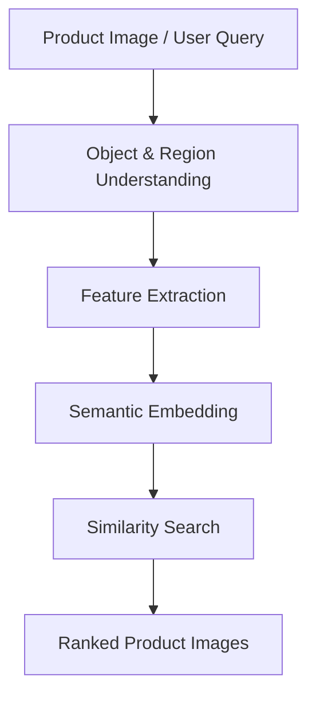

## 2.5. Kết luận chuyển tiếp

Từ các đặc trưng trên, có thể thấy product image search không phải bài toán image retrieval thuần túy. Hệ thống cần vừa chống nhiễu thị giác, vừa hiểu semantic, vừa tận dụng nhiều modality trong catalog. Vì vậy, dataset và phương pháp được chọn phải đủ gần với dữ liệu e-commerce thực tế. Đây là lý do chúng tôi sử dụng M5Product và SCALE làm nền tảng cho phần tiếp theo.

---

# 03. Dataset: M5Product

## 3.1. Chuyển tiếp từ Product E-commerce Image

Ở mục 02, ta thấy dữ liệu e-commerce có ba đặc điểm nổi bật: đa phương thức, nhiễu và thiếu hụt, đồng thời có long-tail category. Nếu chỉ dùng dataset ảnh-text nhỏ hoặc dataset thời trang đơn miền, hệ thống khó mô phỏng môi trường catalog thực tế. Vì vậy, chúng tôi chọn **M5Product** từ bài *M5Product: Self-harmonized Contrastive Learning for E-commercial Multi-modal Pretraining*.

## 3.2. Tổng quan M5Product

M5Product là dataset e-commerce đa phương thức gồm 5 modality:

- Image
- Text/caption
- Table/specification
- Video
- Audio

Theo bài báo, dataset có **6,313,067 samples**, **6,232 categories**, hơn **5,000 attributes**, và lớn hơn đáng kể so với các dataset đa phương thức cùng số modality trước đó. Điểm quan trọng là M5Product không phải dataset paired hoàn hảo; nó chứa missing modality, noise và phân phối long-tail, giống điều kiện e-commerce thật.

## 3.3. Vai trò của từng modality

| Modality | Thông tin chính | Vai trò trong retrieval |
| --- | --- | --- |
| Image | Appearance, color, shape, texture, pattern. | Cốt lõi cho visual similarity và query bằng ảnh. |
| Text | Title, caption, selling point, category phrase. | Bổ sung semantic và intent mà ảnh khó biểu diễn. |
| Table | Brand, material, color, applicable scene, product properties. | Cung cấp thuộc tính cấu trúc, hỗ trợ fine-grained matching. |
| Video | Nhiều góc nhìn, scale, use case, product behavior. | Giảm view incompleteness và sensory gap. |
| Audio | Voice/sound trong video hoặc mô tả liên quan. | Bổ sung tín hiệu khi query hoặc listing có audio. |

## 3.4. Dataset split và annotation

Bài báo M5Product mô tả training set gồm **4,423,160 samples** từ **3,593 classes**. Phần retrieval được chia thành gallery/query cho hai mức:

- **Coarse-grained retrieval**: match theo category, ví dụ tất cả điện thoại được xem là cùng nhóm.
- **Fine-grained retrieval**: chỉ xem là match khi cùng sản phẩm ở mức instance, ví dụ cùng model/màu/kiểu dáng.

Để giảm chi phí labeling, paper dùng ResNet50 và BERT-Base để tạo candidate pool, sau đó dùng crowd-sourcing để xác nhận các cặp match. Điều này phù hợp với mục tiêu của đề tài: đánh giá không chỉ retrieval theo category mà còn retrieval cùng sản phẩm hoặc rất gần sản phẩm.

## 3.5. Vì sao M5Product phù hợp với đề tài?

- Có đủ 5 modality cho product entry trong catalog: image, text, video, audio và information table.
- Có dữ liệu lớn để học embedding robust.
- Có missing modality, giúp kiểm tra khả năng vận hành khi catalog không đầy đủ.
- Có category đa dạng hơn các dataset thời trang hẹp miền.
- Có 6.232 category nên giúp mở rộng kiến thức của model ngoài các nhóm quen thuộc như giày dép hoặc quần áo; tuy vậy vẫn cần đánh giá riêng category long-tail và category ngoài training.
- Có task retrieval, classification và clustering để đánh giá embedding.

## 3.6. Cách sử dụng trong đề tài

Chúng tôi dự kiến dùng M5Product theo ba pha:

1. **Pretraining/finetuning feature extractor**: học embedding chung bằng SCALE.
2. **Build gallery embedding**: trích xuất embedding cho ảnh sản phẩm trong catalog.
3. **Evaluate retrieval**: dùng query set để truy hồi top-K qua `IndexFlatIP` exact baseline, Faiss HNSW và IVF-PQ, sau đó đo mAP@K, Precision@K, Recall@K.

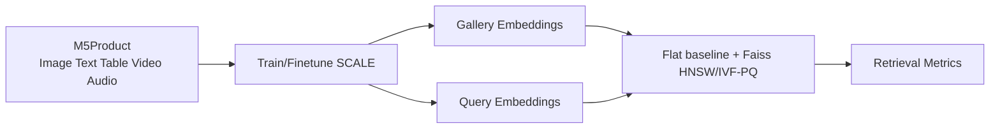

---

# 04. Problem Statement

## 4.1. Mục tiêu

Mục tiêu là xây dựng hệ thống retrieval cho e-commerce: với catalog gồm các product entry đa phương thức và một ảnh query, hệ thống trả về top-K product entry phù hợp nhất. Text hoặc bảng thuộc tính ngắn, nếu đi kèm query, được dùng làm ngữ cảnh bổ sung chứ không mở rộng phạm vi thành video/audio query.

## 4.2. Formal Definition

| Thành phần | Mô tả |
| --- | --- |
| **Input** | **Catalog D(n)**: n product entry, mỗi entry có ảnh đại diện và metadata/modality sẵn có.<br>**Query**: một ảnh có chứa sản phẩm cần tìm; có thể kèm text hoặc bảng thuộc tính ngắn. |
| **Output** | Danh sách top-K product entry phù hợp, kèm ảnh đại diện và metadata. |

Ký hiệu:

- `D = {x_1, x_2, ..., x_n}` là catalog product entry; mỗi `x_i` gồm ảnh đại diện và các modality/metadata có sẵn.
- `q = (q_img, q_ctx)` gồm ảnh query `q_img` và ngữ cảnh tùy chọn `q_ctx` (text/table).
- `f_q(.)` và `f_c(.)` là query encoder và catalog-entry encoder.
- `sim(f_q(q), f_c(x_i))` là độ tương đồng giữa query và product entry.
- `TopK(q, D)` là K product entry có score cao nhất.

Bài toán:

```text
TopK(q, D) = arg top-K_{x_i in D} sim(f(q), f(x_i))
```

### 4.2.1. Ảnh query là gì?

`q_img` là ảnh do người dùng cung cấp, trong đó sản phẩm cần tìm xuất hiện toàn bộ hoặc một phần. Ảnh query có thể thuộc một trong các tình huống sau:

- **Ảnh chụp thực tế:** người dùng chụp sản phẩm ở nhà, ngoài trời hoặc trong cửa hàng; ảnh có thể thiếu sáng, nghiêng, bị che một phần hoặc có background phức tạp.
- **Ảnh từ media trực tuyến:** ảnh/screenshot lấy từ mạng xã hội, video, quảng cáo hoặc website; ảnh có thể bị nén, watermark, crop hoặc chứa text overlay.
- **Ảnh sản phẩm đã crop:** người dùng cắt riêng chiếc túi, đôi giày hoặc món đồ cần tìm từ một ảnh có nhiều object.
- **Ảnh catalog:** người dùng lưu lại ảnh sản phẩm từ một sàn thương mại điện tử khác; trường hợp này thường sạch hơn nhưng có thể khác góc chụp so với catalog của hệ thống.

Ảnh query không bắt buộc là ảnh studio và không cần trùng chính xác với ảnh catalog. Điều kiện tối thiểu là sản phẩm hoặc chi tiết nhận diện quan trọng của sản phẩm phải nhìn thấy được. Video/audio trong M5Product được dùng để làm giàu product entry ở catalog, không phải input query chính của proposal.

## 4.3. Yêu cầu hệ thống

- Trích xuất embedding đủ giàu để biểu diễn visual và semantic similarity.
- Hỗ trợ ảnh query và ngữ cảnh text/table tùy chọn; xử lý missing modality ở catalog.
- Truy hồi nhanh trên catalog lớn.
- Chống nhiễu query như crop, compression, rotation, watermark hoặc background phức tạp.
- Có metric đánh giá rõ ràng cho representation, retrieval và chất lượng hệ thống.

## 4.4. Output mong muốn

Với mỗi query, hệ thống trả về:

- Danh sách `top-K` product entry kèm ảnh đại diện.
- Similarity score hoặc distance score.
- Product metadata cơ bản để phục vụ UI/ranking sau này.
- Thời gian truy hồi và trạng thái index để phục vụ đánh giá hệ thống.

---

# 05. Các thách thức thực hiện

## 5.1. Cách dùng thuật ngữ trong proposal

Mục 02 định nghĩa bốn gap: Sensory, Semantic, Context-Query và Model Gap. Mục này không tạo thêm một bộ gap khác; mỗi mục bên dưới chỉ mô tả cách một gap xuất hiện khi triển khai hệ thống. Ngoài bốn gap, Mục 5.6 là ràng buộc hệ thống về quy mô và cập nhật catalog.

## 5.2. Sensory Gap: ảnh query khác ảnh catalog

Ảnh query thường do người dùng chụp hoặc trích từ mạng xã hội, nên có thể bị nén, mờ, thiếu sáng, chụp nghiêng, che khuất hoặc có nhiều vật thể. Ngược lại, ảnh catalog thường có nền sạch và sản phẩm chiếm phần lớn khung hình. Đây là Sensory Gap, còn được gọi là *domain gap* trong bối cảnh query và catalog thuộc hai phân bố ảnh khác nhau.

Ví dụ, cùng một đôi giày có thể được catalog chụp trên nền trắng, còn query là ảnh chụp ngoài đường bị tối và chỉ thấy một phần thân giày. Nếu embedding học quá phụ thuộc vào nền hoặc ánh sáng catalog, kết quả retrieval sẽ lệch. Chất lượng ảnh tham chiếu vì vậy cần thể hiện rõ sản phẩm, ít vật thể gây nhiễu và có nhiều góc nhìn bổ sung [37].

## 5.3. Semantic Gap: giống ảnh nhưng sai sản phẩm

Trong e-commerce, nhiều candidate có hình dáng tổng thể rất giống nhau nhưng khác ở logo, màu sắc, dung tích, kích thước, model, mã phiên bản hoặc vật liệu. Các chi tiết này có thể nhỏ hơn background hay bố cục, nhưng lại quyết định sản phẩm có phù hợp với người mua hay không.

Ví dụ, hai ốp lưng điện thoại có thể có cùng màu và họa tiết nhưng một chiếc dành cho iPhone 14, chiếc còn lại dành cho iPhone 15. Visual similarity cao không đủ để kết luận hai sản phẩm thay thế được nhau. Thách thức rõ hơn khi query chỉ là ảnh crop một bộ phận, còn candidate là ảnh đầy đủ có background hoặc nhiều item; TIGER-FG gọi sự lệch mức chi tiết này là *granularity disparity* [38].

## 5.4. Context-Query Gap: query thiếu ngữ cảnh và metadata có nhiễu

Query thường chỉ là ảnh, trong khi candidate có thể có thêm title, category, brand và bảng thuộc tính. Sự không cân xứng thông tin này được TIGER-FG gọi là *modality disparity* [38]; trong proposal này, nó được xem là biểu hiện của Context-Query Gap: hệ thống phải quyết định khi nào metadata giúp làm rõ nhu cầu và khi nào nó gây nhiễu.

Ví dụ, ảnh một chiếc túi không cho biết người dùng muốn đúng mẫu, cùng brand hay chỉ cùng kiểu dáng. Nếu query có thêm text như “da thật” hoặc “cho laptop 14 inch”, metadata catalog có thể giúp xếp hạng chính xác hơn. Ngược lại, title quảng cáo quá ngắn, brand/category thiếu hoặc thuộc tính ghi không thống nhất sẽ làm semantic signal kém tin cậy.

## 5.5. Model Gap: kiến thức model không bao quát mọi category

Model chỉ học tốt những loại sản phẩm và thuộc tính xuất hiện đủ trong dữ liệu huấn luyện. Nếu training chủ yếu chứa giày dép và quần áo, embedding có thể phân biệt tốt trong hai nhóm này nhưng không biểu diễn chính xác cặp, ba lô hoặc trang sức. Đây là Model Gap: giới hạn kiến thức theo độ bao phủ category của model, không phải lỗi region extraction.

M5Product giúp giảm gap vì có 6.232 category và dữ liệu đa phương thức từ e-commerce thực tế. Text, table, video và audio cũng bổ sung tín hiệu cho các sản phẩm mà ảnh đơn lẻ khó mô tả. Tuy nhiên, M5Product không bảo đảm model sẽ đúng với mọi loại hàng: category long-tail, sản phẩm mới và category ngoài training vẫn có thể có chất lượng kém. Vì vậy, Model Gap được đánh giá bằng Precision@K/Recall@K và failure analysis tách theo nhóm category, thay vì chỉ dùng một metric trung bình toàn bộ dataset.

## 5.6. Ràng buộc hệ thống: quy mô catalog và dữ liệu động

Đây không phải một gap về dữ liệu hay mô hình, mà là ràng buộc vận hành. Chi phí exact search tăng tuyến tính theo số embedding, trong khi catalog e-commerce có thể gồm từ hàng chục nghìn đến hàng triệu product entry. Hệ thống phải cân bằng độ trễ với chất lượng xếp hạng giữa exact search và approximate nearest-neighbor search.

Catalog cũng thay đổi liên tục: sản phẩm mới được thêm, ảnh được thay thế, sản phẩm hết bán và metadata được hiệu chỉnh. Các cập nhật này có thể làm index, embedding và mapping metadata không đồng bộ. Vì vậy, hệ thống cần quy trình cập nhật tăng dần hoặc tái tạo index theo lô, đồng thời benchmark lại sau các đợt thay đổi lớn [37].

---

# 06. Related Works

## 6.1. Tổng quan

Các bài báo trong `docs/paper/related works` cho thấy visual product search đang phát triển theo ba hướng chính: học embedding đa phương thức, hiểu sản phẩm ở mức product-level/multi-view, và triển khai vector retrieval quy mô lớn. Từ đó, phương pháp của chúng tôi chọn **SCALE** để trích xuất đặc trưng đa phương thức và **Faiss-based ANN retrieval** để đánh chỉ mục/truy hồi nhanh.

## 6.2. Các công trình liên quan

| Paper | Ý tưởng chính | Điểm mạnh | Giới hạn/gap |
| --- | --- | --- | --- |
| M5Product/SCALE | Dataset 5 modality và Self-harmonized Contrastive Learning để học representation cho e-commerce. | Giải quyết modal diversity, missing modality, semantic alignment. | Chưa tập trung sâu vào production ANN serving. |
| Visually Similar Products Retrieval for Shopsy | Multi-task visual embedding với attribute classification, triplet ranking, VAE và ANN retrieval. | Có kinh nghiệm production: augmentation, PCA, ScaNN/HNSW, Precision@K/QPS. | Chủ yếu image-to-image, chưa khai thác đủ 5 modality. |
| Transformer-Empowered Multi-Modal Item Embedding | MIEM dùng ảnh nhiều góc và product title, kết hợp I2I + multi-modal item embedding tại Shopee. | Tăng semantic awareness và giảm storage so với index từng ảnh. | Phụ thuộc text/title và deployment từng marketplace. |
| MRSE | Multi-modality retrieval system cho large-scale e-commerce search, dùng text, image và user preference. | Tối ưu search công nghiệp với LMoE, hybrid loss, online metrics. | Tập trung nhiều vào text query/user behavior hơn image query thuần. |
| FashionMV | Product-level composed image retrieval với multi-view fashion data. | Nhấn mạnh view incompleteness và product-level representation. | Hẹp miền fashion và yêu cầu dữ liệu multi-view/caption phức tạp. |

## 6.3. Bảng so sánh theo gap

| Method | Sensory Gap | Semantic Gap | Context-Query Gap | Model Gap |
| --- | --- | --- | --- | --- |
| Single image CNN/I2I | Trung bình: học texture/shape tốt nhưng dễ nhạy với crop, compression. | Yếu: dễ trả về sản phẩm nhìn giống nhưng sai category. | Yếu: không hiểu intent ngoài ảnh. | Yếu: kiến thức phụ thuộc category trong dữ liệu train, khó generalize sang nhóm sản phẩm khác. |
| Triplet + attribute + VAE (Shopsy) | Tốt: augmentation và VAE giúp robust hơn. | Trung bình: attribute/triplet giảm sai fine-grained. | Trung bình: tốt cho image query thực tế nhưng ít context modality khác. | Trung bình: vẫn bị giới hạn bởi domain/category của marketplace training data. |
| MIEM | Trung bình-Tốt: nhiều ảnh sản phẩm giảm phụ thuộc một view. | Tốt: title + image giúp hiểu category/semantic. | Trung bình: query vẫn chủ yếu image, context đến từ product title. | Trung bình: phụ thuộc coverage category của image/title trong marketplace đã huấn luyện. |
| MRSE | Trung bình: có image feature nhưng không tối ưu riêng cho noisy image query. | Tốt: text, image, user preference được align. | Tốt: modeling preference theo user/history. | Trung bình: representation đa phương thức vẫn cần dữ liệu đủ đa dạng để bao quát category mới. |
| FashionMV/ProCIR | Tốt: multi-view giảm view incompleteness. | Tốt: product-level embedding và modification text. | Tốt: composed query image + text. | Yếu-Trung bình: chủ yếu được kiểm chứng trong miền fashion. |
| **SCALE + Faiss HNSW/IVF-PQ (ours)** | **Trung bình**: cần kiểm chứng trên ảnh query thực tế. | **Tốt**: SCALE align semantic giữa modality, table/text bổ sung category/attribute. | **Tốt**: ảnh query có thể kèm text/table để làm rõ intent. | **Tốt-Trung bình**: M5Product có 6.232 category giúp mở rộng coverage, nhưng vẫn cần test long-tail/out-of-distribution. |

## 6.4. Vì sao lựa chọn này phù hợp với Product E-commerce Retrieval

Product E-commerce Retrieval có hai yêu cầu khác nhau nhưng phải giải quyết đồng thời. Thứ nhất là **biểu diễn đúng sản phẩm**: hệ thống phải hiểu ảnh, tiêu đề, thuộc tính bảng, video và audio trong cùng một không gian semantic. Thứ hai là **truy hồi nhanh ở quy mô catalog lớn**: sau khi có embedding, hệ thống phải tìm top-K trong hàng trăm nghìn đến hàng triệu sản phẩm mà không duyệt tuyến tính toàn bộ catalog ở mỗi query. Vì vậy, phương pháp được chọn cần tách rõ **feature extraction** và **retrieval indexing**.

### 6.4.1. Vì sao dùng SCALE cho feature extraction?

SCALE phù hợp hơn các hướng image-only vì dữ liệu e-commerce không chỉ nằm trong ảnh. Một ảnh sản phẩm có thể cho biết màu, hình dạng, texture; nhưng title và table lại cho biết brand, material, category, usage scene; video cho biết nhiều góc nhìn; audio hoặc voice có thể mang thông tin mô tả bổ sung. Các nguồn này giúp giảm bốn gap chính:

| Gap | SCALE hỗ trợ như thế nào? |
| --- | --- |
| Sensory Gap | Image/video branch giúp học nhiều góc nhìn; cần đánh giá riêng trên ảnh query nhiễu. |
| Semantic Gap | Text/table branch bổ sung category, brand, material, function để tránh trả về sản phẩm chỉ giống texture nhưng sai ý nghĩa. |
| Context-Query Gap | Ảnh query có thể kèm text/table ngắn để làm rõ intent; nếu không có, hệ thống vẫn truy hồi bằng ảnh. |
| Model Gap | M5Product cung cấp nhiều category và SCALE học từ 5 modality, nên coverage tốt hơn dataset đơn miền. Cần báo cáo metric theo category để nhận ra long-tail hoặc out-of-distribution failure. |

Điểm mạnh quan trọng của SCALE là **Self-harmonized Inter-Modality Contrastive Learning (SIMCL)**. Với 5 modality, không phải cặp modality nào cũng hữu ích như nhau. Ví dụ image-text thường mạnh trong retrieval, image-audio có thể chỉ hữu ích với một số category. SIMCL học trọng số alignment giữa các modality, nhờ đó mô hình không ép mọi modality đóng góp ngang nhau. Điều này phù hợp với catalog e-commerce vì dữ liệu thường thiếu modality, nhiễu và long-tail.

### 6.4.2. Vì sao cần FlatL2/FlatIP baseline?

FlatL2/FlatIP không phải lựa chọn triển khai cuối cho catalog lớn, nhưng nó rất cần trong nghiên cứu vì đây là **exact search baseline**. Nếu HNSW hoặc IVF-PQ trả kết quả kém, ta cần biết lỗi đến từ embedding SCALE hay từ approximation của index.

Flat baseline giúp trả lời ba câu hỏi:

- Embedding của SCALE có đủ phân biệt sản phẩm không?
- ANN index làm mất bao nhiêu recall so với exact search?
- Khi tune HNSW/IVF-PQ, cấu hình nào đạt trade-off tốt nhất giữa speed và accuracy?

Vì vậy, FlatL2/FlatIP là mốc đo chất lượng bắt buộc trước khi kết luận Faiss HNSW hoặc IVF-PQ tốt.

### 6.4.3. Vì sao dùng Faiss HNSW làm index chính?

Faiss HNSW phù hợp làm index chính cho prototype vì:

- Không cần training index như IVF/PQ, nên dễ xây pipeline ban đầu.
- Có recall-latency trade-off tốt thông qua `efSearch`, `efConstruction`, `M`.
- Phù hợp với embedding dense như output của SCALE.
- Dễ so sánh với FlatL2/FlatIP trong cùng thư viện Faiss.
- Phù hợp với yêu cầu demo: cần top-K nhanh, không nhất thiết phải tối ưu memory ngay từ đầu.

Trong Product E-commerce Retrieval, người dùng thường chỉ nhìn top vài kết quả đầu. Vì vậy, index chính cần ưu tiên Precision@K/Recall@K ở K nhỏ và latency thấp. HNSW là lựa chọn cân bằng tốt cho giai đoạn này.

### 6.4.4. Vì sao cần IVF-PQ/OPQ-PQ?

HNSW nhanh và chính xác nhưng tốn RAM vì lưu graph links và vector. Khi catalog tăng lên hàng triệu hoặc hàng chục triệu sản phẩm, memory footprint trở thành bottleneck. IVF-PQ/OPQ-PQ phù hợp làm phương án mở rộng vì:

- IVF chia vector space thành nhiều cụm, lúc search chỉ duyệt một số cụm gần query.
- PQ nén vector thành code ngắn hơn, giảm memory.
- OPQ xoay không gian vector để PQ nén hiệu quả hơn.

Đổi lại, IVF-PQ có thể làm giảm precision/recall và cần training/tuning (`nlist`, `nprobe`, code size). Vì vậy proposal không chọn IVF-PQ làm index đầu tiên, mà dùng nó như phương án scale khi HNSW bắt đầu quá nặng.

### 6.4.5. ScaNN trong related work

Shopsy sử dụng ScaNN như một tham chiếu cho ANN retrieval trong môi trường production. Trong proposal này, ScaNN chỉ được giữ ở related work để đối chiếu định hướng kỹ thuật; nó không thuộc pipeline cài đặt hay kế hoạch benchmark. Phạm vi triển khai được giới hạn ở `IndexFlatIP`, Faiss HNSW và IVF-PQ để mọi index dùng chung một toolkit.

### 6.4.6. Tóm tắt vai trò từng thành phần

| Thành phần | Vai trò trong proposal | Lý do cần có |
| --- | --- | --- |
| SCALE | Multi-modal feature extractor. | Giải quyết semantic gap và tăng tín hiệu biểu diễn từ image, text, table, video, audio. |
| `IndexFlatIP` | Exact baseline. | Đo chất lượng embedding và đo recall loss của approximate index. |
| Faiss HNSW | Index chính. | Dễ triển khai, không cần train, recall-latency tốt cho demo. |
| Faiss IVF-PQ/OPQ-PQ | Index scale/nén. | Giảm memory khi catalog lớn. |
| ScaNN | Tham chiếu related work. | Không thuộc pipeline triển khai của đề tài. |

Như vậy, lựa chọn này phù hợp với Product E-commerce Retrieval vì SCALE tập trung vào chất lượng biểu diễn sản phẩm, `IndexFlatIP` giúp đánh giá khoa học, Faiss HNSW phục vụ demo/latency và IVF-PQ phục vụ scale. ScaNN chỉ là một tham chiếu production trong related work.

## 6.5. Kết luận lựa chọn phương pháp

SCALE phù hợp với feature extraction vì nó được thiết kế cho M5Product, học adaptive modality importance và xử lý missing modality. Với retrieval layer, pipeline triển khai dùng **`IndexFlatIP`** làm exact baseline, **Faiss HNSW** làm index chính vì cân bằng tốt giữa recall và latency, và **Faiss IVF-PQ/OPQ-PQ** khi memory là bottleneck. Các cấu hình này được benchmark bằng Precision@K, Recall@K, QPS, memory footprint và build time.

---

# 07. Methodology

## 7.1. Mục tiêu kỹ thuật

Phương pháp đề xuất gồm hai khối lớn:

1. **SCALE feature extractor**: biến dữ liệu sản phẩm đa phương thức thành vector embedding chung.
2. **Faiss-based retrieval index**: lưu và tìm kiếm các embedding đó để trả về top-K product entry gần query nhất. `IndexFlatIP` là exact baseline trên vector đã chuẩn hóa, Faiss HNSW là index chính, còn IVF-PQ/OPQ-PQ là phương án nén khi cần.

Nói ngắn gọn: SCALE trả lời câu hỏi "query và sản phẩm có giống nhau không?", còn retrieval index trả lời câu hỏi "làm sao tìm nhanh sản phẩm giống nhất trong hàng triệu sản phẩm?".

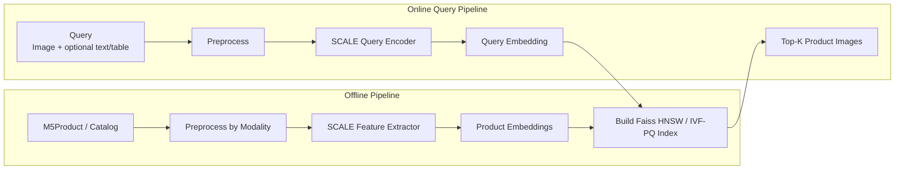

## 7.2. Một khái niệm nền: token, feature và embedding

Trước khi đi vào từng modality, cần phân biệt ba khái niệm:

- **Raw data**: dữ liệu gốc, ví dụ ảnh `.jpg`, câu mô tả sản phẩm, bảng key-value, video `.mp4`, audio waveform.
- **Feature/token**: biểu diễn trung gian mà model đọc được. Transformer không đọc trực tiếp ảnh/video/audio thô; ta phải đổi chúng thành một chuỗi vector. Mỗi vector trong chuỗi được gọi là một token.
- **Embedding**: vector cuối cùng đại diện cho cả query hoặc cả sản phẩm. Vector này được dùng để tính similarity và đưa vào Flat baseline hoặc Faiss HNSW/IVF-PQ index.

Ví dụ với text `"white leather sneakers"`, tokenizer có thể tách thành các token như `[CLS]`, `white`, `leather`, `sneakers`, `[SEP]`; mỗi token được biến thành một vector 768 chiều. Với image, "token" không phải là word mà là region feature: vùng giày, vùng logo, vùng đế giày, vùng texture, v.v.

## 7.3. Tổng quan kiến trúc SCALE

SCALE trong paper M5Product là một kiến trúc multi-modal pretraining gồm:

1. **Modality-specific encoders**: mỗi loại dữ liệu có encoder riêng để biến dữ liệu đó thành token vectors.
2. **Concatenate tokens**: nối token của các modality thành một sequence dài.
3. **Joint Co-Transformer (JCT)**: transformer chung học quan hệ giữa token của nhiều modality.
4. **SIMCL + masked tasks**: các loss để model học alignment giữa modality và học lại phần bị che.

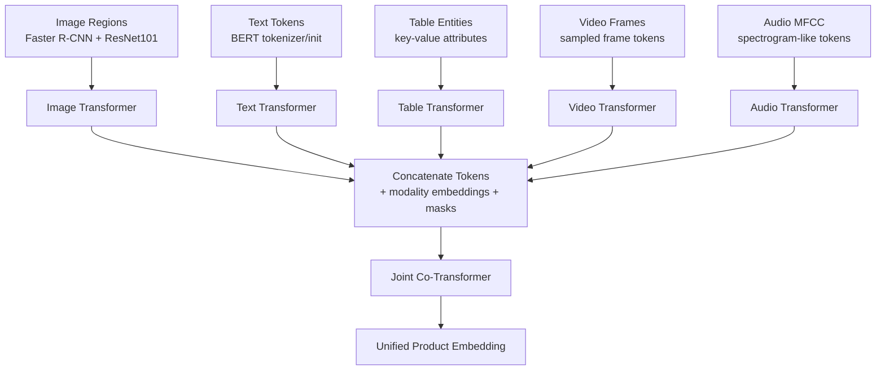

Theo paper M5Product/SCALE:

- Text transformer được khởi tạo từ BERT.
- Các modality transformer và fusion encoder có 6 transformer layers; tổng single-modality + multi-modal fusion là 12 layers.
- Hidden size là 768.
- Caption length tối đa là 36, table length tối đa là 64.
- Image dùng Faster R-CNN với ResNet101 pretrained trên Visual Genome để lấy 10-36 region features.
- Audio dùng MFCC.
- Missing modality được xử lý bằng zero imputation.

## 7.4. Image branch: Image Regions -> Image Transformer

### 7.4.1. Image branch là gì?

Image branch là nhánh biến ảnh sản phẩm thành một sequence các vector mô tả những vùng quan trọng trong ảnh. Thay vì đưa toàn bộ ảnh vào transformer như một ma trận pixel, SCALE dùng object/region features.

Ví dụ ảnh một đôi giày:

- Region 1: toàn bộ đôi giày.
- Region 2: logo.
- Region 3: phần đế.
- Region 4: dây giày.
- Region 5: texture da/vải.

Mỗi region được biểu diễn bằng một vector. Sequence các vector này là input cho Image Transformer.

### 7.4.2. Vì sao dùng region feature thay vì toàn ảnh?

Trong e-commerce, background, model, ánh sáng và layout ảnh có thể thay đổi mạnh. Nếu dùng toàn ảnh, model dễ học nhầm background hoặc style chụp. Region feature giúp model tập trung vào object chính và các bộ phận sản phẩm.

Paper SCALE dùng hướng **bottom-up attention**: object detector đề xuất các vùng ảnh quan trọng trước, sau đó transformer học quan hệ giữa các vùng đó.

### 7.4.3. Input và output

| Thành phần | Mô tả |
| --- | --- |
| Input raw | Ảnh sản phẩm hoặc ảnh query. |
| Detector output | `N` bounding boxes, thường chọn 10-36 vùng có objectness score cao. |
| Region feature | Vector cho mỗi vùng, ví dụ `N x d`. |
| Image transformer output | Sequence token ảnh đã được contextualize, ví dụ `N x 768`. |

### 7.4.4. Tool đề xuất

| Tool | Nguồn | Vai trò |
| --- | --- | --- |
| `airsplay/py-bottom-up-attention` | Được paper SCALE nhắc tới trong footnote. | Gần nhất với cách SCALE lấy bottom-up region features. |
| `torchvision.models.detection` | Tool ngoài, dựa trên PyTorch/TorchVision. | Dùng Faster R-CNN/ResNet-FPN để prototype object detection nếu không dùng đúng bottom-up attention code. |
| `timm` hoặc `torchvision.models` | Tool ngoài. | Dùng ResNet/ViT/Swin làm visual backbone thay thế nếu cần đơn giản hóa. |

Nếu dùng đúng tinh thần paper, lựa chọn tốt nhất là `py-bottom-up-attention`. Nếu môi trường khó cài, có thể dùng `torchvision` Faster R-CNN để lấy bounding boxes, sau đó lấy feature từ backbone hoặc ROI pooled features. Đây là thay thế thực dụng, cần ghi rõ trong báo cáo là implementation approximation.

## 7.5. Text branch: Text Tokens -> Text Transformer

### 7.5.1. Text branch là gì?

Text branch biến title/caption/description thành token vectors. Ví dụ:

```text
Input text: "Bubble Matt Blind Box Storage Ladder"
Tokens: [CLS], bubble, matt, blind, box, storage, ladder, [SEP]
```

Mỗi token được ánh xạ thành vector thông qua embedding layer của BERT, sau đó đi qua Text Transformer để học ngữ cảnh.

### 7.5.2. BERT init nghĩa là gì?

SCALE không train text transformer từ con số 0. Paper dùng BERT để khởi tạo text transformer. BERT là encoder-only transformer đã học ngôn ngữ bằng masked language modeling. Vì vậy, ngay từ đầu model đã biết một phần quan hệ giữa các từ, ví dụ `leather`, `shoe`, `sneaker`, `white`, `size`.

### 7.5.3. Input và output

| Thành phần | Mô tả |
| --- | --- |
| Input raw | Product title, caption, description. |
| Tokenizer output | `input_ids`, `attention_mask`, optional `token_type_ids`. |
| Text transformer output | Sequence token text, ví dụ `L_text x 768`. |
| Vai trò | Bổ sung category, function, material, selling point mà ảnh không thể hiện rõ. |

### 7.5.4. Tool đề xuất

| Tool | Nguồn | Vai trò |
| --- | --- | --- |
| Hugging Face `transformers` | Tool ngoài, official docs. | Dùng `BertTokenizer`, `BertModel`, hoặc `AutoTokenizer/AutoModel`. |
| Google BERT checkpoint | Paper gốc BERT. | Khởi tạo text encoder. |

Ví dụ lựa chọn implementation:

```text
tokenizer = AutoTokenizer.from_pretrained("bert-base-uncased")
text_encoder = AutoModel.from_pretrained("bert-base-uncased")
```

## 7.6. Table branch: Table Entities -> Table Transformer

### 7.6.1. Table entities là gì?

Table trong e-commerce là thông tin có cấu trúc dạng key-value. Ví dụ:

| Key | Value |
| --- | --- |
| Item | Blind Box Ladder Storage Box |
| Brand | Tang Craftsman |
| Material | Wood |
| Color | White, Light Gray, Dark Gray |
| Applicable Scene | Study |

Một **table entity** là một đơn vị thuộc tính có nghĩa, thường là cặp `key: value`. Ví dụ `Material: Wood` là một entity, `Color: White` là một entity. Nó khác text bình thường vì key cho biết vai trò của value.

### 7.6.2. Vì sao không chỉ nối table thành text?

Nếu nối mọi thứ thành câu text, model có thể mất cấu trúc key-value. Ví dụ `white` trong `Color: White` khác với `Brand: White Label`. Table Transformer giúp model học rằng `Color`, `Brand`, `Material`, `Size`, `Applicable Scene` là các loại thuộc tính khác nhau.

### 7.6.3. Cách biểu diễn table entity

Paper SCALE dùng table transformer riêng và **Mask Entity Modeling (MEM)**, nhưng không công bố chi tiết serialization table trong phần chính. Chi tiết encoding table sẽ được quyết định khi hiện thực và ghi riêng trong báo cáo thực nghiệm; nó không được xem là một thành phần đã xác định của SCALE gốc.

### 7.6.4. Input và output

| Thành phần | Mô tả |
| --- | --- |
| Input raw | JSON/CSV/key-value product specification. |
| Entity sequence | Danh sách entity đã serialize. |
| Table transformer output | Sequence token/entity table, ví dụ `L_table x 768`. |
| Vai trò | Bổ sung fine-grained attributes như brand, material, color, size. |

### 7.6.5. Tool đề xuất

| Tool | Nguồn | Vai trò |
| --- | --- | --- |
| `pandas` | Tool ngoài. | Đọc CSV/JSON, normalize bảng thuộc tính. |
| Python `json` | Standard library. | Parse product attribute JSON. |
| Hugging Face tokenizer | Tool ngoài. | Tokenize chuỗi entity serialization. |

### 7.6.6. Mask Entity Modeling

Với MLM, ta mask token lẻ. Với MEM, ta mask cả entity:

```text
Before: [ENT] key = material [VAL] wood [SEP]
After:  [MASK_ENTITY]
Target: material = wood
```

Việc mask nguyên entity buộc model dùng image/text/video/audio còn lại để suy luận thuộc tính bị thiếu. Ví dụ nhìn ảnh ghế gỗ và title "wooden chair", model có thể dự đoán `Material: Wood`.

## 7.7. Video branch: Video Frames -> Video Transformer

### 7.7.1. Video branch là gì?

Video branch biến video sản phẩm thành chuỗi frame features. Một video có nhiều frame, nhưng không thể đưa toàn bộ frame vào model vì quá nặng. Ta sample một số frame đại diện, ví dụ 8 hoặc 16 frame theo thời gian.

Ví dụ video quay túi xách:

- Frame 1: mặt trước.
- Frame 2: góc nghiêng.
- Frame 3: mặt sau.
- Frame 4: cận cảnh khóa kéo.
- Frame 5: bên trong túi.

Những frame này giúp model hiểu sản phẩm ở nhiều góc nhìn.

### 7.7.2. Input và output

| Thành phần | Mô tả |
| --- | --- |
| Input raw | Video sản phẩm. |
| Frame sampler | Chọn `T` frame theo thời gian. |
| Frame feature | Vector cho từng frame hoặc region trong frame. |
| Video transformer output | Sequence video tokens, ví dụ `T x 768`. |

### 7.7.3. Tool đề xuất

| Tool | Nguồn | Vai trò |
| --- | --- | --- |
| `ffmpeg` | Tool ngoài, industry standard. | Decode video, extract frames/audio. |
| `PyAV` | Tool ngoài, Python binding cho FFmpeg libraries. | Đọc video frame trực tiếp trong Python dataloader. |
| `decord` | Tool ngoài. | Efficient video loading cho deep learning. |
| `torchvision.io` | Tool ngoài. | Đọc video cơ bản trong PyTorch ecosystem. |

## 7.8. Audio branch: Audio MFCC -> Audio Transformer

### 7.8.1. Audio branch là gì?

Audio branch biến tín hiệu âm thanh thành chuỗi feature theo thời gian. Trong SCALE, audio được biểu diễn bằng **MFCC - Mel-Frequency Cepstral Coefficients**.

MFCC là cách nén phổ âm thanh theo thang Mel, gần với cách tai người cảm nhận tần số. Nó thường gồm các bước:

1. Chia audio thành frame ngắn.
2. Tính phổ tần số cho từng frame.
3. Áp dụng Mel filter bank.
4. Lấy log năng lượng.
5. Dùng DCT để tạo cepstral coefficients.

### 7.8.2. Audio giúp gì cho product search?

Audio không phải modality mạnh nhất cho mọi sản phẩm, nhưng có thể hữu ích khi:

- Video sản phẩm có lời giới thiệu.
- Sản phẩm có âm thanh đặc trưng, ví dụ nhạc cụ, thiết bị điện, đồ chơi.
- Audio transcript có thể bổ sung text signal.

### 7.8.3. Input và output

| Thành phần | Mô tả |
| --- | --- |
| Input raw | Audio waveform hoặc audio track từ video. |
| MFCC output | Ma trận `time_steps x n_mfcc`. |
| Projection | Linear layer đưa MFCC về hidden size 768. |
| Audio transformer output | Sequence audio tokens, ví dụ `L_audio x 768`. |

### 7.8.4. Tool đề xuất

| Tool | Nguồn | Vai trò |
| --- | --- | --- |
| `librosa.feature.mfcc` | Tool ngoài, official docs. | Tính MFCC từ waveform. |
| `torchaudio.transforms.MFCC` | Tool ngoài, PyTorch ecosystem. | Tính MFCC trực tiếp bằng tensor pipeline. |
| `ffmpeg` hoặc `PyAV` | Tool ngoài. | Tách audio track từ video. |

## 7.9. Concatenate Tokens: nối các modality như thế nào?

Sau khi từng encoder tạo token sequence riêng, ta nối chúng thành một sequence chung:

```text
[IMG_CLS], img_1, img_2, ..., img_N,
[TXT_CLS], txt_1, txt_2, ..., txt_L,
[TAB_CLS], tab_1, tab_2, ..., tab_M,
[VID_CLS], vid_1, vid_2, ..., vid_T,
[AUD_CLS], aud_1, aud_2, ..., aud_A
```

Để JCT biết token nào thuộc modality nào, cần cộng thêm:

- **Position embedding**: token đứng ở vị trí nào trong sequence.
- **Modality/type embedding**: token thuộc image, text, table, video hay audio.
- **Attention mask**: token nào là thật, token nào là padding/missing.

Đây là phần implementation cần làm rõ khi code. Nếu thiếu modality, ví dụ query chỉ có image, ta dùng mask để JCT không chú ý vào padding token của modality khác.

## 7.10. Joint Co-Transformer (JCT)

### 7.10.1. JCT là gì?

JCT là transformer chung nhận sequence token đã nối từ nhiều modality. Nó dùng self-attention để mỗi token có thể "nhìn" các token khác, kể cả token từ modality khác.

Ví dụ:

- Token ảnh vùng "đế giày" có thể chú ý tới token text "sneaker".
- Token table `Material: leather` có thể chú ý tới vùng texture trong ảnh.
- Token video frame cận cảnh logo có thể chú ý tới text brand.
- Token audio từ lời giới thiệu có thể chú ý tới table attribute.

### 7.10.2. Vì sao JCT quan trọng?

Nếu chỉ encode từng modality riêng rồi average, model khó học quan hệ chi tiết giữa chúng. JCT cho phép cross-modal reasoning:

- Text giải thích ảnh.
- Table xác nhận thuộc tính trong ảnh.
- Video bổ sung góc nhìn ảnh không có.
- Audio/voice bổ sung intent hoặc selling point.

JCT là nơi semantic gap và việc liên kết thông tin đa phương thức được cải thiện mạnh nhất.

### 7.10.3. Self-attention trong JCT hoạt động thế nào?

Với mỗi token, transformer tạo ba vector `Q`, `K`, `V`:

- `Q` - query: token này đang tìm thông tin gì?
- `K` - key: token khác chứa loại thông tin nào?
- `V` - value: nội dung token khác sẽ truyền sang là gì?

Attention score giữa token `i` và token `j` được tính từ `Q_i` và `K_j`. Nếu score cao, token `i` lấy nhiều thông tin từ `V_j`.

Trong JCT, token image có thể attend tới token text/table/video/audio. Vì vậy, output của JCT không còn là feature đơn modality nữa mà là feature đã được "làm giàu" bởi các modality khác.

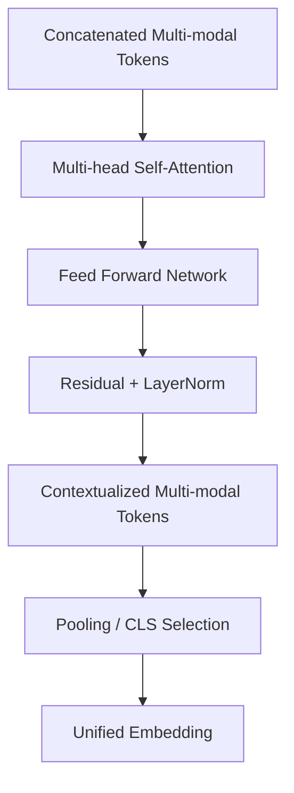

### 7.10.4. Output của JCT lấy embedding như thế nào?

Paper sử dụng fused modality features từ JCT cho downstream task nhưng không quy định một pooling rule duy nhất trong phần chính. Pooling rule được chọn cho pipeline retrieval cần được ghi rõ và kiểm chứng bằng ablation.

## 7.11. Self-supervised masked tasks

SCALE dùng các pretext tasks để model học đặc trưng hữu ích ngay cả khi không có label thủ công.

| Task | Modality | Cách hoạt động | Vì sao hữu ích |
| --- | --- | --- | --- |
| MRP - Masked Region Prediction | Image | Che một số region image và dự đoán lại feature/label vùng đó. | Học object part và visual context. |
| MLM - Masked Language Modeling | Text | Che token text và dự đoán token bị che. | Học ngữ nghĩa title/caption. |
| MEM - Mask Entity Modeling | Table | Che nguyên entity key-value. | Học product attributes có cấu trúc. |
| MFP - Mask Frame Prediction | Video | Che frame/token video và dự đoán lại. | Học quan hệ theo thời gian/góc nhìn. |
| MAM - Mask Audio Modeling | Audio | Che audio feature và dự đoán lại. | Học pattern âm thanh/speech context. |

Paper mask 15% input. Với table, mask nguyên entity giúp model học tốt hơn so với mask từng word rời rạc.

## 7.12. Self-harmonized Inter-Modality Contrastive Learning (SIMCL)

Nếu chỉ có hai modality image-text, ta có thể dùng contrastive learning: image và text của cùng sản phẩm là positive pair, image và text của sản phẩm khác là negative pair. Nhưng với 5 modality, có nhiều cặp: image-text, image-table, image-video, text-table, video-audio, v.v. Không phải cặp nào cũng quan trọng như nhau.

SIMCL học một **modality alignment score matrix** để tự cân bằng:

- Cặp modality nào align tốt và nhiều thông tin hơn thì trọng số cao hơn.
- Cặp modality nhiễu hoặc thiếu thông tin thì trọng số thấp hơn.
- Masked task của từng modality cũng được cân bằng, tránh một modality lấn át toàn bộ training.

Trong paper, alignment score matrix được học như tham số tự do; phần tam giác trên được dùng để weighting các inter-modality contrastive loss, còn phần đường chéo weighting intra-modality masked loss. Vì vậy SIMCL là cơ chế weighting loss, không phải bộ chọn modality động ở inference.

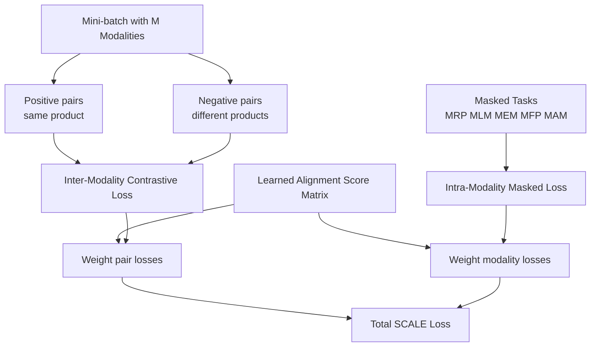

Tổng loss khái niệm:

```text
L_total = weighted_inter_modality_contrastive_loss
        + weighted_intra_modality_masked_loss
```

Đây là lý do SCALE phù hợp hơn cách fusion đơn giản như concatenate rồi train classifier: nó không chỉ nối dữ liệu, mà còn học mức độ tin cậy/đóng góp giữa các modality.

## 7.13. Embedding extraction

Sau khi train/finetune, ta dùng SCALE để tạo embedding:

### Catalog embedding offline

1. Load product record.
2. Đọc image/text/table/video/audio nếu có.
3. Preprocess từng modality.
4. Chạy qua modality encoders.
5. Nối token và chạy JCT.
6. Pool output thành vector embedding.
7. L2-normalize.
8. Lưu `{product_id, image_id, embedding, metadata}`.

### Query embedding online

1. Nhận query.
2. Xác định query có modality nào.
3. Preprocess modality đó.
4. Các modality thiếu được mask/zero.
5. Chạy qua SCALE.
6. L2-normalize embedding.
7. Search Flat baseline hoặc Faiss HNSW/IVF-PQ index.

L2-normalization giúp cosine similarity hoặc inner product ổn định hơn. Shopsy cũng dùng L2-normalization trước khi đưa embedding vào ANN.

## 7.14. Retrieval index: Flat baseline, Faiss HNSW và IVF-PQ

Tầng retrieval nhận embedding của ảnh query và tìm top-K embedding gần nhất trong gallery product entry. Embedding gallery được tạo offline, lưu cùng `product_id`, ảnh đại diện và metadata; khi truy vấn, hệ thống chỉ tính embedding query rồi gọi index. Thiết kế này tách chi phí feature extraction khỏi latency của retrieval.

### 7.14.1. Chuẩn hóa vector và exact baseline

Trước khi index, query embedding và gallery embedding đều được L2-normalize. Retrieval chính dùng inner product, vì với vector đã chuẩn hóa thứ hạng theo inner product tương đương cosine similarity. `IndexFlatIP` duyệt toàn bộ gallery nên là exact baseline: top-K của nó được đối chiếu với nhãn đánh giá để đo chất lượng representation, đồng thời làm mốc tính recall loss của index ANN. `IndexFlatL2` chỉ dùng để kiểm tra tính nhất quán của metric khi cần, không phải một index triển khai riêng.

### 7.14.2. Faiss HNSW: index chính

Prototype sử dụng `IndexHNSWFlat` với inner product trên embedding đã chuẩn hóa. HNSW không cần train index; mỗi embedding mới có thể được thêm cùng `product_id` qua lớp mapping ID. Ba tham số được tune trên validation set:

- `M`: số liên kết của mỗi node, ảnh hưởng memory và recall.
- `efConstruction`: độ rộng tìm kiếm khi xây graph, ảnh hưởng build time và chất lượng graph.
- `efSearch`: độ rộng tìm kiếm khi query, là núm điều chỉnh chính cho trade-off latency–recall.

HNSW phù hợp cho demo vì pipeline add vector đơn giản và latency thấp. Tuy nhiên, record bị xóa hoặc thay ảnh không nên chỉnh trực tiếp trong graph: hệ thống đánh dấu `product_id` không còn hiệu lực ở metadata mapping, lọc kết quả trước khi trả về, và rebuild index theo batch khi lượng thay đổi tích lũy vượt ngưỡng đã đặt.

### 7.14.3. IVF-PQ/OPQ-PQ: phương án nén

Khi memory của HNSW không còn phù hợp với kích thước gallery, hệ thống chuyển sang IVF-PQ. IVF phân cụm embedding thành `nlist` cell; khi query chỉ duyệt `nprobe` cell gần nhất. PQ nén mỗi vector thành mã PQ, còn OPQ là phép xoay không gian tùy chọn trước PQ để giảm sai số lượng tử hóa.

IVF-PQ phải được train trên một mẫu gallery đại diện trước khi add toàn bộ vector. Các tham số `nlist`, `nprobe`, số subquantizer `m` và số bit mỗi mã được chọn bằng validation benchmark; cấu hình được chấp nhận khi đạt memory budget và recall loss so với `IndexFlatIP` phù hợp với mục tiêu demo. IVF-PQ không thay thế HNSW trong bản đầu, mà là phương án scale khi benchmark cho thấy HNSW vượt memory budget.

### 7.14.4. Quy trình benchmark và cập nhật index

Mỗi cấu hình chạy trên cùng gallery, cùng embedding, cùng hardware và cùng tập query. Báo cáo gồm Recall@K so với `IndexFlatIP`, query latency, QPS, build time và memory footprint. Với catalog update, embedding mới được tạo offline; HNSW add tăng dần, còn IVF-PQ add sau khi index đã train. Mỗi lần rebuild phải tạo version mới của index và metadata mapping, kiểm tra trên validation set rồi mới thay thế version đang phục vụ.

| Thành phần | Vai trò trong hệ thống | Điều kiện sử dụng |
| --- | --- | --- |
| `IndexFlatIP` | Exact baseline trên vector L2-normalize. | Luôn chạy trên subset/benchmark để đo representation quality và recall loss. |
| `IndexHNSWFlat` | Index ANN mặc định cho demo. | Dùng khi memory đáp ứng và cần latency thấp. |
| IVF-PQ/OPQ-PQ | Index ANN nén. | Dùng khi benchmark cho thấy HNSW vượt memory budget. |

## 7.15. Index building pipeline

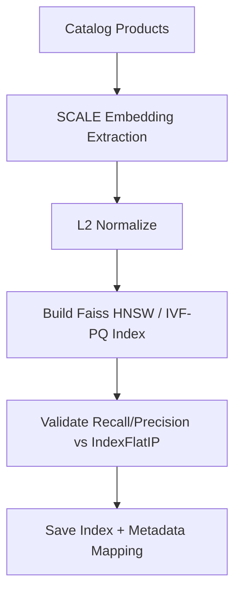

## 7.16. Training workflow

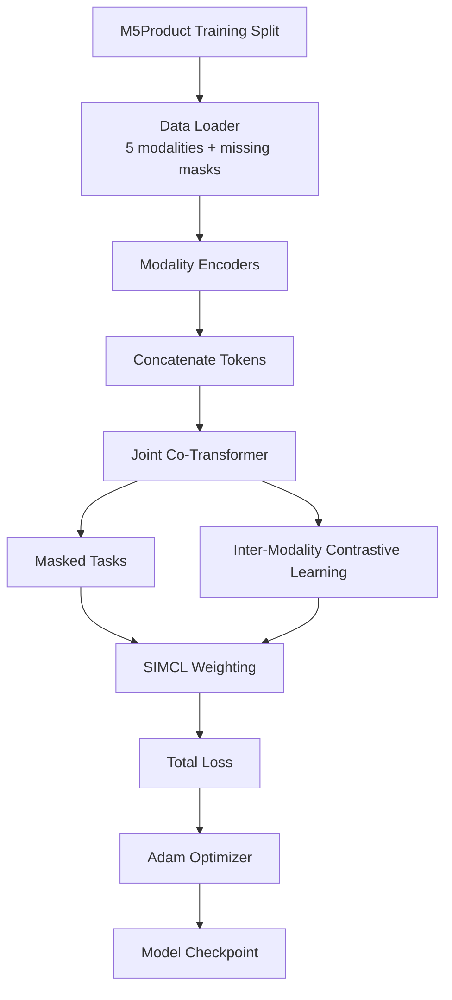

Training chia thành:

- **Pretraining**: self-supervised masked tasks + SIMCL trên dữ liệu lớn.
- **Finetuning**: dùng subset retrieval/classification nếu có label category/instance.
- **Embedding export**: freeze model tốt nhất và export gallery/query embedding.

Để tái lập paper, cấu hình tham chiếu là batch size 64, 5 epochs, Adam với warm-up learning rate `1e-4`; chỉ thay đổi khi giới hạn GPU hoặc subset dữ liệu buộc phải điều chỉnh. Mọi thay đổi cấu hình của nhóm phải được ghi riêng trong thực nghiệm.

## 7.17. Testing and evaluation workflow

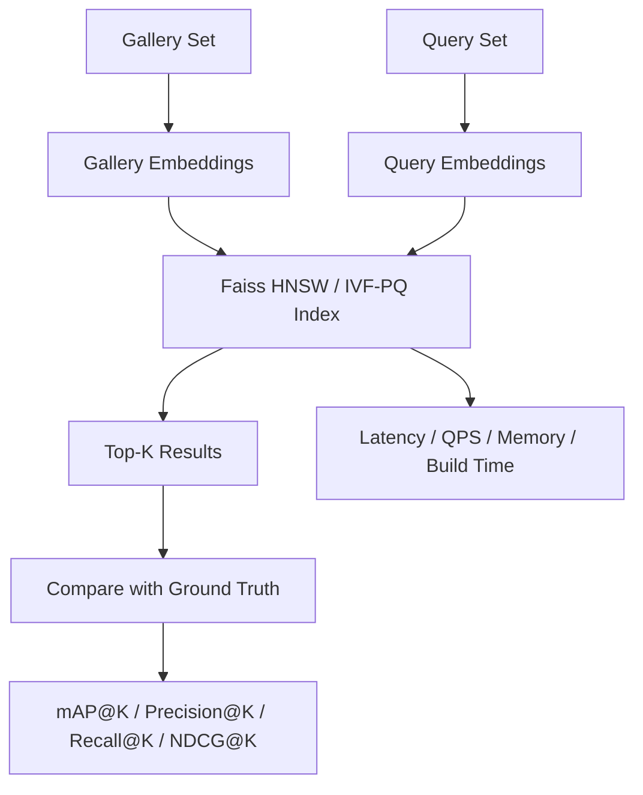

Model quality được đo bằng retrieval metrics. System quality được đo bằng latency, QPS, memory footprint và index build/update time.

## 7.18. Serving design

Online serving gồm:

1. Query API nhận file hoặc payload.
2. Preprocessor chuẩn hóa modality.
3. SCALE inference tạo query embedding.
4. ANN service trả về candidate IDs.
5. Metadata service map IDs sang image/product.
6. Optional reranker sắp xếp lại bằng business rules hoặc score kết hợp.

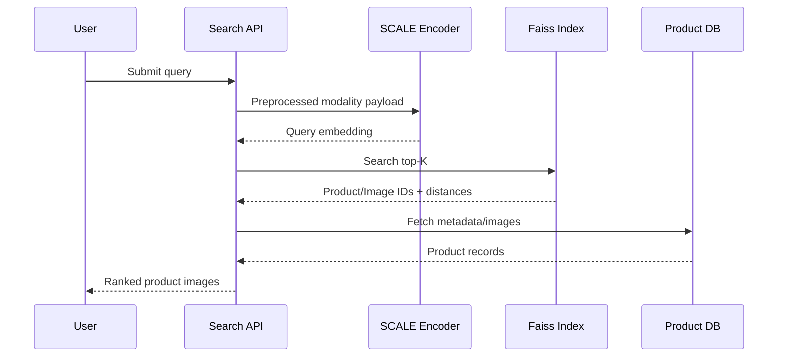

## 7.19. Rủi ro và hướng xử lý

| Rủi ro | Nguyên nhân | Hướng xử lý |
| --- | --- | --- |
| Query chỉ có image nhưng model train nhiều modality | Modal mismatch giữa train và serve. | Missing modality mask/zero imputation theo SCALE. |
| Semantic sai dù ảnh giống | Embedding quá thiên về texture. | Tăng trọng số text/table, finetune bằng category/instance labels. |
| Approximate index giảm recall | Approximation/quantization quá mạnh. | So sánh với `IndexFlatIP`, tune Faiss HNSW hoặc IVF-PQ, dùng rerank top-N bằng exact distance. |
| Latency cao | SCALE inference nặng. | Cache embedding, batch offline, dùng model distillation/ONNX/TensorRT nếu cần. |
| Catalog update | Product mới cần embedding và index update. | Incremental index hoặc rebuild định kỳ theo batch. |

## 7.20. Phương pháp giải quyết các thách thức thực hiện

Mỗi thách thức được xử lý ở một tầng khác nhau. SCALE và M5Product giúp model tạo embedding tốt hơn; Faiss giúp tìm kiếm nhanh; re-ranking ở Mục 08 chỉ sắp xếp lại các kết quả đã tìm được. Vì vậy, không có một thành phần nào giải quyết toàn bộ vấn đề.

### 7.20.1. Sensory Gap

**Vấn đề:** ảnh query có thể tối, bị crop hoặc có background khác ảnh catalog.

**Hệ thống làm gì:** image regions giúp model tập trung hơn vào vùng sản phẩm; video trong catalog cung cấp thêm góc nhìn của cùng sản phẩm.

**Giới hạn:** nếu ảnh query quá mờ hoặc chỉ thấy một chi tiết quá nhỏ, kết quả vẫn có thể kém. Vì vậy cần báo cáo metric riêng cho từng nhóm ảnh nhiễu.

### 7.20.2. Semantic Gap

**Vấn đề:** sản phẩm nhìn giống nhau nhưng khác model, material, size hoặc compatibility.

**Hệ thống làm gì:** image encoder học phần nhìn thấy; text/table encoder bổ sung thông tin như brand, model, material; JCT kết hợp các nguồn này. Nếu query có text/table đáng tin cậy, attribute-aware re-ranking ở Mục 08 ưu tiên candidate khớp thuộc tính.

**Giới hạn:** nếu query chỉ có ảnh, hệ thống không biết chắc ràng buộc như “iPhone 14” hay “iPhone 15”.

### 7.20.3. Context-Query Gap

**Vấn đề:** chỉ từ ảnh, không phải lúc nào hệ thống cũng biết người dùng muốn đúng SKU, cùng style hay sản phẩm thay thế.

**Hệ thống làm gì:** hệ thống nhận thêm text/table ngắn khi có; JCT và metadata catalog dùng thông tin đó để làm rõ intent. Zero imputation cho phép model vẫn hoạt động khi một modality bị thiếu.

**Giới hạn:** metadata thiếu hoặc sai không thể tự trở thành thông tin đúng. Hệ thống không dùng metadata của Top-1 để đoán ngược ý định của query.

### 7.20.4. Model Gap

**Vấn đề:** model có thể học tốt các category quen thuộc nhưng kém với category hiếm hoặc chưa xuất hiện trong training.

**Hệ thống làm gì:** M5Product có 6.232 category và 5 modality, nên model được học từ dữ liệu đa dạng hơn dataset đơn miền.

**Giới hạn:** dữ liệu đa dạng giúp giảm gap nhưng không bảo đảm đúng với sản phẩm long-tail hoặc ngoài training. Vì vậy metric và failure case phải được tách theo category.

### 7.20.5. Ràng buộc hệ thống

**Vấn đề:** catalog lớn làm exact search chậm; catalog thay đổi làm index cũ đi nhanh.

**Hệ thống làm gì:** embedding catalog được tạo offline. `IndexFlatIP` làm mốc exact; HNSW phục vụ tìm nhanh; IVF-PQ dùng khi cần giảm memory. Exact re-ranking ở Mục 08 sửa thứ tự của Top-N sau HNSW.

**Giới hạn:** HNSW/IVF-PQ vẫn có recall loss so với exact search; re-ranking không tìm lại candidate bị ANN bỏ sót. Khi catalog thay đổi nhiều, index và metadata mapping cần được rebuild/batch update.

Nhờ cách tách này, thực nghiệm có thể trả lời rõ: embedding có hiểu sản phẩm không, index đã đánh đổi bao nhiêu chất lượng để đổi tốc độ, và gap nào vẫn là failure case.

## 7.21. Summary

SCALE + Faiss-based retrieval phù hợp với đề tài vì SCALE học representation chung cho 5 modality, còn Faiss biến embedding đó thành hệ thống truy hồi có thể đo đạc và mở rộng. Pipeline cải thiện representation và khả năng phục vụ, nhưng không tự giải quyết hoàn toàn ảnh query nhiễu, category ngoài training hay metadata sai. Vì vậy, kết quả cần được báo cáo theo Sensory, Semantic, Context-Query, Model Gap và ràng buộc hệ thống thay vì chỉ nêu một metric trung bình.

---

# 08. Cải thiện đề xuất

Mục 05 phân chia bốn gap và một ràng buộc hệ thống. Hai cải tiến trong mục này chỉ hoạt động ở **sau Faiss HNSW**; vì vậy chúng không thay đổi SCALE, không thay thế M5Product và không giải quyết tất cả thách thức.

| Cải tiến | Liên hệ với Mục 05 | Mục đích | Không giải quyết trực tiếp |
| --- | --- | --- | --- |
| Exact re-ranking | Ràng buộc hệ thống ở Mục 5.6: ANN có thể xếp sai thứ tự. | Sắp xếp lại Top-N bằng điểm exact để cải thiện Top-K. | Sensory Gap, Model Gap và candidate bị HNSW bỏ sót hoàn toàn. |
| Attribute-aware re-ranking | Semantic Gap ở Mục 5.3 và Context-Query Gap ở Mục 5.4. | Dùng thuộc tính query đáng tin cậy để ưu tiên sản phẩm tương thích. | Không giúp khi query chỉ có ảnh hoặc metadata không tin cậy. |

## 8.1. Flow cơ sở và flow sau cải thiện

Flow cơ sở trả trực tiếp Top-K từ HNSW. Flow mới lấy Top-N lớn hơn, tính lại điểm exact và chỉ kiểm tra thuộc tính khi query có text/table đáng tin cậy.

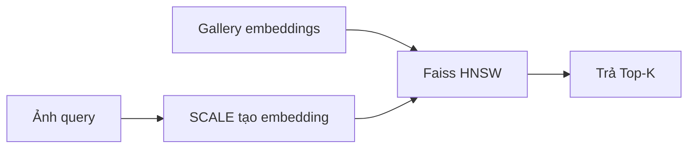

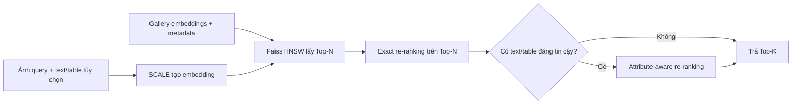

## 8.2. Exact re-ranking cho ràng buộc ANN

**Thách thức liên quan:** Ở Mục 5.6, HNSW dùng approximate nearest-neighbor search để giảm latency. Đổi lại, các candidate có score gần nhau có thể bị xếp sai thứ tự.

**Cách làm:** HNSW lấy Top-N, ví dụ 100 candidate. Hệ thống tính lại inner product chính xác giữa query embedding và từng candidate trong Top-N, sau đó sắp xếp lại trước khi trả Top-K.

```text
HNSW lấy Top-N -> tính exact inner product trên Top-N -> trả Top-K
```

**Mục đích:** tăng chất lượng thứ tự Top-K nhưng không phải exact search trên toàn bộ gallery.

**Giới hạn:** bước này chỉ đổi thứ tự candidate đã có trong Top-N. Nếu HNSW không đưa sản phẩm đúng vào Top-N, re-ranking không thể khôi phục nó.

**Đánh giá:** so sánh Precision@K, Recall@K và latency trước/sau re-ranking; chọn `N` và `efSearch` bằng validation set.

## 8.3. Attribute-aware re-ranking cho Semantic và Context-Query Gap

**Thách thức liên quan:** Semantic Gap ở Mục 5.3 xảy ra khi sản phẩm nhìn giống nhưng khác model, size hoặc compatibility. Context-Query Gap ở Mục 5.4 xảy ra vì ảnh query không luôn nói rõ ràng buộc người dùng cần.

**Cách làm:** chỉ khi query có text hoặc bảng thuộc tính đáng tin cậy, hệ thống kiểm tra metadata của candidate trong Top-N sau exact re-ranking. Candidate khớp model, size hoặc compatibility được ưu tiên cao hơn; màu sắc/texture chỉ là thuộc tính phụ.

**Mục đích:** tránh kết quả “nhìn giống nhưng dùng sai”, ví dụ ốp iPhone 14 được xếp trên ốp iPhone 15 khi query ghi rõ “iPhone 14”.

**Giới hạn:** không lấy metadata của Top-1 làm nhãn cho query vì Top-1 sai sẽ khuếch đại lỗi. Khi query chỉ có ảnh, hoặc metadata không tin cậy, hệ thống chỉ dùng exact re-ranking ở Mục 8.2.

**Đánh giá:** đo Precision@K trên tập query có text/table và kiểm tra rằng metric chung không giảm.

## 8.4. Phần còn lại của Mục 05 được xử lý như thế nào?

- **Sensory Gap (Mục 5.2):** SCALE dùng image regions và catalog có nhiều view, nhưng proposal không thêm cải tiến riêng cho ảnh query nhiễu. Chất lượng được kiểm tra bằng noise slice trong evaluation.
- **Model Gap (Mục 5.5):** M5Product có 6.232 category giúp mở rộng kiến thức model. Gap này không thể loại bỏ bằng re-ranking; cần báo cáo metric và failure case theo category, đặc biệt long-tail/out-of-distribution.
- **Metadata noise (Mục 5.4):** attribute-aware re-ranking chỉ chạy khi metadata query đáng tin cậy; metadata nhiễu vẫn được coi là failure case, không được tự động tin tưởng.

## 8.5. Thứ tự triển khai

1. Chạy baseline SCALE + `IndexFlatIP` + HNSW.
2. Thêm exact re-ranking và chọn `N`, `efSearch` theo validation set.
3. Chỉ bật attribute-aware re-ranking cho query có text/table đủ tin cậy.
4. Báo cáo riêng hiệu quả theo gap: noise slice, category slice, query có/không có context và ANN recall loss.

Hai cải tiến chỉ được giữ khi metric tốt hơn baseline tương ứng và latency vẫn đáp ứng yêu cầu demo.

---

# 09. Expected Results and Evaluation

## 9.1. Kết quả mong muốn

Hệ thống kỳ vọng đạt được:

- Truy hồi top-K product entry phù hợp với ảnh query, kèm metadata và ảnh đại diện.
- Embedding thể hiện tốt cả visual similarity và semantic similarity.
- Faiss HNSW/IVF-PQ cho tốc độ truy hồi nhanh hơn exhaustive search đáng kể, trong khi `IndexFlatIP` giữ vai trò exact baseline.
- Khả năng chống nhiễu với query bị crop, compression, rotation hoặc watermark.
- Pipeline có thể mở rộng cho catalog lớn và cập nhật sản phẩm định kỳ.

## 9.2. Tiêu chí đánh giá chất lượng mô hình

Paper M5Product/SCALE báo cáo retrieval bằng mAP và Precision. Recall@K, NDCG@K, Category Match@K và các metric hệ thống dưới đây là protocol đánh giá do nhóm bổ sung cho pipeline ảnh-query + Faiss; chúng không phải cấu hình downstream gốc của paper.

| Metric | Ý nghĩa | Lý do dùng |
| --- | --- | --- |
| Precision@K | Tỷ lệ kết quả đúng trong top-K. | Phù hợp với mục tiêu trả về ít kết quả nhưng chính xác. |
| Recall@K | Tỷ lệ ground-truth được tìm thấy trong top-K. | Đo khả năng không bỏ sót sản phẩm đúng. |
| mAP@K | Trung bình average precision theo nhiều query. | Đánh giá cả đúng/sai và thứ tự ranking. |
| NDCG@K | Đánh giá ranking khi có nhiều mức relevance. | Hữu ích nếu có label same/similar/irrelevant. |
| Category Match@K | Tỷ lệ query có ít nhất một kết quả cùng category trong top-K. | Chỉ số bổ sung cho semantic discovery; không thay thế SKU/instance-level metric. |
| Robustness by noise slice | Precision@K theo từng loại noise. | Kiểm tra sensory gap. |

## 9.3. Tiêu chí đánh giá hệ thống retrieval

| Metric | Ý nghĩa |
| --- | --- |
| Query latency | Thời gian từ lúc gửi query đến lúc nhận top-K. |
| QPS | Số query xử lý mỗi giây. |
| Index build time | Thời gian tạo index từ gallery embeddings. |
| Memory footprint | Bộ nhớ index cần dùng. |
| Recall loss vs `IndexFlatIP` | Mức giảm chất lượng khi dùng HNSW/IVF-PQ thay exact search. |
| Update cost | Chi phí thêm sản phẩm mới vào index. |

## 9.4. Tiêu chí đánh giá sản phẩm so với sản phẩm khác

| Tiêu chí | Sản phẩm của chúng tôi | Baseline/sản phẩm khác |
| --- | --- | --- |
| Query modality | Image; có thể kèm text/table ngắn. Video/audio dùng như modality của catalog khi dữ liệu có sẵn. | Thường chỉ image hoặc image+text. |
| Semantic awareness | Dựa trên SCALE multi-modal embedding. | I2I thuần dễ thiên texture/shape. |
| Large-scale retrieval | `IndexFlatIP` baseline, Faiss HNSW index chính, IVF-PQ khi cần giảm memory. | Exact search chậm, prototype index thiếu benchmark. |
| Robustness | Báo cáo theo từng nhóm query nhiễu và missing modality. | Dễ giảm chất lượng khi query nhiễu. |
| Evaluation | Kết hợp model metrics và system metrics. | Nhiều demo chỉ đánh giá qualitative. |
| Failure analysis | Phân tích theo nhiễu ảnh, nhóm category, missing metadata và loại index. | Nhiều demo chỉ đánh giá qualitative. |

## 9.5. Target kỳ vọng ban đầu

Các target này là mục tiêu thực nghiệm, không phải cam kết cuối:

- Precision@5 và Recall@10 cao hơn baseline image-only.
- Chọn cấu hình HNSW/IVF-PQ có recall loss so với `IndexFlatIP` phù hợp với latency và memory budget đã công bố.
- Query latency đủ thấp cho demo interactive.
- Benchmark `IndexFlatIP`, HNSW và IVF-PQ trên cùng gallery, cùng hardware và nhiều quy mô catalog.

## 9.6. Failure analysis dự kiến

Hệ thống sẽ ghi nhận các nhóm lỗi:

- Same color/texture nhưng sai category.
- Cùng category nhưng sai model/variant.
- Query chứa nhiều object, chọn nhầm object chính.
- Product mới hoặc long-tail category chưa học tốt.
- Kết quả đúng semantic nhưng ảnh không giống trực quan.

Các lỗi này sẽ được dùng để phân tích giới hạn của representation, modality và index/rerank strategy.

---

# 10. Execution Plan

## 10.1. Thời gian thực hiện

Kế hoạch kéo dài 2 tháng, chia thành 8 tuần.

| Tuần | Công việc | Kết quả |
| --- | --- | --- |
| Week 1 | Đọc paper, chốt problem statement, chuẩn hóa proposal, khảo sát dataset M5Product. | Proposal hoàn chỉnh, danh sách requirement và metric. |
| Week 2 | Chuẩn bị data loader, preprocess image/text/table/video/audio, thiết kế schema metadata. | Pipeline đọc dữ liệu và kiểm tra sample. |
| Week 3 | Cài đặt hoặc tái hiện SCALE feature extraction; chạy thử trên subset nhiều nhóm category. | Embedding extraction chạy được; có thống kê metric/failure cơ bản theo category. |
| Week 4 | Pretrain/finetune thử nghiệm và tạo failure slice cho ảnh nhiễu/nhiều object. | Checkpoint đầu tiên, log training và bộ kiểm tra robustness/region failure. |
| Week 5 | Export gallery/query embeddings, xây `IndexFlatIP` baseline và Faiss HNSW index. | Index đầu tiên, kết quả Precision@K/Recall@K baseline. |
| Week 6 | Tune Faiss HNSW và Faiss IVF-PQ/OPQ-PQ với `IndexFlatIP` làm exact baseline; thử exact re-ranking trên Top-N. | Bảng Recall@K, latency, QPS, memory, build time và ablation re-ranking. |
| Week 7 | Xây demo/API retrieval, visualize top-K result, thêm logging failure cases và attribute-aware re-ranking cho query có context đáng tin cậy. | Demo end-to-end và báo cáo cải thiện theo failure slice. |
| Week 8 | Tổng hợp kết quả, viết báo cáo, hoàn thiện slide/demo, phân tích hạn chế. | Final report, demo, evaluation table. |

## 10.2. Milestones

| Milestone | Deadline | Deliverable |
| --- | --- | --- |
| M1 | Cuối Week 1 | Proposal và scope hoàn chỉnh. |
| M2 | Cuối Week 3 | Data + feature extraction prototype. |
| M3 | Cuối Week 5 | Retrieval baseline với `IndexFlatIP` và Faiss HNSW. |
| M4 | Cuối Week 7 | Demo end-to-end và ablation cho các cải thiện đã chọn. |
| M5 | Cuối Week 8 | Báo cáo cuối và kết quả đánh giá. |

## 10.3. Phân công dự kiến

| Thành viên | Trọng tâm |
| --- | --- |
| Trần Hải Đức | Feature extraction, SCALE, preprocessing, evaluation metrics. |
| Trần Hoàng Nam | Faiss HNSW/IVF-PQ index, API/demo retrieval, benchmark latency/QPS, report visualization. |

## 10.4. Rủi ro kế hoạch

| Rủi ro | Ảnh hưởng | Phương án dự phòng |
| --- | --- | --- |
| M5Product quá lớn hoặc khó tải đầy đủ | Chậm training và storage cao. | Dùng subset theo category, ưu tiên image/text/table trước. |
| GPU hạn chế | Không train full SCALE được. | Dùng pretrained/finetune nhỏ, freeze backbone, giảm batch size. |
| Label retrieval không đủ | Metric yếu. | Dùng category label, instance label hoặc human-labeled subset nhỏ. |
| Category long-tail hoặc ngoài training | Kiến thức model không bao quát đủ loại sản phẩm. | Đo metric theo category, ghi nhận failure case và nêu rõ giới hạn coverage của dataset/model. |
| Demo latency cao | Trải nghiệm demo kém. | Cache embedding, batch offline và tối ưu batch size. |

---

# 11. Appendix and References

## 11.1. References từ local papers

1. N. Venkatesan, M. Suresh, Vethamuthu Richard Paul, Diganta Kumar Das, P. Vijayakumar. **The Rise of Visual Search in E-Commerce: Leveraging AI to Redefine Product Discovery**. Journal of Marketing & Social Research, 2025.
2. Xiao Dong, Xunlin Zhan, Yangxin Wu, Yunchao Wei, Michael C. Kampffmeyer, Xiao-Yong Wei, Minlong Lu, Yaowei Wang, Xiaodan Liang. **M5Product: Self-harmonized Contrastive Learning for E-commercial Multi-modal Pretraining**. 2022.
3. Prajit Nadkarni, Narendra Varma Dasararaju. **Visually Similar Products Retrieval for Shopsy**. arXiv:2210.04560, 2022.
4. Chang Liu, Peng Hou, Anxiang Zeng, Han Yu. **Transformer-Empowered Multi-Modal Item Embedding for Enhanced Image Search in E-commerce**. AAAI, 2024.
5. Hao Jiang, Haoxiang Zhang, Qingshan Hou, Chaofeng Chen, Weisi Lin, Jingchang Zhang, Annan Wang. **MRSE: An Efficient Multi-modality Retrieval System for Large Scale E-commerce**.
6. Peng Yuan, Bingyin Mei, Hui Zhang. **FashionMV: Product-Level Composed Image Retrieval with Multi-View Fashion Data**. arXiv:2604.10297, 2026.

## 11.2. References được trích trong methodology

7. Shaoqing Ren, Kaiming He, Ross Girshick, Jian Sun. **Faster R-CNN: Towards Real-Time Object Detection with Region Proposal Networks**. IEEE TPAMI, 2017.
8. Kaiming He, Xiangyu Zhang, Shaoqing Ren, Jian Sun. **Deep Residual Learning for Image Recognition**. CVPR, 2016.
9. Jacob Devlin, Ming-Wei Chang, Kenton Lee, Kristina Toutanova. **BERT: Pre-training of Deep Bidirectional Transformers for Language Understanding**. NAACL, 2019.
10. Alec Radford et al. **Learning Transferable Visual Models From Natural Language Supervision**. ICML, 2021.
11. Florian Schroff, Dmitry Kalenichenko, James Philbin. **FaceNet: A Unified Embedding for Face Recognition and Clustering**. CVPR, 2015.
12. Diederik P. Kingma, Max Welling. **Auto-Encoding Variational Bayes**. ICLR, 2014.
13. Yury A. Malkov, Dmitry A. Yashunin. **Efficient and Robust Approximate Nearest Neighbor Search Using Hierarchical Navigable Small World Graphs**. IEEE TPAMI, 2020.
14. Ruiqi Guo, Philip Sun, Erik Lindgren, Quan Geng, David Simcha, Felix Chern, Sanjiv Kumar. **Accelerating Large-Scale Inference with Anisotropic Vector Quantization**. ICML, 2020.
15. Jeff Johnson, Matthijs Douze, Herve Jegou. **Billion-scale Similarity Search with GPUs**. IEEE Transactions on Big Data, 2019.
16. Herve Jegou, Matthijs Douze, Cordelia Schmid. **Product Quantization for Nearest Neighbor Search**. IEEE TPAMI, 2011.

## 11.3. Tool/library references

17. Meta AI. **Faiss Documentation**. https://faiss.ai/
18. Meta AI. **Faiss Guidelines to Choose an Index**. https://github.com/facebookresearch/faiss/wiki/Guidelines-to-choose-an-index
19. Google Research. **ScaNN: Scalable Nearest Neighbors**. https://github.com/google-research/google-research/tree/master/scann
20. Qdrant. **Indexing Documentation**. https://qdrant.tech/documentation/manage-data/indexing/
21. Milvus. **In-memory Index Documentation**. https://milvus.io/docs/index.md
22. NVIDIA. **Apex: Tools for Easy Mixed Precision and Distributed Training in PyTorch**. https://github.com/NVIDIA/apex
23. PyTorch Contributors. **PyTorch**. https://pytorch.org/
24. Hugging Face. **BERT model documentation in Transformers**. https://huggingface.co/docs/transformers/model_doc/bert
25. Hugging Face. **Transformers library**. https://github.com/huggingface/transformers
26. TorchVision. **Detection models and operators**. https://pytorch.org/vision/stable/models.html
27. Librosa. **librosa.feature.mfcc documentation**. https://librosa.org/doc/latest/generated/librosa.feature.mfcc.html
28. PyAV Contributors. **PyAV Documentation**. https://pyav.org/docs/stable/
29. FFmpeg Developers. **FFmpeg Documentation**. https://ffmpeg.org/documentation.html
30. Pandas Contributors. **pandas Documentation**. https://pandas.pydata.org/docs/
31. Ross Wightman. **timm: PyTorch Image Models**. https://github.com/huggingface/pytorch-image-models

## 11.4. Paper references for tools and model components

32. Peter Anderson, Xiaodong He, Chris Buehler, Damien Teney, Mark Johnson, Stephen Gould, Lei Zhang. **Bottom-Up and Top-Down Attention for Image Captioning and Visual Question Answering**. CVPR, 2018.
33. Ranjay Krishna et al. **Visual Genome: Connecting Language and Vision Using Crowdsourced Dense Image Annotations**. International Journal of Computer Vision, 2017.
34. Ashish Vaswani et al. **Attention Is All You Need**. NeurIPS, 2017.
35. Steven Davis, Paul Mermelstein. **Comparison of Parametric Representations for Monosyllabic Word Recognition in Continuously Spoken Sentences**. IEEE Transactions on Acoustics, Speech, and Signal Processing, 1980.

## 11.5. References cho các thách thức thực hiện

36. Arnon Dagan, Ido Guy, Slava Novgorodov. **Shop by image: characterizing visual search in e-commerce**. *Information Retrieval Journal*, 26, Article 2, 2023. https://doi.org/10.1007/s10791-023-09418-1
37. Google Cloud. **Vision API Product Search: General tips** (tài liệu triển khai; Product Search đang ở maintenance mode). https://cloud.google.com/vision/product-search/docs/general-tips
38. **TIGER-FG: Text-Guided Implicit Fine-Grained Grounding for E-commerce Retrieval**. arXiv:2605.18434, 2026. https://arxiv.org/html/2605.18434v1

## 11.6. Appendix: ký hiệu

| Ký hiệu | Ý nghĩa |
| --- | --- |
| `D(n)` | Dataset gồm n ảnh sản phẩm trong catalog. |
| `q` | Query của người dùng. |
| `K` | Số kết quả trả về. |
| `f(.)` | Feature extractor/encoder. |
| `sim(.)` | Hàm similarity, thường là cosine hoặc inner product sau L2-normalization. |
| ANN | Approximate Nearest Neighbor. |
| JCT | Joint Co-Transformer trong SCALE. |
| SIMCL | Self-harmonized Inter-Modality Contrastive Learning. |
