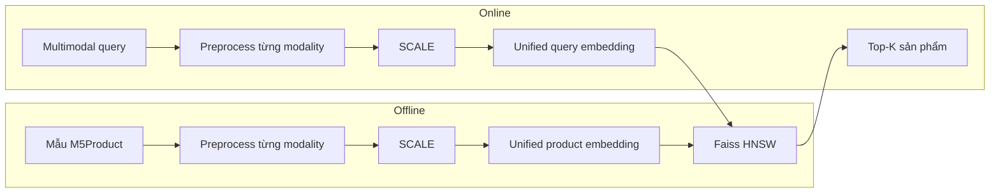
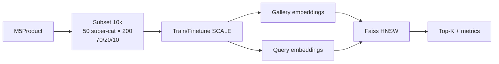

# 00. Introduction

## Topic

**Visual Product Image Search in E-commerce**

Phương pháp trình bày: trích xuất đặc trưng bằng SCALE và indexing bằng Faiss HNSW.

## Team Members

| STT | Team Member | Student ID | Email | Phone |
| --- | --- | --- | --- | --- |
| 1 | Trần Hải Đức | 23127173 | thduc23@clc.fitus.edu.vn | 0916821170 |
| 2 | Trần Hoàng Nam | 23127232 | thnam23@clc.fitus.edu.vn | 0916821170 |

## Revision History

| Version | Date | Author | Description |
| --- | --- | --- | --- |
| 0.1 | 2026-06-26 | Trần Hải Đức, Trần Hoàng Nam | Khởi tạo proposal, xác định topic, problem statement, dataset, methodology và plan 2 tháng. |
| 0.2 | 2026-06-26 | Trần Hải Đức, Trần Hoàng Nam | Bổ sung related works, hướng dùng SCALE để trích xuất đặc trưng và Faiss-based ANN retrieval để truy hồi top-K. |
| 0.3 | 2026-08-19 | Trần Hải Đức, Trần Hoàng Nam | Căn chỉnh proposal theo slide: bài toán multimodal retrieval, subset M5Product 10.000 mẫu, SCALE + Faiss HNSW, tái xếp hạng thuộc tính. |

## Scope

Đề tài xây dựng hệ thống **multimodal retrieval** cho sản phẩm thương mại điện tử, không giới hạn ở image retrieval thuần túy. Query và mỗi product entry trong catalog đều có dạng `(Image, Text, Table, Video, Audio)`; các modality có thể thiếu, với điều kiện query tối thiểu có Image hoặc Video.

SCALE tạo embedding thống nhất cho query và cho từng mẫu catalog. Offline, embedding catalog được đánh chỉ mục bằng **Faiss HNSW**. Online, embedding query được so khớp trên chỉ mục để lấy tập ứng viên, sau đó **tái xếp hạng bằng thuộc tính** (siêu danh mục, danh mục/thương hiệu, thông số) trước khi trả top-K.

Proposal mô tả bối cảnh, đặc điểm dữ liệu sản phẩm thương mại, dataset M5Product và cách chọn subset, phát biểu bài toán, thách thức modality interaction/noise, related works, phương pháp SCALE + HNSW, hướng cải tiến tái xếp hạng, tiêu chí đánh giá và tài liệu tham khảo.

---

# 01. Topic Introduction and Overview

## 1.1. Bối cảnh

E-commerce đang chuyển từ tìm kiếm dựa hoàn toàn vào từ khóa sang trải nghiệm giàu ngữ cảnh hơn. Tìm kiếm truyền thống đòi hỏi người dùng diễn đạt sản phẩm bằng text: tên mặt hàng, màu sắc, kiểu dáng, vật liệu hoặc thương hiệu. Cách này thất bại khi người dùng chỉ có ảnh hoặc video tham khảo, không biết gọi đúng tên sản phẩm, hoặc khi mô tả của người bán không đồng nhất.

Truy vấn thị giác giảm ma sát đó: người dùng đưa ảnh hoặc video sản phẩm, hệ thống nhận diện đặc trưng và truy hồi sản phẩm tương tự. Bài survey *The Rise of Visual Search in E-Commerce* nhấn mạnh visual search giúp cải thiện product discovery, tăng relevance và giảm search friction.

Trong catalog thực tế, một listing hiếm khi chỉ là ảnh. Sản phẩm thường kèm caption, bảng thuộc tính, video giới thiệu và audio tách từ video. Vì vậy đề tài không dừng ở so khớp ảnh-ảnh, mà đặt bài toán **multimodal retrieval**: biểu diễn query và sản phẩm từ mọi modality khả dụng, rồi tìm top-K entry tương đồng nhất.

## 1.2. Visual Product Image Search trong phạm vi đề tài

Topic giữ tên visual product image search vì ảnh (hoặc video) là tín hiệu vào tối thiểu. Phạm vi kỹ thuật là truy hồi đa phương thức trên catalog e-commerce:

- **Query** `q = (Image, Text, Table, Video, Audio)` gồm các modality khả dụng; tối thiểu có Image hoặc Video; các modality còn lại có thể thiếu.
- **Catalog** `G = {p_1, ..., p_N}` với mỗi `p_i` cũng là bộ năm modality, và cũng có thể thiếu một số nhánh.
- **Kết quả** là top-K product entry có embedding đa phương thức gần query nhất, kèm ảnh đại diện và metadata.

Kết quả không chỉ cần giống màu hoặc texture, mà còn phải đúng ngữ nghĩa thương mại: cùng siêu danh mục/danh mục, cùng thuộc tính quyết định mua. Pixel-level similarity không đủ.

## 1.3. Tại sao topic này quan trọng?

- Giảm phụ thuộc vào từ khóa và lỗi mô tả sản phẩm.
- Hỗ trợ mobile commerce và social commerce, nơi người dùng thường thấy sản phẩm qua ảnh hoặc video ngắn.
- Tận dụng thông tin bổ sung từ text, table, video và audio khi listing có đủ dữ liệu.
- Vẫn hoạt động khi listing thiếu modality — tình huống phổ biến trên sàn.
- Mở đường cho catalog lớn: embedding được lập chỉ mục HNSW để thêm sản phẩm mới mà không rebuild toàn bộ.

## 1.4. Overview hệ thống đề xuất

Hệ thống gồm hai tầng, khớp pipeline trên slide:

1. **Feature extraction**: SCALE học embedding chung từ image, text, table, video và audio; tự cân bằng mức đóng góp từng modality (SIMCL) và xử lý missing modality bằng zero imputation.
2. **Indexing/retrieval**: Faiss HNSW lưu embedding catalog; query được embed rồi duyệt đồ thị đa tầng để lấy ứng viên. Tầng cải tiến tái xếp hạng ứng viên bằng thuộc tính trước khi cắt top-K.



Điểm cốt lõi: SCALE trả lời câu hỏi sản phẩm và query có cùng ngữ nghĩa đa phương thức hay không; HNSW trả lời câu hỏi làm sao tìm nhanh trên catalog lớn và cập nhật listing mới.

---

# 02. Đặc điểm sản phẩm thương mại điện tử

## 2.1. Khái niệm

Một mẫu sản phẩm thương mại điện tử không chỉ là ảnh đại diện. Trên trang listing, người mua thường thấy đồng thời ảnh, tên/mô tả, bảng thuộc tính, đôi khi video và audio đi kèm. Các tín hiệu này cùng mô tả một SKU nhưng không trùng nội dung: ảnh nói về hình dáng, table nói về brand/chất liệu/kích thước, video nói về cách dùng.

Trong truy vấn, mẫu sản phẩm là đơn vị retrieval: hệ thống so khớp biểu diễn đa phương thức của query với biểu diễn đa phương thức của từng `p_i` trong kho, chứ không so từng ảnh đơn lẻ như image retrieval thuần túy.

## 2.2. Ba tính chất then chốt

### 2.2.1. Dữ liệu có cấu trúc

Một mẫu sản phẩm thường gồm:

- Ảnh: appearance, màu, hình dáng.
- Text: tên sản phẩm, caption, selling point.
- Table: cặp key-value như thương hiệu, chất liệu, kích thước, xuất xứ.
- Video: nhiều góc nhìn, độ đàn hồi, cách sử dụng.
- Audio: lời giới thiệu hoặc âm thanh tách từ video.

Ví dụ đồng hồ Casio trên slide: ảnh mặt đồng hồ đi cùng caption dòng Accent Color EF-130D-1A2 và bảng thuộc tính (thương hiệu, chống nước 100m, độ dày 13mm, xuất xứ Nhật Bản, loại hiển thị kim). Không modality nào tự đủ để định danh sản phẩm.

### 2.2.2. Dữ liệu không toàn vẹn

Không phải listing nào cũng đủ năm modality. Người bán có thể chỉ đăng ảnh và title, thiếu table, video và audio. M5Product phản ánh đúng thực tế này: nhiều mẫu thiếu một hoặc nhiều modality, khoảng 5% là unimodal. Hệ thống không được loại các mẫu thiếu khỏi huấn luyện hay khỏi catalog; nếu loại, mất dữ liệu và retrieval kém đi vì embedding không học được listing thiếu thông tin.

### 2.2.3. Dữ liệu cực kỳ đa dạng

Catalog không giới hạn một ngành hàng. Giày, đồ gia dụng, đồ phòng khách, thực phẩm, đồng hồ, balo đều có thể xuất hiện. Hình dáng tổng thể của nhiều SKU gần nhau (đế giày, mũi giày, dây giày), trong khi khác nhau ở model, màu, chất liệu. Background cũng không đồng nhất: nền trắng studio, nền màu, hoặc môi trường thật.

## 2.3. Hệ quả với retrieval

| Tính chất | Hệ quả kỹ thuật |
| --- | --- |
| Có cấu trúc, nhiều modality | Cần fusion: mỗi nhánh chỉ chứa một phần thông tin sản phẩm. |
| Không toàn vẹn | Cần cơ chế vẫn encode được mẫu thiếu modality, không discard. |
| Đa dạng ngành hàng | Embedding phải generic, không chỉ học tốt một miền như fashion. |

Quy trình điển hình vì vậy gồm: nhận query đa phương thức → preprocess từng modality → trích xuất embedding → so khớp trên catalog → xếp hạng top-K. Đề tài mở rộng bước so khớp ảnh-ảnh thành so khớp embedding đa phương thức, rồi thêm tái xếp hạng thuộc tính ở Mục 08.

## 2.4. Kết luận chuyển tiếp

Product search trên e-commerce không phải image retrieval thuần túy. Dataset và phương pháp phải gần dữ liệu thật: nhiều modality, thiếu cặp, nhiều ngành hàng. Đây là lý do chọn M5Product và SCALE, đồng thời lấy subset 10.000 mẫu vẫn giữ tỉ lệ mẫu đủ/thiếu modality.

---

# 03. Dataset: M5Product

## 3.1. Chuyển tiếp từ đặc điểm sản phẩm

Mục 02 nêu ba tính chất: dữ liệu có cấu trúc nhiều modality, không toàn vẹn, và cực kỳ đa dạng. Dataset ảnh-text nhỏ hoặc dataset thời trang đơn miền không mô phỏng được catalog đó. Chúng tôi chọn **M5Product** từ bài *M5Product: Self-harmonized Contrastive Learning for E-commercial Multi-modal Pretraining*.

## 3.2. Tổng quan M5Product

M5Product là bộ dữ liệu quy mô lớn cho sản phẩm thương mại điện tử:

- Hơn **6 triệu** mẫu đa phương thức; **6,313,067** samples theo paper.
- **6,232** danh mục; hơn **5.000** thuộc tính với **24 triệu+** giá trị.
- **5 modality**: hình ảnh, văn bản, dữ liệu bảng, video, âm thanh.
- Thu thập từ hơn **1 triệu** người bán, đảm bảo đa dạng ngành hàng.

Dataset không paired hoàn hảo: thiếu modality, nhiễu, phân phối long-tail — giống điều kiện sàn thật.

## 3.3. Vai trò của từng modality

| Modality | Thông tin chính | Vai trò trong retrieval |
| --- | --- | --- |
| Image | Appearance, màu, hình dáng, texture. | Tín hiệu thị giác; thường có mặt trong query. |
| Text | Title, caption, selling point, cụm category. | Semantic và intent mà ảnh khó biểu diễn. |
| Table | Brand, chất liệu, kích thước, scene, thuộc tính. | Fine-grained matching theo thông số. |
| Video | Nhiều góc nhìn, use case, hành vi sản phẩm (ví dụ độ đàn hồi). | Bổ sung appearance/usage khi có video. |
| Audio | Lời giới thiệu hoặc âm thanh tách từ video (MFCC). | Tín hiệu bổ sung; không phải video nào cũng có tiếng hữu ích. |

## 3.4. Dataset split gốc của paper

Training set paper gồm **4,423,160** samples từ **3,593** classes. Retrieval chia gallery/query ở hai mức:

- **Coarse-grained**: match theo category.
- **Fine-grained**: match cùng sản phẩm (model/màu/kiểu).

Paper dùng ResNet50 + BERT để tạo candidate pool, rồi crowd-sourcing xác nhận cặp match.

## 3.5. Subset dùng trong đề tài

Full M5Product quá lớn cho thời gian và GPU của nhóm. Chúng tôi chọn số mẫu nhỏ hơn nhưng vẫn giữ bao quát ngành hàng và tính **không đầy đủ** của từng mẫu:

1. Đếm số sản phẩm theo hơn 6.000 category.
2. Đưa danh sách số mẫu và tên category qua ChatGPT, gộp thành **50 super category** (ví dụ giày, đồ gia dụng, đồ phòng khách).
3. Với mỗi super category chọn **200** mẫu theo tỉ lệ **70 / 20 / 10**:
   - 70% đủ 5 modality;
   - 20% thiếu 1 hoặc 2 modality;
   - 10% chỉ có 1 modality.
4. Tổng **50 × 200 = 10.000** mẫu.

Subset này dùng cho train/finetune embedding, xây gallery HNSW và đánh giá retrieval. Tỉ lệ 70/20/10 bảo đảm model vẫn gặp missing modality, khớp Thách thức 2 ở Mục 05.

## 3.6. Vì sao M5Product phù hợp?

- Đủ 5 modality cho cả query và catalog.
- Missing modality giúp kiểm tra zero imputation và SIMCL.
- Super category đa dạng hơn dataset fashion hẹp miền.
- Có task retrieval để đo mAP@K, Precision@K trên embedding SCALE.

## 3.7. Cách sử dụng trong đề tài

1. **Pretrain/finetune SCALE** trên subset 10.000 mẫu.
2. **Build gallery embedding** rồi lập chỉ mục Faiss HNSW.
3. **Evaluate**: query đa phương thức → unified embedding → HNSW → (tùy chọn) tái xếp hạng thuộc tính → top-K; đo Precision@K, AP, mAP, kể cả ablation Image-Text-Video hoặc Image-Table-Video.



---

# 04. Problem Statement

## 4.1. Mục tiêu

Nhóm giải **multimodal retrieval** trên tập sản phẩm thương mại điện tử, không chỉ image retrieval. Với query gồm các modality khả dụng và kho sản phẩm `G`, hệ thống trả về top-K entry có biểu diễn đa phương thức tương đồng nhất, đúng tinh thần bài M5Product/SCALE: cùng listing có thể thiếu nhánh, nhưng embedding vẫn phải so được.

## 4.2. Input và output

### Input

1. **Query**

```text
q = (Image, Text, Table, Video, Audio)
```

Table là bảng thuộc tính; Audio lấy từ video (SCALE tách bằng moviepy, lưu mp3, rồi MFCC). Query gồm các modality khả dụng, **tối thiểu có Image hoặc Video**, các nhánh còn lại có thể thiếu.

2. **Kho sản phẩm**

```text
G = {p_1, p_2, ..., p_N}
p_i = (Image_i, Text_i, Table_i, Video_i, Audio_i)
```

Mỗi `p_i` cũng có thể thiếu modality — M5Product không phải dataset paired đầy đủ.

### Output

```text
Output = {p_1, p_2, ..., p_K}
p_i = (Image_i, Text_i, Table_i, Video_i, Audio_i)
```

Kèm ảnh đại diện, metadata và điểm `sim(f(q), f(p_i))` để UI và tầng tái xếp hạng.

## 4.3. Formalization

- `f(.)` là SCALE: encoder từng nhánh, zero-impute nhánh thiếu, Joint Co-Transformer, pooled embedding.
- `sim` là inner product trên vector đã L2-normalize (tương đương cosine).
- Bài toán:

```text
TopK(q, G) = arg top-K_{p_i in G} sim(f(q), f(p_i))
```

Sau HNSW, điểm này có thể kết hợp `S_thuoc_tinh` ở Mục 08 rồi cắt đúng K.

## 4.4. Ví dụ minh họa

### Query ảnh + text + table (từ slide)

Query là đồng hồ Casio Edifice trên cổ tay, caption dòng Accent Color EF-130D-1A2, bảng thuộc tính (thương hiệu Casio, chống nước 100m, độ dày 13mm, xuất xứ Nhật Bản, loại hiển thị kim). Output là top-K listing cùng model/cùng dòng, không chỉ cùng màu mặt đồng hồ.


**Hình 4.1.** Query thị giác thực tế: sản phẩm chính là đồng hồ, nhưng ảnh còn chữ quảng cáo, giá và logo shop.

## 4.5. Yêu cầu hệ thống

- Học embedding giàu ngữ nghĩa từ năm modality, tự cân bằng mức bổ trợ (SIMCL).
- Encode được query/catalog thiếu modality (zero imputation).
- Truy hồi nhanh; thêm listing vào HNSW không rebuild toàn bộ.
- Đánh giá bằng mAP@K và Prec@K theo protocol `evaluate_unit_v2.py` của SCALE, K ∈ {1, 5, 10}.

---

# 05. Các thách thức thực hiện

Hai thách thức trung tâm lấy từ M5Product/SCALE: **Modality Interaction** và **Modality Noise**. Thách thức bổ sung trên slide là nhiễu thị giác trên ảnh listing.

## 5.1. Thách thức 1: Modality Interaction

Làm sao mô hình hóa tương tác giữa nhiều modality khi mỗi nhánh chỉ chứa một phần thông tin sản phẩm?

Ví dụ chiếc gối trong slide:

- Ảnh: màu sắc và hình dáng.
- Text: gối Memory Foam.
- Table: kích thước và chất liệu.
- Video: độ đàn hồi.
- Audio: lời giới thiệu người bán.

Không modality nào đủ để mô tả toàn bộ. SCALE gọi mức bổ trợ semantic giữa hai nhánh là điểm alignment. Trong SIMCL, ma trận `S` học được chính là trọng số cho từng cặp loss liên-modality:

- `S(u, v)` lớn: hai nhánh bổ sung nhiều thông tin cho nhau.
- `S(u, v)` nhỏ: hai nhánh ít hỗ trợ hoặc gần độc lập.

Nếu gán mọi cặp trọng số bằng nhau (cách mặc định của các model image–text), nhánh nhiễu hoặc ít complementary kéo representation lệch khi số modality tăng — đúng quan sát paper khi đi từ 2 lên 5 nhánh.

## 5.2. Thách thức 2: Modality Noise

Làm sao tận dụng sản phẩm có modality không đầy đủ?

Ví dụ gối khác chỉ có ảnh và text “gối du lịch”, không table/video/audio. Embedding thiếu kích thước, chất liệu, độ đàn hồi.

Trong M5Product:

- Khoảng **20%** mẫu không đủ năm modality; **~5%** unimodal.
- Paper không loại mẫu thiếu: zero imputation, vẫn train.

Nếu discard mẫu thiếu thì mất dữ liệu và model không học được listing thực tế trên sàn.

## 5.3. Thách thức khác: nhiễu trên ảnh

SCALE dùng region feature (bottom-up Faster R-CNN, 10–36 ROI) vì ảnh e-commerce hiếm khi là object sạch trên nền trắng. Các ảnh dưới lấy từ slide đề tài.

**Nhiễu do chữ.** Chữ quảng cáo, giá, watermark, logo shop chiếm diện tích lớn hoặc đè lên sản phẩm. Detector/encoder nếu nhìn toàn ảnh sẽ nhúng cả banner.


**Hình 5.1.** Listing điện thoại: sản phẩm chính bị bao bởi chữ, badge “hiện hàng”, tai nghe và quạt tản nhiệt tặng kèm.

**Nhiễu do nhiều biến thể trong một khung.** Cùng brand, khác dung tích/vòi bơm/móc treo. Query một size có thể kéo cả family SKU.


**Hình 5.2.** Một ảnh chứa nhiều biến thể cùng dòng — dễ nhầm instance-level retrieval thành category-level.

**Nhiễu do người, đồ tặng, sản phẩm phụ.** Vòng trên cổ tay, cọ tặng kèm set makeup, hộp quà.


**Hình 5.3.** Sản phẩm chính là vòng; tay người và dây đồng hồ là tín hiệu phụ.


**Hình 5.4.** Set + quà tặng: model có thể nhúng nhầm cọ hoặc hộp thay vì chai.

Hai hệ quả đi kèm (cũng trên slide): hàng trăm SKU giày/điện thoại trông gần giống nhau nhưng khác model; background trắng, màu, hoặc môi trường thật.

## 5.4. Ràng buộc vận hành: catalog lớn và dữ liệu động

Exact search tuyến tính không phù hợp catalog lớn. Listing được thêm liên tục. Chỉ mục cần nạp vector mới, liên kết láng giềng, không rebuild mỗi lần cập nhật — lý do HNSW ở Mục 07, tách khỏi hai thách thức representation của SCALE.

---

# 06. Related Works

## 6.1. Tổng quan

Visual product search tách thành hai lớp: **biểu diễn listing** và **truy hồi vector**. Các bài trong `docs/paper` cho thấy hầu hết hệ thống công nghiệp vẫn dừng ở ảnh, hoặc ảnh+title, hoặc **text query** + ảnh item. SCALE khác chỗ nhận **năm modality** (image, text, table, video, audio), học trọng số tương tác, và train cả mẫu thiếu. Đề tài giữ SCALE làm encoder, thêm Faiss HNSW và tái xếp hạng thuộc tính ở serving.

## 6.2. M5Product / SCALE (Dong et al., 2022)

**Bài toán.** Pretraining đa phương thức bị kẹt vì thiếu dataset lớn hơn image–text. E-commerce tự nhiên có caption, bảng spec, video bán hàng và audio. Hai thách thức: (1) interaction khi số modality ≥ 3; (2) noise do missing modality, long-tail.

**Dữ liệu.** M5Product: 6,313,067 mẫu, 6,232 category, 5,679 thuộc tính, crawl listing thật (CC BY-NC-SA 4.0). ~20% thiếu nhánh; ~5% unimodal. Split train 4.42M / 3,593 class; retrieval coarse và fine-grained; classification 1,805 class.

**Phương pháp.** Single-stream: encoder riêng từng modality → concat token → Joint Co-Transformer. Masked tasks 15%: MLM, MRP (region), MEM (cả entity table), MFP (frame), MAM (audio). SIMCL học ma trận `S` (init 0): `S ← S · softmax(S)`; tam giác nhân contrastive InfoNCE, đường chéo nhân masked loss. Missing = zero imputation.

**Kiến trúc/train.** Text init BERT; 6 layer unimodal + 6 layer fusion; hidden 768; caption ≤ 36, table ≤ 64; Faster R-CNN ResNet101 (Visual Genome), 10–36 box; audio MFCC. Paper: batch 64, 5 epoch, Adam `1e-4`. Code eval load `pytorch_model_9.bin` (epoch index 9).

**Kết quả.** Thêm modality thì Accuracy/mAP tăng, mức tăng lớn hơn trên full set. Subset 5 modality: Acc **85.50**, mAP@1 **58.72 / 70.62** (pretrain/finetune). I+T: SCALE 51.47 mAP@1 vs CAPTURE 50.30, UNITER 49.87.

**Gap với đề tài.** Paper đo exact inner product, không ANN serving, không rerank metadata trên top ứng viên.

## 6.3. Shopsy — Visually Similar Products Retrieval (Nadkarni & Dasararaju, 2022)

**Bối cảnh.** Reseller trên Facebook/WhatsApp gửi **ảnh** (không link). Ảnh bị nén chat, crop, scribble, logo reseller. Text search đẩy về head brand.

**Phương pháp.** Multi-task trên ảnh fashion Flipkart: (1) attribute classification có masking; (2) triplet ranking với **offline mining đa thuộc tính** (không chỉ một class label); (3) VAE chống nhiễu nén/crop. Production: embedding → ANN (HNSW/ScaNN), tối ưu Precision@K, QPS, memory, tần suất cập nhật catalog.

**Điểm mạnh.** Rõ ràng về nhiễu ảnh thật và lựa chọn index.

**Giới hạn.** Chỉ image-to-image, miền Lifestyle/fashion; không table/video/audio; không missing-modality pretraining.

## 6.4. MIEM — Transformer-Empowered Multi-Modal Item Embedding (Liu et al., AAAI 2024)

**Bài toán Shopee image search.** I2I thuần: (1) thiên texture/packaging (chỉ nha khoa kéo sạc pin vì vỏ giống); (2) nhiễu khi ảnh nhiều object; (3) mỗi ảnh một vector → index phình, phải map nhiều ảnh về một product.

**Hệ thống.** Query = ảnh user (detect box → crop). Hai recall song song: I2I và MIEM, merge ID, rồi rank. Offline precompute hai index HNSW.

**Mô hình.** Dual-tower. Query tower: Swin Transformer Base trên ảnh query. Item tower: nhiều ảnh sản phẩm + title (mBERT); **6 layer merge-attention** (concat patch + token, tốt hơn cross-attention cho recall). Chiếu 128 chiều. Train InfoNCE từ click log, từng country một model.

**Kết quả.** Deploy 3/2023: +9.90% clicks/user, +4.23% orders/user.

**Giới hạn.** Query chỉ ảnh; catalog chỉ ảnh+title; không table/video/audio; fusion item-side, không SIMCL năm nhánh; không zero-impute mẫu thiếu video.

## 6.5. MRSE — Multi-modality Retrieval for Large Scale E-commerce (Jiang et al., 2024)

**Bài toán.** Search **text query** trên Shopee. Uni-modality ERS (FastText/BERT) lệch vì query và title khác convention; không bắt được ý màu (“red guitar” vs dây đỏ).

**Kiến trúc.** Two-tower, hai giai đoạn. LMoE ba expert: **VBert** (ViT-L đóng băng + adaptor, rồi Light-BERT 2 layer/128-d) cho image–text; **Light-Bert** cho text; **FtAtt** (FastText + attention) cho lịch sử n-gram. DSSM fuse. User portrait đa modality từ lịch sử click (ảnh đã xem, query cũ) để chỉnh preference (quần áo thiên ảnh, cây lau nhà thiên mô tả chức năng).

**Loss.** Hybrid: in-batch softmax CE + triplet với hard-easy negative sampling — vì triplet/softmax đơn thuần khó hội tụ trên billions.

**Serving.** HNSW, cosine, two-tower late fusion để latency thấp.

**Kết quả.** +18.9% relevance offline, +3.7% core metric online; trở thành base model Shopee Search.

**Giới hạn.** Query là **câu text**, không phải ảnh/video. “Multi-modality” = query text + item image + user history, không phải năm nhánh listing như SCALE. Không MEM/table entity, không video pretraining.

## 6.6. FashionMV / ProCIR (Yuan et al., 2026)

**Bài toán.** Composed Image Retrieval (CIR): ảnh tham chiếu + câu sửa (“muốn kiểu hở lưng”). Mọi benchmark CIR (FashionIQ, CIRR, FACap) là **image-level**. Fashion có **View Incompleteness**: cổ V chỉ thấy từ trước, dây chéo sau lưng chỉ thấy từ sau — một ảnh không đủ.

**Dữ liệu.** FashionMV: 127K sản phẩm, 472K ảnh multi-view, 220K+ triplet CIR; pipeline tự động (Kimi caption → Qwen lọc ảo giác trái/phải → Gemini chọn target và viết modification). 99.83% triplet ≥ 2 viewpoint.

**Phương pháp.** ProCIR trên Qwen3.5-0.8B: mọi view nhét một request, token `<emb>` làm product embedding (d=1024). Ba cơ chế: two-stage dialogue (tách nhìn và lý giải câu sửa), caption-based alignment, CoT; SFT tùy chọn. Ablation 16 cấu hình: alignment là then chốt; two-stage là điều kiện; SFT và CoT trùng vai trò knowledge.

**Giới hạn.** Fashion CIR, query = ảnh + modification text, không table/video/audio e-commerce tổng quát; gallery là product-level fashion embedding, không M5Product.

## 6.7. So sánh theo yêu cầu đề tài

| Method | Interaction | Missing modality | Query | Index |
| --- | --- | --- | --- | --- |
| I2I / Shopsy | Không fusion 5 nhánh | Không | Ảnh (thường bị nén/crop) | HNSW/ScaNN |
| MIEM | Merge-attn ảnh×N + title | Không đặt video/table thiếu | Ảnh | HNSW, 128-d |
| MRSE | LMoE text–image–history | Không | **Text** | HNSW two-tower |
| FashionMV | MLLM gom multi-view + text sửa | Yêu cầu 2–5 view | Ảnh + câu sửa | Embedding product-level |
| **SCALE + HNSW + rerank (ours)** | JCT + SIMCL `S` | Zero imputation | `(I,T,Tab,V,A)`, tối thiểu I hoặc V | HNSW add tăng dần |

## 6.8. Vì sao chọn SCALE + HNSW

Listing e-commerce đúng như M5Product: năm tín hiệu, thường thiếu. MIEM/MRSE mạnh production nhưng không cover video/table/audio và missing-modality SSL. Shopsy/FashionMV mạnh nhiễu ảnh hoặc multi-view fashion, hẹp miền. SCALE đã có masked tasks năm nhánh và `S` tự học — khớp Mục 05.1–05.2.

HNSW (Malkov & Yashunin): add vector không train IVF, đồ thị đa tầng, cập nhật catalog không rebuild — đúng ràng buộc 05.4. Exact search của paper giữ làm protocol so Table 3–5; HNSW là lớp serving.

Tái xếp hạng thuộc tính (Mục 08) bù phần SCALE không làm: chữ đè ảnh và SKU gần giống sau khi đã có top-N.

---

# 07. Methodology

## 7.1. Mục tiêu kỹ thuật

Hai khối, đúng SCALE rồi mới tới serving:

1. **SCALE** (Dong et al.): năm encoder → Joint Co-Transformer → masked tasks + SIMCL → embedding.
2. **Faiss HNSW**: lập chỉ mục catalog, lọc thô ứng viên. Tái xếp hạng thuộc tính ở Mục 08.


**Hình 7.1.** Offline nhúng toàn bộ listing vào HNSW. Online chạy cùng SCALE trên query (nhánh thiếu = zero imputation).

## 7.2. Ý tưởng SCALE

**SCALE** (*Self-harmonized ContrAstive Learning*): học embedding chung từ nhiều modality và **tự cân bằng** đóng góp từng nhánh.

- **Chi tiết token:** che 15% input, dùng hidden JCT khôi phục (MLM, MRP, MEM, MFP, MAM).
- **Toàn cục:** contrastive giữa modality cùng listing (positive) và listing khác trong batch (negative), nhân trọng số từ ma trận alignment `S`.

Paper: với ≥3 modality không được gán mọi cặp `L_CL` bằng nhau vì complementary khác nhau.

## 7.3. Token, feature, embedding

- **Raw:** ảnh, caption, bảng key-value, video 24 FPS, audio (mp3 từ video).
- **Token:** region 2048-d, WordPiece, entity table, frame/S3D, MFCC.
- **Embedding:** pooled vector sau JCT (thường `[CLS]` từng nhánh), lúc retrieval cộng các nhánh dùng được rồi L2-normalize.

## 7.4. Tổng quan kiến trúc

Paper mô tả **single-stream transformer**. Đáy: năm embedding layer + transformer unimodal. Token được concat, đưa **Joint Co-Transformer (JCT)**. Mỗi unimodal encoder và fusion encoder **6 layer** (tổng 12); hidden **768**. Text init BERT; các nhánh còn lại random. Caption max **36**, table max **64**. Missing modality: **zero imputation**.


**Hình 7.2.** Kiến trúc SCALE: năm stream → concat + modality embedding/mask → JCT → pretext + SIMCL.

## 7.5. Xử lý từng modality


**Hình 7.3.** Pipeline raw → token cho Image, Text, Table, Video, Audio.

### 7.5.1. Image: region giàu thông tin (bottom-up attention)

SCALE **không** đưa cả ảnh pixel vào ViT. Object detector đề xuất vùng, transformer học quan hệ giữa vùng.

Paper dùng Faster R-CNN, backbone **ResNet-101**, pretrained **Visual Genome**, lấy **10–36** box có objectness cao — cùng setting ViLBERT / `py-bottom-up-attention`. Mỗi region là vector (thường 2048-d khi `predict_feature`); cộng location (x, y, w, h, area). Image Transformer (6 layer) contextualize thành image tokens `R1 … Rk`.

Lý do e-commerce: background, model, chữ, quà tặng thay đổi mạnh (Mục 5.3). Region giúp token bám logo, đế giày, texture thay vì banner giá.

Code: `image_feat` shape `B × box × 2048`, `image_attention_mask` đánh dấu box padding.

### 7.5.2. Text: BERT tokenizer + Text Transformer

Input: title/caption merchant (paper: text không luôn khớp ảnh). Tokenizer WordPiece, max length **36**, `[CLS]` / `[SEP]`. Text transformer **khởi tạo BERT** (paper: `bert-base`; script gốc `bert-base-chinese` vì caption tiếng Trung).

`[CLS]` sau encoder là `pooled_output_t`. MLM che 15% token, đoán lại từ ngữ cảnh **và các modality khác** qua JCT.

### 7.5.3. Table: entity key-value, encoder riêng

Table là spec merchant: 5,679 loại thuộc tính, ~24.4M value. SCALE **không** concat table vào caption. Ablation paper (Table 8): T/Tab tách **85.50** Acc vs T+Tab **84.61** — một transformer dễ hy sinh table vì text “mạnh miệng” hơn.

Serialize entity, ví dụ:

```text
[ENT] key = material [VAL] wood [SEP]
```

Max **64** token. **MEM** che **cả entity** (brand, property), không che từng subword như MLM — Acc 85.50 vs 84.05 (Table 7).

Code: `pv_input_ids` (pv = property-value), `em_label_ids` cho MEM; loss `masked_em_loss`.

### 7.5.4. Video: sample 1 fps

Video listing 24 FPS. Paper: **một frame mỗi giây** để bớt frame kề trùng, rồi “ordinal frames” vào video encoder. Mask Frame Prediction (MFP) che frame/token, reconstruct feature.


**Hình 7.4.** Đúng preprocessing M5Product: 24 FPS → 1 fps → video tokens.

Code train: `video_len=12` (12 token). Tool `VideoFeatureExtractor` trong repo SCALE fork S3D pretrained HowTo100M, xuất `.npy` rồi pickle — implementation cụ thể hơn câu “video transformer” trên paper. Padding/mask khi listing không có video.

### 7.5.5. Audio: MFCC từ video

Audio **tách từ video** (moviepy → mp3). Không phải clip nào cũng có tiếng hữu ích. SCALE: Mel-Frequency Cepstral Coefficients, **frame size 1024, hop 256**, ma trận `time_steps × n_mfcc`, linear projection lên 768, Audio Transformer, MAM.

Code: `audio_len=12`, `audio_feat` / `audio_label` / `audio_target` song song image/video. Thiếu audio = zero + mask.

## 7.6. JCT: Joint Co-Transformer

Paper: **single-stream** — không dual-stream như ViLBERT. Sau encoder unimodal, token năm nhánh **concatenate**, cộng:

- position embedding;
- **modality / type embedding** (biết token thuộc I/T/Tab/V/A);
- **attention mask** (padding và nhánh zero-impute không được attend).

JCT (6 layer, hidden 768) self-attention trên chuỗi hỗn hợp. Pedagogical (slide): intra-modality = token cùng màu chú ý nhau; cross-modality = vùng “đế giày” chú ý token “sneaker”, `Material: leather` chú ý texture.


**Hình 7.5.** Một transformer, năm loại token; output `H = (h_I, h_t, h_tab, h_v, h_a)`.

Pooled vector lấy `sequence_output[:, 0]` từng nhánh (token đầu / `[CLS]`). Code `SCALE.py`:

```text
pooled_output_t  = sequence_output_t[:, 0]
pooled_output_pv = sequence_output_pv[:, 0]   # table
pooled_output_v  = sequence_output_v[:, 0]    # image
pooled_output_video, pooled_output_audio tương tự
```

## 7.7. Masked self-supervised learning

Che **15%**. Ground truth là feature/token vùng bị che. Loss nhánh `i`:

```text
L_Mi(θ) = −E log Pθ(t_msk | t_¬msk, M_¬i)
```

tức dùng token còn lại **và modality khác** để đoán — đây là chỗ JCT buộc interaction.


**Hình 7.6.** Pretext SCALE. MEM khác MLM: mask nguyên entity.

| Paper | Code (`pretrain_task.py`) | Mục tiêu |
| --- | --- | --- |
| MLM | `masked_loss_t`, flag `--MLM` | Token caption |
| MRP / MRM | `masked_loss_v`, `--MRM` | Region image (`predict_feature`: regress 2048-d) |
| MEM | `masked_loss_pv`, `--MEM` | Entity table |
| MFP / MFM | `masked_loss_video`, `--MFM` | Frame/video token |
| MAM | `masked_loss_audio`, `--MAM` | Audio token |

Tắt flag thì nhân loss với 0. `predict_feature=True` đặt `v_target_size=2048` (feature regression); false thì 1601 (object class Visual Genome).

## 7.8. SIMCL và alignment matrix S

Với hai modality, InfoNCE: cùng sample = positive; sample khác trong batch = negative; `sim` = cosine, temperature `τ` (code/paper ~0.1).

Với năm modality, số cặp tăng; paper không fit trực tiếp Eq. 2. **SIMCL** đưa ma trận `S`:

- Paper: `S` init 0, học như parameter; `S ← S · softmax(S)`. Tam giác `S_△` nhân `L_CL`; chéo `S_\` nhân `L_Mi`.

```text
L_total = Σ S△ S_ij L_CL_ij + Σ S\ S_i L_Mi
```

- Code `graph_construct_per_sample`: với mỗi sample, xếp 5 pooled vector, cosine `5×5`, rồi `revised = sim * softmax(sim)` — **cùng công thức** `S · softmax(S)`, tính **theo sample** từ embedding hiện tại. `modality_weight` lấy đường chéo; các `prediction_scores_*` (masked heads) được **nhân** `modality_weight` trước khi tính MLM/MRM/… Contrastive là `CLR_loss` (`--CLR`).


**Hình 7.7.** SIMCL: positive cùng listing, negative listing khác; `S` hạ trọng số nhánh thiếu hoặc ít complementary.

## 7.9. Cách SCALE giải hai thách thức

**Modality Interaction (5.1).** Năm loại token vào một JCT; self-attention trong nhánh, cross-attention giữa nhánh. SIMCL không ép mọi `L_CL` bằng nhau.

**Modality Noise (5.2).** Zero imputation + mask: mẫu thiếu vẫn vào batch (paper Table 10: train cả incomplete tốt hơn chỉ full-modality). `S` / `modality_weight` giảm ảnh hưởng nhánh zero.

## 7.10. Xuất embedding

Paper: fused feature từ JCT cho retrieval/classification/clustering; không khóa một pooling rule. Code `extract_features.py` (`return_features=True`) lưu **từng** pooled nhánh và **tổng**:

```text
tpiva = t + p + i + v + a
```

Ablation I+T+V tương ứng file `tiv_feature_np.npy`, v.v. `id.npy` giữ product id.


**Hình 7.8.** Cùng encoder; nhánh thiếu = 0 nên tổng `tpiva` tự rơi về các nhánh có dữ liệu.

Offline: preprocess → SCALE → L2-normalize → `{product_id, embedding, metadata}`. Online query: tối thiểu Image hoặc Video, cùng đường, search HNSW (serving) hoặc dot product (so với paper).

## 7.11. Indexing với Faiss HNSW

Paper SCALE **không** dùng HNSW; retrieval là `query · gallery^T` (`retrieval_unit_id_list_v2.py`). HNSW là lớp đề tài:

- Add vector, không train IVF.
- Đồ thị đa tầng: trên thưa, tầng 0 đủ điểm.
- Tune `M`, `efConstruction`, `efSearch`.
- Xóa listing: đánh dấu metadata, rebuild theo lô.

Mục 08 lấy **N > K** ứng viên rồi tái xếp hạng.

## 7.12. Training (paper + `pretrain_task.py`)

Paper: batch **64**, **5 epoch**, Adam, warmup lr **`1e-4`**, 4 GPU 3090/2080 Ti, Apex mixed precision. Script eval gốc load **`pytorch_model_9.bin`** → đề tài train **10 epoch** (`epochId` 0–9), so Table 3–5 bằng đúng protocol Mục 7.13.

Vòng lặp `pretrain_task.py`:

1. `Pretrain_DataSet_Train`: lmdb ảnh, caption json, video/audio dir, flags MLM/MRM/MEM/MFM/MAM/CLR.
2. `BertForMultiModalPreTraining`: BERT init nếu `--from_pretrained`.
3. Forward → `masked_loss_t, masked_loss_pv, masked_loss_v, masked_loss_video, masked_loss_audio, next_sentence_loss` (CLR).
4. `loss = Σ masked_* + CLR` (nhánh tắt = ×0; image × `img_weight`).
5. BertAdam, warmup_proportion mặc định 0.1; BERT pretrained lr × 0.1 so với phần random.
6. Mỗi hết epoch: `pytorch_model_{epochId}.bin`.


**Hình 7.9.** Trái: pretrain. Phải: extract → ranking → `evaluate_unit_v2.py`.

Finetune classification: `train_cls.py` gắn head trên concat 5 pooled (`dense1: 5×hidden → bi_hidden`), Accuracy trên test, cũng lưu `pytorch_model_{epochId}.bin`. Retrieval sau CLS dùng `extract_features_cls.py` (`dense_feature_np`).

Subset đề tài: 10k, tỉ lệ 70/20/10 đủ/thiếu/unimodal để SIMCL gặp missing modality như paper.

## 7.13. Đánh giá retrieval (paper + source)

**Không** dùng SigLIP/`downloaded_2k` khi so số paper.

1. Load checkpoint (`pytorch_model_9.bin`).
2. `extract_features.py`: `model.eval()`, `return_features=True`, ghi `*_feature_np.npy` + `id.npy`.
3. `retrieval_unit_id_list_v2.py`: `score = query @ gallery.T`, `heapq.nlargest(max_topk=10)`, **bỏ id trùng query**.
4. `evaluate_unit_v2.py`: GT json `id → label` (category). Positive = mọi id cùng label (kể cả query trong tập label). Với K ∈ {1,5,10}:
   - `topk = min(K, |pos_set|, |rank_list|)`;
   - Prec = |hit ∩ topk| / topk;
   - AP = trung bình precision tại mỗi hit, **chia cho số hit** (không chia `min(|pos|, K)`);
   - mAP, Prec trung bình theo query, nhân 100 khi ghi json.

Paper Table 3–5: mAP@1,5,10 và Prec@1,5,10, cột pretrain/finetune; classification Accuracy; clustering NMI, Purity. Ablation đúng tổ hợp file npy: `ti`, `tpi`, `tpiv`, `tpiva`, …

HNSW, latency, QPS là **metric hệ thống** của đề tài, báo cáo tách, không trộn vào bảng SCALE.

## 7.14. Serving

1. API nhận payload multimodal.
2. Preprocess + SCALE → query embedding (cùng fusion lúc export).
3. HNSW → candidate + `S_emb`.
4. Map metadata.
5. Optional Mục 08 rồi cắt K.

## 7.15. Rủi ro và xử lý

| Rủi ro | Hướng xử lý |
| --- | --- |
| Thiếu modality | Zero + mask; `S` / `modality_weight`. |
| Chữ/quà trên ảnh | Region 10–36 box; rerank / segment sau này. |
| SKU gần giống | Table/MEM; `S_thuoc_tinh` Mục 08. |
| So số paper lệch công thức AP | Bắt buộc `evaluate_unit_v2.py`. |
| Checkpoint epoch | Báo cáo `pytorch_model_9.bin` (10 epoch), ghi chú paper viết 5 epoch. |

## 7.16. Summary

SCALE: năm encoder, JCT, masked 15%, SIMCL `S · softmax(S)`, zero-impute. Retrieval gốc: cộng pooled nhánh + dot product + mAP/Prec@1,5,10. HNSW và rerank là phần serving của đề tài, không thay protocol so với bài báo.

---

# 08. Hướng cải tiến phương pháp

Baseline Mục 07 trả top-K trực tiếp từ HNSW theo `S_emb`. Chữ quảng cáo, logo, watermark và vật thể phụ vẫn có thể làm embedding lệch, nên kết quả lọc thô chưa chắc đúng sản phẩm cần tìm. Cải tiến **không đổi SCALE**, mà thêm tái xếp hạng trên tập ứng viên.


## 8.1. Giai đoạn 1: Lọc thô với Faiss HNSW

| | |
| --- | --- |
| Đầu vào | Vector `v_query` do SCALE trích từ query đa phương thức. |
| Xử lý | Duyệt HNSW, lấy **N** listing có `S_emb` cao nhất (N > K). |
| Đầu ra | Danh sách N ID kèm điểm tương đồng thị giác/đa phương thức `S_emb`. |

## 8.2. Giai đoạn 2: Tái xếp hạng

Dùng metadata (siêu danh mục, danh mục, thương hiệu, thông số) để định danh lại ứng viên. Nếu HNSW đưa 100 listing gần về embedding, tầng này giữ những listing trùng thuộc tính cao hơn.

Hàm chỉ thị `I(·)` = 1 nếu điều kiện đúng, = 0 nếu sai hoặc thành phần truy vấn thiếu. `Jaccard` đo trùng tập từ khóa thông số. Trọng số `α, β, γ` thỏa `α + β + γ = 1` và `α > β` (siêu danh mục quan trọng hơn danh mục chi tiết).

### Hướng 1: Query có ảnh kèm văn bản

Người dùng nhập ảnh kèm text chứa siêu danh mục `SD_truy_van`, danh mục `D_truy_van` hoặc thông số `S_truy_van`.

```text
S_thuoc_tinh
  = α · I(SD_truy_van = SD_ung_vien)
  + β · I(D_truy_van = D_ung_vien)
  + γ · Jaccard(S_truy_van, S_ung_vien)
```

### Hướng 2: Query chỉ có ảnh

Không có text thuộc tính. Áp dụng **phản hồi độ liên quan giả định** (pseudo relevance feedback) trên N ứng viên lọc thô:

1. **Trích xuất thuộc tính**: lấy nhãn đa số trong N ứng viên.
   - `SD*`: siêu danh mục xuất hiện nhiều nhất.
   - `D*`: nhãn thương hiệu (danh mục suy luận) xuất hiện nhiều nhất.
2. **Tính điểm thuộc tính** để loại listing khác siêu danh mục/thương hiệu gốc:

```text
S_thuoc_tinh = α · I(SD_ung_vien = SD*) + β · I(D_ung_vien = D*)
```

với `α > β`.

Hướng 2 chỉ suy từ tập ứng viên HNSW, không lấy Top-1 làm nhãn duy nhất (Top-1 sai sẽ khuếch đại lỗi). Nếu N ứng viên lẫn nhiều ngành, `SD*`/`D*` có thể sai; ghi nhận là failure case.

## 8.3. Điểm tổng hợp và Giai đoạn 3

```text
S_tong = λ · S_emb + (1 − λ) · S_thuoc_tinh,   λ ∈ [0, 1]
```

Điều phối `λ` theo ngành:

- Thời trang, ưu tiên thị giác: `λ > 0.5`.
- Thiết bị số, ưu tiên cấu hình: `λ < 0.5`.

Giai đoạn 3: sắp xếp N ứng viên theo `S_tong` giảm dần, cắt đúng **K** listing (K < N) để hiển thị.

## 8.4. Liên hệ thách thức

| Thách thức | Baseline SCALE + HNSW | Cải tiến này |
| --- | --- | --- |
| Modality Interaction / Noise | JCT, SIMCL, zero imputation | Không thay; vẫn dùng `S_emb`. |
| SKU gần giống, sai danh mục | Embedding có thể lẫn | `S_thuoc_tinh` ưu tiên trùng SD/D/thông số. |
| Query chỉ ảnh | Vẫn retrieve được | Hướng 2 suy SD*, D* từ ứng viên. |
| Chữ/logo trên ảnh | Region features, chưa lọc rác | Không xóa chữ; hướng phát triển: lọc nhiễu / segment vùng sản phẩm (Mục 09). |

## 8.5. Thứ tự triển khai

1. Baseline: SCALE + HNSW trả top-K theo `S_emb`.
2. Lấy Top-N, bật Hướng 1 cho query có text/table.
3. Bật Hướng 2 cho query chỉ ảnh; chọn `N`, `α, β, γ`, `λ` trên validation.
4. Ablation: Image-Text-Video, Image-Table-Video, và mô hình đủ 5 modality; so Precision@K, AP, mAP trước/sau rerank.

Cải tiến chỉ giữ khi metric tăng và latency demo vẫn chấp nhận được.

---

# 09. Kết quả mong muốn và hướng phát triển

## 9.1. Hệ thống kỳ vọng đạt được

- Truy vấn trả về top-K sản phẩm tương đồng về **vẻ ngoài và danh mục** với query đa phương thức `q = (Image, Text, Table, Video, Audio)`.
- Pretrain SCALE **10 epoch** (checkpoint `pytorch_model_9.bin`, `epochId` 0–9), rồi đo retrieval bằng **cùng protocol với bài báo / source gốc**, để so với số liệu Table 3–5.
- Pipeline mở rộng được cho catalog lớn và cập nhật listing định kỳ nhờ HNSW add tăng dần.
- Tầng tái xếp hạng (khi bật) cải thiện đúng đắn ngữ nghĩa so với chỉ `S_emb`.

Paper ghi train 5 epoch; script đánh giá gốc (`eval_gallery1_*.sh`) load `pytorch_model_9.bin`. Đề tài bám convention của code: train 10 epoch và so với kết quả gốc trên bảng paper.

## 9.2. Protocol đánh giá để so với bài báo

Không dùng protocol SigLIP + Faiss trên `downloaded_2k` khi so với số paper. So sánh gốc đi theo pipeline SCALE:

1. Extract pooled embedding từng modality (và tổng `t+p+i+v+a` / `dense` sau finetune CLS).
2. Ranking exact: `score = query · gallery^T`, loại chính query khỏi danh sách, `max_topk = 10`.
3. Ground truth: **cùng category label** (`evaluate_unit_v2.py`). Positive set là mọi ID cùng label.
4. Báo cáo **mAP@1,5,10** và **Prec@1,5,10**. Classification (nếu finetune): Accuracy trên test CLS.

Công thức AP trong code gốc: cộng precision tại mỗi hit rồi chia cho **số hit trong top-k** (không chia cho `min(|positives|, k)`). `k` thực tế bị cắt `min(K, |pos_set|, |rank_list|)`. Khi so với Table 3–5 phải giữ đúng công thức này.

| Task | Script gốc | Metric paper |
| --- | --- | --- |
| Retrieval sau pretrain | `extract_features.py` → `retrieval_unit_id_list_v2.py` → `evaluate_unit_v2.py` | mAP@K, Prec@K (pretrain / finetune) |
| Classification | `train_cls.py` (Accuracy mỗi epoch) | Accuracy |
| Retrieval sau CLS | `extract_features_cls.py` (`dense`) → cùng retrieval + eval | mAP@K, Prec@K |
| Clustering | NMI, Purity trên fused embedding | NMI, Purity |

Ablation modality dùng đúng tổ hợp paper: I+T, I+T+Tab, I+T+Tab+V, I+T+Tab+V+A, v.v.

## 9.3. Số liệu gốc cần đối chiếu

Bảng dưới lấy từ SCALE trên M5Product. Cặp `a / b` là **pretrain / finetune**. Mục tiêu đề tài: chạy 10 epoch trên subset, báo cáo cùng cột, ghi **delta** so với hàng tương ứng.

### Classification + retrieval khi thêm dần modality (Table 3)

**Subset paper**

| Modality | Accuracy | mAP@1 | mAP@5 | mAP@10 | Prec@1 | Prec@5 | Prec@10 |
| --- | --- | --- | --- | --- | --- | --- | --- |
| Text | 77.42 | 47.70 / 65.10 | 53.63 / 68.39 | 51.59 / 66.99 | 47.70 / 65.10 | 30.96 / 44.89 | 24.15 / 33.44 |
| +Image | 79.58 | 51.47 / 67.02 | 56.16 / 69.85 | 54.41 / 68.43 | 51.47 / 67.02 | 33.41 / 46.29 | 25.55 / 34.29 |
| +Table | 82.83 | 57.14 / 67.97 | 61.71 / 70.34 | 59.64 / 69.38 | 57.14 / 67.97 | 38.02 / 46.85 | 28.99 / 34.36 |
| +Video | 84.31 | 58.57 / 69.79 | 63.15 / 72.30 | 61.02 / 70.67 | 58.57 / 69.79 | 39.26 / 47.44 | 29.56 / 34.78 |
| **+Audio (5 modality)** | **85.50** | **58.72 / 70.62** | **63.17 / 73.02** | **61.05 / 71.50** | **58.72 / 70.62** | **39.66 / 48.20** | **30.32 / 35.35** |

**Toàn bộ M5Product** (tham chiếu; đề tài không train full 6.3M)

| Modality | Accuracy | mAP@1 | mAP@5 | mAP@10 | Prec@1 | Prec@5 | Prec@10 |
| --- | --- | --- | --- | --- | --- | --- | --- |
| **+Audio (5 modality)** | **86.57** | **63.56 / 73.77** | **67.51 / 76.17** | **65.39 / 74.73** | **63.56 / 74.01** | **42.68 / 50.78** | **32.17 / 37.42** |

### Image+Text so baseline (Table 5, subset)

| Method | mAP@1 | Accuracy | NMI | Purity |
| --- | --- | --- | --- | --- |
| Imagebased | 15.17 | 27.67 | 63.62 | 54.86 |
| BERT | 47.70 | 77.42 | 76.35 | 68.80 |
| UNITER | 49.87 | 78.54 | 82.71 | 73.58 |
| CAPTURE | 50.30 | 78.69 | 83.06 | 74.14 |
| **SCALE (gốc)** | **51.47** | **79.58** | **84.23** | **75.81** |

Kỳ vọng trên subset 10k của nhóm: **cùng thứ tự xếp hạng** (5 modality > I+T+Tab > I+T; SCALE I+T ≥ BERT/image-only). Số tuyệt đối có thể thấp hơn Table 3 vì ít mẫu hơn subset paper; báo cáo rõ split và epoch, không gộp với số full-set.

## 9.4. Cải tiến HNSW + tái xếp hạng (ngoài protocol paper)

Sau khi có embedding SCALE 10 epoch, đo thêm trên Faiss HNSW và Mục 08. Các metric này **không có trong paper**, dùng để so baseline nội bộ (trước/sau rerank), không thay số Table 3–5.

Kỳ vọng gia tăng Prec@K, AP, mAP ở:

- Ablation **Ảnh–Text–Video** hoặc **Ảnh–Table–Video**.
- Tổng thể đủ modality khả dụng.
- Trước/sau tái xếp hạng; tách query có text (Hướng 1) và query chỉ ảnh (Hướng 2).

| Metric | Ý nghĩa | Khi nào dùng |
| --- | --- | --- |
| mAP@K, Prec@K (code gốc) | So với Table 3–5. | Bắt buộc. |
| Precision@K, Recall@K, nDCG@K | Protocol nhóm (loại self, chia AP cho `min(\|pos\|, k)`). | Báo cáo phụ; ghi rõ khác công thức paper. |
| Latency, QPS, add-time HNSW | Catalog động. | Hệ thống, không phải paper. |

## 9.5. Hướng phát triển tương lai

- Lọc nhiễu rác trên ảnh (chữ quảng cáo, logo, watermark).
- Phân đoạn ảnh, tách vùng sản phẩm trọng tâm trước khi đưa vào SCALE.

Hai hướng này nhắm Thách thức “nhiễu trên ảnh” ở Mục 05, nằm ngoài phạm vi so với kết quả gốc.

## 9.6. Failure analysis dự kiến

- Cùng màu/texture nhưng sai category (kéo mAP/Prec so với Table 3).
- Cùng ngành nhưng sai model/thương hiệu (fine-grained).
- Ảnh nhiều object hoặc chữ chiếm nửa khung.
- Hướng 2: đa số N ứng viên sai ngành → `SD*`/`D*` sai.
- Subset 10k / long-tail: Accuracy và mAP thấp hơn hàng subset paper.

---

# 10. Appendix and References

## 10.1. References từ local papers

1. N. Venkatesan, M. Suresh, Vethamuthu Richard Paul, Diganta Kumar Das, P. Vijayakumar. **The Rise of Visual Search in E-Commerce: Leveraging AI to Redefine Product Discovery**. Journal of Marketing & Social Research, 2025.
2. Xiao Dong, Xunlin Zhan, Yangxin Wu, Yunchao Wei, Michael C. Kampffmeyer, Xiao-Yong Wei, Minlong Lu, Yaowei Wang, Xiaodan Liang. **M5Product: Self-harmonized Contrastive Learning for E-commercial Multi-modal Pretraining**. 2022.
3. Prajit Nadkarni, Narendra Varma Dasararaju. **Visually Similar Products Retrieval for Shopsy**. arXiv:2210.04560, 2022.
4. Chang Liu, Peng Hou, Anxiang Zeng, Han Yu. **Transformer-Empowered Multi-Modal Item Embedding for Enhanced Image Search in E-commerce**. AAAI, 2024.
5. Hao Jiang, Haoxiang Zhang, Qingshan Hou, Chaofeng Chen, Weisi Lin, Jingchang Zhang, Annan Wang. **MRSE: An Efficient Multi-modality Retrieval System for Large Scale E-commerce**.
6. Peng Yuan, Bingyin Mei, Hui Zhang. **FashionMV: Product-Level Composed Image Retrieval with Multi-View Fashion Data**. arXiv:2604.10297, 2026.

## 10.2. References được trích trong methodology

7. Shaoqing Ren, Kaiming He, Ross Girshick, Jian Sun. **Faster R-CNN: Towards Real-Time Object Detection with Region Proposal Networks**. IEEE TPAMI, 2017.
8. Kaiming He, Xiangyu Zhang, Shaoqing Ren, Jian Sun. **Deep Residual Learning for Image Recognition**. CVPR, 2016.
9. Jacob Devlin, Ming-Wei Chang, Kenton Lee, Kristina Toutanova. **BERT: Pre-training of Deep Bidirectional Transformers for Language Understanding**. NAACL, 2019.
10. Alec Radford et al. **Learning Transferable Visual Models From Natural Language Supervision**. ICML, 2021.
11. Yury A. Malkov, Dmitry A. Yashunin. **Efficient and Robust Approximate Nearest Neighbor Search Using Hierarchical Navigable Small World Graphs**. IEEE TPAMI, 2020.
12. Jeff Johnson, Matthijs Douze, Herve Jegou. **Billion-scale Similarity Search with GPUs**. IEEE Transactions on Big Data, 2019.
13. Alexey Dosovitskiy et al. **An Image is Worth 16x16 Words: Transformers for Image Recognition at Scale**. ICLR, 2021.

## 10.3. Tool/library references

14. Meta AI. **Faiss Documentation**. https://faiss.ai/
15. NVIDIA. **Apex: Tools for Easy Mixed Precision and Distributed Training in PyTorch**. https://github.com/NVIDIA/apex
16. PyTorch Contributors. **PyTorch**. https://pytorch.org/
17. Hugging Face. **BERT model documentation in Transformers**. https://huggingface.co/docs/transformers/model_doc/bert
18. Hugging Face. **Transformers library**. https://github.com/huggingface/transformers
19. TorchVision. **Detection models and operators**. https://pytorch.org/vision/stable/models.html
20. Librosa. **librosa.feature.mfcc documentation**. https://librosa.org/doc/latest/generated/librosa.feature.mfcc.html
21. PyAV Contributors. **PyAV Documentation**. https://pyav.org/docs/stable/
22. FFmpeg Developers. **FFmpeg Documentation**. https://ffmpeg.org/documentation.html
23. Pandas Contributors. **pandas Documentation**. https://pandas.pydata.org/docs/

## 10.4. Paper references for tools and model components

24. Peter Anderson, Xiaodong He, Chris Buehler, Damien Teney, Mark Johnson, Stephen Gould, Lei Zhang. **Bottom-Up and Top-Down Attention for Image Captioning and Visual Question Answering**. CVPR, 2018.
25. Ranjay Krishna et al. **Visual Genome: Connecting Language and Vision Using Crowdsourced Dense Image Annotations**. International Journal of Computer Vision, 2017.
26. Ashish Vaswani et al. **Attention Is All You Need**. NeurIPS, 2017.
27. Steven Davis, Paul Mermelstein. **Comparison of Parametric Representations for Monosyllabic Word Recognition in Continuously Spoken Sentences**. IEEE Transactions on Acoustics, Speech, and Signal Processing, 1980.

## 10.5. Appendix: ký hiệu

| Ký hiệu | Ý nghĩa |
| --- | --- |
| `q = (Image, Text, Table, Video, Audio)` | Query đa phương thức; tối thiểu Image hoặc Video. |
| `G = {p_1, ..., p_N}` | Kho sản phẩm. |
| `p_i` | Một listing, cùng bộ năm modality, có thể thiếu nhánh. |
| `K` | Số kết quả trả về. |
| `N` | Số ứng viên lọc thô HNSW, `N > K`. |
| `f(.)` | SCALE encoder, unified embedding. |
| `sim(.)` / `S_emb` | Độ tương đồng embedding (inner product sau L2-normalize). |
| `S` | Alignment score matrix trong SIMCL. |
| `S(u, v)` | Mức bổ trợ semantic giữa hai modality. |
| `S_thuoc_tinh` | Điểm khớp siêu danh mục / danh mục / thông số. |
| `S_tong` | `λ S_emb + (1-λ) S_thuoc_tinh`. |
| `SD`, `D` | Siêu danh mục, danh mục (Hướng 2: `D*` là thương hiệu đa số). |
| `I(·)` | Hàm chỉ thị; 0 nếu thiếu thành phần query. |
| JCT | Joint Cross-modal Transformer. |
| SIMCL | Self-harmonized Inter-Modality Contrastive Learning. |
| HNSW | Hierarchical Navigable Small World (Faiss). |
